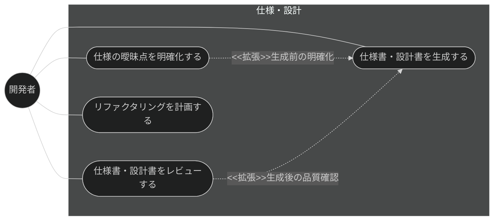
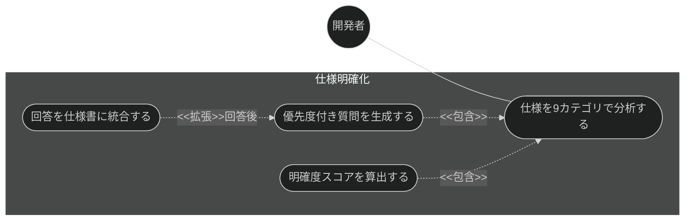
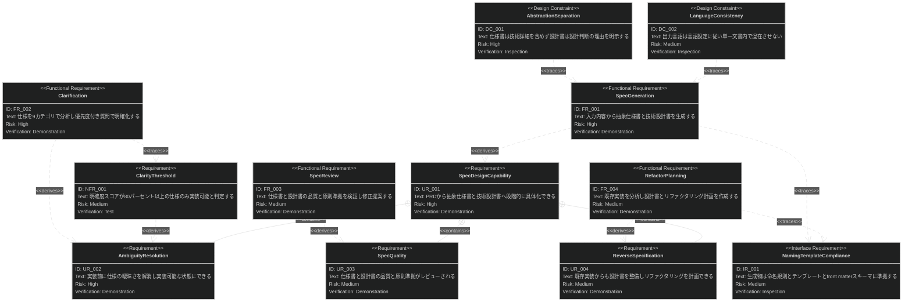
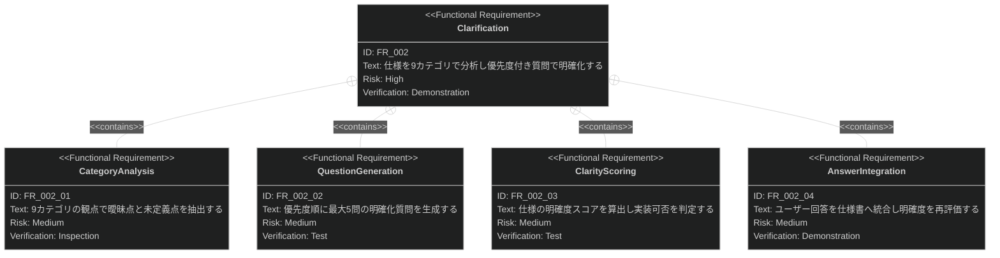

# 仕様・設計 要求仕様書

## 概要

本ドキュメントは、Claude Code プラグイン「sdd-workflow」の仕様・設計機能群に対する要求仕様書である。

AI-SDD ワークフローでは、PRD（何を・なぜ）から抽象仕様書（`*_spec.md`: 何を）と技術設計書
（`*_design.md`: どのように）へ段階的に具体化することで、AI 実装者へのガードレールを構築する。
本機能群は、この Specify / Plan フェーズの中核として、仕様書・設計書の生成、実装前の曖昧さ解消、
品質レビュー、および既存実装からの仕様逆算（リファクタリング計画）を提供する。

**対象範囲:**

- 抽象仕様書・技術設計書の生成
- 仕様の明確化（曖昧点の分析・質問生成・回答統合）
- 仕様書・設計書の品質レビュー
- 既存機能のリファクタリング計画（実装からの設計書逆算）

---

# 1. 要求図の読み方

SysML 要求図の記法（要求タイプ・リスクレベル・検証方法・関係タイプ）の凡例は
[PRD_TEMPLATE.md](../PRD_TEMPLATE.md) のセクション 1 を参照。

---

# 2. 要求一覧

## 2.1. ユースケース図（概要）

## 2.2. ユースケース図（詳細）

### 仕様明確化フロー

## 2.3. 機能一覧（テキスト形式）

- 仕様書・設計書生成
    - 入力内容（PRD・要件記述）からの抽象仕様書（`*_spec.md`）生成
    - 抽象仕様書からの技術設計書（`*_design.md`）生成
    - 命名規則・テンプレート・front matter への準拠
- 仕様明確化
    - 9 カテゴリ（機能範囲・データモデル・フロー・非機能・統合・エッジケース・制約・用語・完了基準）での分析
    - 優先度付き明確化質問の生成（最大 5 問）
    - 明確度スコアの算出と実装可否判定
    - ユーザー回答の仕様書への統合
- 品質レビュー
    - CONSTITUTION 準拠・曖昧表現・セクション欠落・トレーサビリティの検証
    - 修正提案の生成
- リファクタリング計画
    - 既存実装の分析と設計書の作成・更新
    - 対象範囲の指定（スコープ絞り込み）

---

# 3. 要求図（SysML Requirements Diagram）

## 3.1. 全体要求図

## 3.2. 主要サブシステム詳細図

### 仕様明確化

---

# 4. 要求の詳細説明

## 4.1. ユーザー要求

### UR_001: 段階的な具体化

開発者は、PRD または要件記述を入力として、「何を作るか」を定義する抽象仕様書と
「どのように実現するか」を定義する技術設計書を、抽象度を分離した 2 層のドキュメントとして生成できること。

**検証方法:** デモンストレーションによる検証

### UR_002: 実装前の曖昧さ解消

開発者は、実装に着手する前に仕様の曖昧点・未定義点を体系的に洗い出し、
対話を通じて解消して、実装可能な明確度に到達できること。

**検証方法:** デモンストレーションによる検証

### UR_003: 仕様・設計の品質保証

生成・更新された仕様書・設計書は、プロジェクト原則への準拠・曖昧表現の有無・必須セクションの
網羅性・上流ドキュメントとのトレーサビリティの観点でレビュー可能であること。

**検証方法:** デモンストレーションによる検証

### UR_004: 既存実装からの仕様整備

仕様書が存在しない既存機能に対しても、実装コードの分析から設計書を逆算・整備し、
リファクタリング計画を立案できること。

**検証方法:** デモンストレーションによる検証

## 4.2. 機能要求

### FR_001: 仕様書・設計書生成

入力内容（PRD・要件記述）から抽象仕様書（`{feature-name}_spec.md`）と技術設計書
（`{feature-name}_design.md`）を生成し、specification ディレクトリに保存する。UR_001 から派生。

**トリガー方式:** 手動（開発者による `/generate-spec` スキル呼び出し）

**検証方法:** デモンストレーションによる検証

### FR_002: 仕様明確化

対象仕様（またはユーザー要件）を分析し、曖昧点を質問により解消する。UR_002 から派生。

**トリガー方式:** 手動（開発者による `/clarify` スキル呼び出し）。仕様生成前の事前明確化としても利用する

**含まれる機能:**

- FR_002_01: 9 カテゴリ（機能範囲・データモデル・フロー・非機能要求・統合・エッジケース・制約・用語・完了基準）での曖昧点抽出
- FR_002_02: 優先度付き明確化質問の生成（最大 5 問）
- FR_002_03: 明確度スコアの算出と実装可否判定
- FR_002_04: ユーザー回答の仕様書への統合と再評価

**検証方法:** デモンストレーションによる検証

### FR_003: 仕様・設計レビュー

仕様書・設計書に対し、CONSTITUTION 準拠・曖昧表現・必須セクションの欠落・SysML 記法の妥当性・
PRD / 仕様 / 設計間のトレーサビリティを検証し、修正提案を生成する。UR_003 から派生。

**トリガー方式:** 手動（レビュー依頼時）または仕様生成後の品質確認として自動実行

**検証方法:** デモンストレーションによる検証

### FR_004: リファクタリング計画

既存機能の実装コードを分析し、技術設計書の作成・更新とリファクタリング計画の立案を行う。
分析対象はディレクトリ指定で絞り込める。UR_004 から派生。

**トリガー方式:** 手動（開発者による `/plan-refactor` スキル呼び出し）

**検証方法:** デモンストレーションによる検証

## 4.3. 非機能要求

### NFR_001: 明確度の判定基準

仕様の明確度はスコアとして定量化し、80% 以上を実装可能（implementation-ready）と判定すること。
基準未満の仕様に対しては、実装への進行ではなく追加の明確化を推奨すること。

**検証方法:** テストによる検証

## 4.4. インターフェース要求

### IR_001: 命名規則・テンプレート・front matter への準拠

生成される仕様書・設計書は、命名規則（`_spec.md` / `_design.md` サフィックス必須）、
プロジェクトのテンプレート構造、および front matter スキーマ（`type: "spec"` は `sdd-phase: "specify"`、
`type: "design"` は `sdd-phase: "plan"`、depends-on は上流方向のみ）に準拠すること。

**検証方法:** インスペクションによる検証

## 4.5. 設計制約

### DC_001: 抽象度の分離

抽象仕様書（`*_spec.md`）には技術的実装詳細（アーキテクチャ・技術スタック・API 定義・スキーマ）を
含めず、技術設計書（`*_design.md`）には設計判断の理由（なぜその設計か）を明示すること。

**根拠:** AI-SDD 原則の Design Decision Transparency（設計判断の透明性）および
仕様をガードレールとして機能させるための抽象度管理による。

**検証方法:** インスペクションによる検証

### DC_002: 言語の一貫性

生成される仕様書・設計書の言語は `SDD_LANG` 環境変数（en / ja）に従い、
単一ドキュメント内で言語を混在させないこと。

**検証方法:** インスペクションによる検証

---

# 5. 制約事項

## 5.1. 技術的制約

- 本機能群は Claude Code のスキル・エージェント機構上で動作し、分析・生成品質は基盤モデルの能力に依存する
- リファクタリング計画の実装分析は静的なコード読解に基づき、実行時挙動の解析は含まない

## 5.2. ビジネス的制約

- B-001 原則（Vibe Coding 防止）に従い、明確度が基準未満の仕様で実装に進むことを推奨してはならない
- B-002 原則（多言語対応の一貫性）に従い、テンプレート・出力は EN/JA の両言語で同等の構成を維持すること

---

# 6. 前提条件

- 対象プロジェクトで sdd-workflow プラグインが有効化され、`.sdd/` ディレクトリが初期化済みであること
- 上流の PRD が存在する場合、仕様書の front matter から `depends-on` で参照できること
- レビューの CONSTITUTION 準拠チェックは、対象プロジェクトに CONSTITUTION.md が存在する場合にのみ機能する

---

# 7. スコープ外

以下は本 PRD のスコープ外とします：

- PRD 自体の生成（prd-generation カテゴリで扱う）
- 設計書からのタスク分解・実装（task-implementation カテゴリで扱う）
- 実装コードと設計書の継続的な整合性チェック（quality-guardrails カテゴリの check-spec が扱う）
- プロンプト曖昧性の自動検知（quality-guardrails カテゴリの vibe-detector が扱う。本カテゴリは仕様文書の明確化）

---

# 8. 用語集

| 用語         | 定義                                                                 |
|------------|--------------------------------------------------------------------|
| 抽象仕様書      | `{name}_spec.md`。「何を作るか」を技術詳細抜きで定義する Specify フェーズの成果物         |
| 技術設計書      | `{name}_design.md`。「どのように実現するか」と設計判断の理由を定義する Plan フェーズの成果物   |
| 明確度スコア     | 仕様の曖昧さの少なさを定量化した指標。80% 以上で実装可能と判定する                          |
| 9 カテゴリ分析   | 機能範囲・データモデル・フロー・非機能・統合・エッジケース・制約・用語・完了基準の観点による曖昧点分析 |
| リファクタリング計画 | 既存実装の分析に基づく設計書整備と改善手順の立案                                       |
