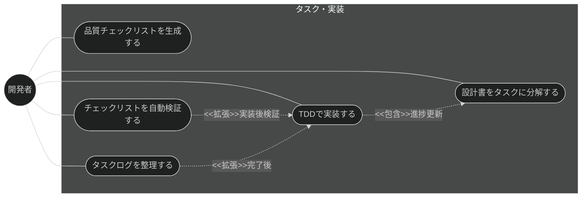
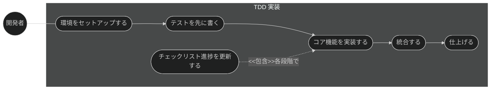
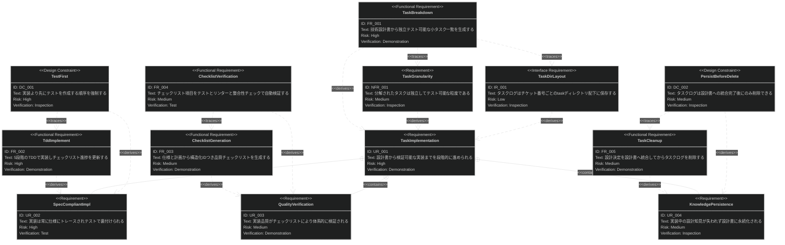
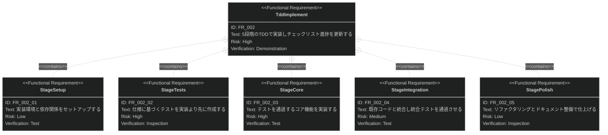

# タスク・実装 要求仕様書

## 概要

本ドキュメントは、Claude Code プラグイン「sdd-workflow」のタスク・実装機能群に対する要求仕様書である。

AI-SDD ワークフローの Tasks / Implement & Review フェーズでは、技術設計書を独立してテスト可能な
小タスクに分解し、TDD に基づいて仕様準拠の実装を進め、品質チェックリストで検証する。
本機能群は、この分解 → 実装 → 検証 → 後片付けのサイクルを提供し、
実装が常に仕様（真実の源）にトレースされた状態を維持する。

**対象範囲:**

- 技術設計書からのタスク分解
- TDD に基づく段階的実装とチェックリスト進捗管理
- 品質チェックリストの生成
- チェックリストの自動検証（テスト・リンター・セキュリティ・整合性）
- 実装完了後のタスクログ整理（設計知見の永続化）

---

# 1. 要求図の読み方

SysML 要求図の記法（要求タイプ・リスクレベル・検証方法・関係タイプ）の凡例は
[PRD_TEMPLATE.md](../PRD_TEMPLATE.md) のセクション 1 を参照。

---

# 2. 要求一覧

## 2.1. ユースケース図（概要）

## 2.2. ユースケース図（詳細）

### TDD 実装フロー

## 2.3. 機能一覧（テキスト形式）

- タスク分解
    - 技術設計書から独立テスト可能な小タスクの一覧を生成
    - チケット番号に紐づく task ディレクトリへの保存
- TDD 実装
    - 5 段階（Setup → Tests → Core → Integration → Polish）の段階的実装
    - tasks.md のチェックリスト進捗の逐次更新
- 品質検証
    - 仕様・計画からの品質チェックリスト生成（構造化 ID・カテゴリ付き）
    - チェックリスト項目の自動検証（テスト・リンター・セキュリティスキャン・仕様整合性）
- タスククリーンアップ
    - 重要な設計決定の技術設計書への統合
    - 統合後の task ディレクトリ削除

---

# 3. 要求図（SysML Requirements Diagram）

## 3.1. 全体要求図

## 3.2. 主要サブシステム詳細図

### TDD 実装

---

# 4. 要求の詳細説明

## 4.1. ユーザー要求

### UR_001: 設計から実装への段階的進行

開発者は、技術設計書を入力として、タスク分解 → 実装 → 検証 → 後片付けの一連のサイクルを
段階的に進められること。各段階の成果物（tasks.md・実装コード・チェックリスト）が明確であること。

**検証方法:** デモンストレーションによる検証

### UR_002: 仕様準拠とテストの裏付け

実装は対応するタスク・設計書・仕様に常にトレース可能であり、テストによって裏付けられること。
テストのない実装や、仕様にない機能の実装を防ぐ構造であること。

**検証方法:** テストによる検証

### UR_003: 体系的な品質検証

実装の品質は、仕様・計画から生成されたチェックリストに基づいて体系的に検証され、
検証結果（合否・根拠）が記録されること。

**検証方法:** デモンストレーションによる検証

### UR_004: 設計知見の永続化

実装過程で行われた設計判断・トレードオフの記録は、一時的なタスクログの削除によって失われず、
技術設計書に統合されて永続化されること。

**検証方法:** インスペクションによる検証

## 4.2. 機能要求

### FR_001: タスク分解

技術設計書（`*_design.md`）を分析し、独立してテスト可能な小タスクの一覧（tasks.md）を生成して、
チケット番号に対応する task ディレクトリに保存する。UR_001 から派生。

**トリガー方式:** 手動（開発者による `/task-breakdown` スキル呼び出し）

**検証方法:** デモンストレーションによる検証

### FR_002: TDD 実装

tasks.md のタスクを、5 段階の TDD プロセスで実装し、各段階の完了に応じて
チェックリストの進捗を逐次更新する。UR_002 から派生。

**トリガー方式:** 手動（開発者による `/implement` スキル呼び出し）

**含まれる機能:**

- FR_002_01: Setup — 実装環境・依存関係のセットアップ
- FR_002_02: Tests — 仕様に基づくテストの先行作成
- FR_002_03: Core — テストを通過するコア機能の実装
- FR_002_04: Integration — 既存コードとの統合と統合テスト
- FR_002_05: Polish — リファクタリング・ドキュメント整備

**検証方法:** デモンストレーションによる検証

### FR_003: チェックリスト生成

仕様書・計画から、構造化 ID とカテゴリを持つ品質保証チェックリストを生成する。UR_003 から派生。

**トリガー方式:** 手動（開発者による `/checklist` スキル呼び出し）

**検証方法:** デモンストレーションによる検証

### FR_004: チェックリスト自動検証

生成されたチェックリスト項目を、テスト実行・リンター・セキュリティスキャナー・
仕様整合性チェックにより自動検証し、実装が品質基準を満たすか判定する。UR_003 から派生。

**トリガー方式:** 手動（開発者による `/run-checklist` スキル呼び出し）

**検証方法:** テストによる検証

### FR_005: タスククリーンアップ

実装完了後、タスクログ内の重要な設計決定を対応する技術設計書（`*_design.md`）へ統合したうえで、
task ディレクトリを削除する。UR_004 から派生。

**トリガー方式:** 手動（開発者による `/task-cleanup` スキル呼び出し）

**検証方法:** デモンストレーションによる検証

## 4.3. 非機能要求

### NFR_001: タスクの粒度

分解されたタスクは、それぞれ独立してテスト可能であり、単一タスクの完了が
他タスクの未完了に依存しない粒度であること。

**インスペクション基準:**

- 各タスクに完了を判定できるテストまたは検証手順が対応づいていること
- あるタスクの実施が、他の未完了タスクの成果物を前提としないこと（依存がある場合は順序を明示すること）

**検証方法:** インスペクションによる検証

## 4.4. インターフェース要求

### IR_001: task ディレクトリのレイアウト

タスクログは `task/{ticket-number}/` 配下に保存し、front matter スキーマ
（`type: "task"`、`sdd-phase: "tasks"`、`ticket` フィールド）に準拠すること。

**検証方法:** インスペクションによる検証

## 4.5. 設計制約

### DC_001: テストファースト

実装（Core 段階）に先立ちテスト（Tests 段階）を作成する順序を、プロセスとして強制すること。
テストのない実装段階への進行を許容しない。

**検証方法:** インスペクションによる検証

### DC_002: 統合前削除の禁止

task ディレクトリの削除は、重要な設計決定の技術設計書への統合が完了した後にのみ許可すること。

**根拠:** D-003 原則（ドキュメント永続性ルール）。task/ は一時ログであり、
設計知見は永続ドキュメントである `*_design.md` に集約する。

**検証方法:** インスペクションによる検証

---

# 5. 制約事項

## 5.1. 技術的制約

- チェックリスト自動検証が実行するテスト・リンター・セキュリティスキャナーは、
  対象プロジェクトに導入済みのツールに依存する（本機能群はツール自体を提供しない）
- TDD 実装の品質は基盤モデルの能力および仕様書・設計書の明確度に依存する

## 5.2. ビジネス的制約

- B-001 原則（Vibe Coding 防止）に従い、仕様・設計書に定義のない機能を実装過程で推測により追加してはならない
- D-003 原則（ドキュメント永続性ルール）に従い、task/ 配下は一時ログとして扱い、恒久的な設計情報を残置しない
- B-002 原則（多言語対応の一貫性）に従い、本機能群の出力テンプレートは EN/JA の両言語で同等の構成を維持すること

---

# 6. 前提条件

- 対象機能の技術設計書（`*_design.md`）が存在すること（タスク分解の入力）
- 対象プロジェクトで sdd-workflow プラグインが有効化され、`.sdd/` ディレクトリが初期化済みであること
- チケット番号の採番規則はプロジェクト運用に委ねる（本機能群は指定された番号を使用する）

---

# 7. スコープ外

以下は本 PRD のスコープ外とします：

- 仕様書・設計書の生成・明確化（spec-design カテゴリで扱う）
- 実装と設計書の乖離検出（quality-guardrails カテゴリの check-spec が扱う）
- バージョン管理操作（コミット・PR 作成等はプロジェクト運用・他ツールに委ねる）
- CI 環境でのテスト実行基盤の提供（対象プロジェクトの CI 構成に委ねる）

---

# 8. 用語集

| 用語        | 定義                                                              |
|-----------|-------------------------------------------------------------------|
| tasks.md  | タスク分解の成果物。チェックリスト形式のタスク一覧                                  |
| TDD 5 段階  | Setup → Tests → Core → Integration → Polish の段階的実装プロセス           |
| 構造化 ID    | チェックリスト項目に付与する一意な識別子。カテゴリと連番で構成                          |
| タスクログ     | `task/{ticket-number}/` 配下の一時的な作業記録。完了後は設計書へ統合して削除する      |
| チケット番号    | タスクを外部の課題管理と紐づける識別子                                          |
