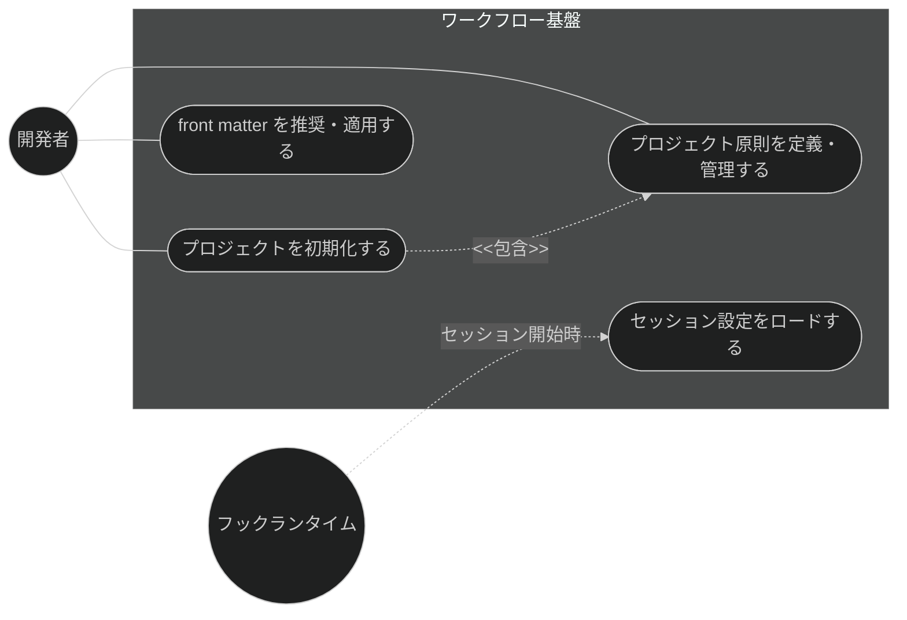
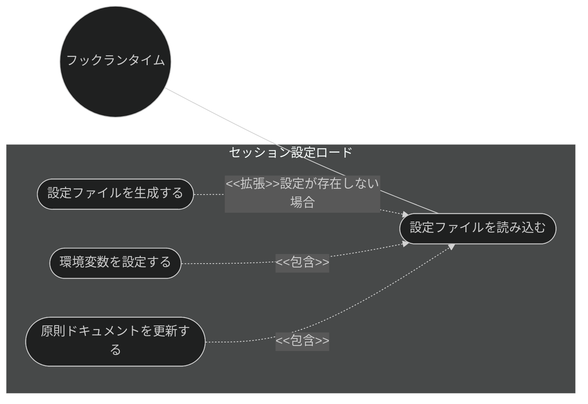
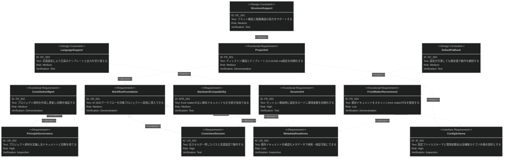
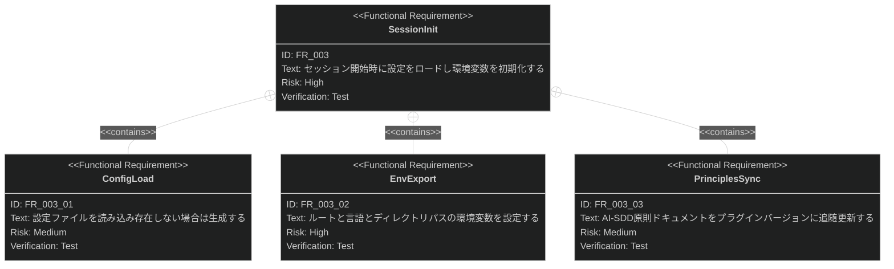

# ワークフロー基盤 要求仕様書

## 概要

本ドキュメントは、Claude Code プラグイン「sdd-workflow」のワークフロー基盤機能群に対する要求仕様書である。

AI-SDD ワークフロー（Specify → Plan → Tasks → Implement & Review）が機能するためには、
対象プロジェクトへの導入（ディレクトリ構造・テンプレート・原則の整備）と、
セッションごとの一貫した設定（パス解決・言語設定）が前提となる。
本機能群は、ワークフロー導入の初期化、プロジェクト原則の定義・管理、セッション設定の自動ロード、
既存ドキュメントへの構造化メタデータ付与という、他のすべての機能カテゴリが依存する土台を提供する。

**対象範囲:**

- プロジェクト初期化（`.sdd/` 構造・テンプレート・CLAUDE.md 設定）
- プロジェクト原則（CONSTITUTION）の定義・管理・同期検証
- セッション開始時の設定ロードと環境変数初期化
- 既存ドキュメントへの YAML front matter 推奨・適用

---

# 1. 要求図の読み方

SysML 要求図の記法（要求タイプ・リスクレベル・検証方法・関係タイプ）の凡例は
[PRD_TEMPLATE.md](../PRD_TEMPLATE.md) のセクション 1 を参照。

---

# 2. 要求一覧

## 2.1. ユースケース図（概要）

## 2.2. ユースケース図（詳細）

### セッション設定ロード

## 2.3. 機能一覧（テキスト形式）

- プロジェクト初期化
    - `.sdd/` ディレクトリ構造の生成
    - テンプレート（PRD / 仕様書 / 設計書）の配置
    - CLAUDE.md への AI-SDD Instructions 設定
- プロジェクト原則管理
    - CONSTITUTION.md の作成・更新
    - 他ドキュメントとの同期検証
- セッション設定
    - `.sdd-config.json` の読み込み（存在しない場合は生成）
    - `SDD_ROOT` / `SDD_LANG` / ディレクトリパス系環境変数の設定
    - AI-SDD 原則ドキュメントのバージョン追随更新
- メタデータ整備
    - 既存ドキュメントのスキャンと front matter 推奨
    - 推奨内容の一括適用（`--apply`）

---

# 3. 要求図（SysML Requirements Diagram）

## 3.1. 全体要求図

## 3.2. 主要サブシステム詳細図

### セッション設定初期化

---

# 4. 要求の詳細説明

## 4.1. ユーザー要求

### UR_001: ワークフローの容易な導入

開発者は、最小限の操作（初期化スキルの 1 回の実行）で、対象プロジェクトに AI-SDD ワークフローの
前提となるディレクトリ構造・テンプレート・設定を導入できること。

**検証方法:** デモンストレーションによる検証

### UR_002: プロジェクト原則のガバナンス

開発者は、プロジェクトの譲れない原則（Constitution）を定義・更新でき、
原則と他ドキュメント（PRD / 仕様書 / 設計書）との同期状態を検証できること。

**検証方法:** インスペクションによる検証

### UR_003: セッションの一貫性

すべてのスキル・エージェント・フックが、同一セッション内で一貫したディレクトリパスと言語設定を
参照して動作すること。設定の解決が個々の機能に分散せず、単一の初期化に集約されること。

**検証方法:** テストによる検証

### UR_004: メタデータによる検索・検証可能性

開発者は、front matter を持たない既存の AI-SDD ドキュメントに対して、構造化メタデータの付与を
推奨・適用でき、機械的な検索・フィルタリング・整合性検証を可能にできること。

**検証方法:** インスペクションによる検証

## 4.2. 機能要求

### FR_001: プロジェクト初期化

対象プロジェクトに `.sdd/` ディレクトリ構造（requirement / specification / task）とテンプレート
（PRD / 抽象仕様書 / 技術設計書）を生成し、CLAUDE.md に AI-SDD Instructions を設定する。UR_001 から派生。

**トリガー方式:** 手動（開発者による `/sdd-init` スキル呼び出し。`--ci` で確認省略）

**検証方法:** デモンストレーションによる検証

### FR_002: プロジェクト原則管理

サブコマンドにより CONSTITUTION.md の作成・更新・参照を行い、原則と他ドキュメントの
同期状態を検証する。UR_002 から派生。

**トリガー方式:** 手動（開発者による `/constitution` スキル呼び出し）

**検証方法:** デモンストレーションによる検証

### FR_003: セッション設定初期化

セッション開始時に自動実行され、以降の全機能が参照する設定を初期化する。UR_003 から派生。

**トリガー方式:** 自動（セッション開始イベント）

**含まれる機能:**

- FR_003_01: 設定ファイル（`.sdd-config.json`）の読み込み。存在しない場合は既定値で生成する
- FR_003_02: `SDD_ROOT` / `SDD_LANG` / requirement・specification・task の各ディレクトリ名とパスの環境変数設定
- FR_003_03: AI-SDD 原則ドキュメント（AI-SDD-PRINCIPLES.md）のプラグインバージョンへの追随更新

**検証方法:** テストによる検証（ユニットテストを CI で実行）

### FR_004: front matter 推奨

既存の AI-SDD ドキュメントをスキャンし、ドキュメント種別に応じた YAML front matter の付与を
推奨する。`--apply` 指定時は推奨内容を一括適用する。UR_004 から派生。

**トリガー方式:** 手動（開発者による `/recommend-front-matter` スキル呼び出し）

**検証方法:** デモンストレーションによる検証

## 4.3. 非機能要求

### NFR_001: 後方互換性

front matter を持たない既存ドキュメントも引き続き有効として扱い、front matter の導入が
既存ワークフローを破壊しないこと。

**検証方法:** テストによる検証

## 4.4. インターフェース要求

### IR_001: 設定スキーマ・環境変数の共通契約

`.sdd-config.json` のスキーマおよび `SDD_*` 環境変数の名称・意味は、全機能カテゴリ
（PRD 生成・仕様設計・タスク実装・品質ガードレール）が参照する共通契約であり、
変更時は参照側との互換性を維持すること。

**検証方法:** インスペクションによる検証

## 4.5. 設計制約

### DC_001: フラット構造と階層構造の両サポート

`.sdd/` 配下のドキュメント配置は、フラット構造（小〜中規模）と階層構造（親機能ディレクトリ +
index / 子機能、中〜大規模）の両方をサポートすること。

**検証方法:** テストによる検証

### DC_002: 既定値へのフォールバック

設定ファイルの欠落・不正（不正 JSON・空値等）があっても、既定値にフォールバックして
セッション初期化を継続すること。設定不備がワークフロー全体を停止させてはならない。

**検証方法:** テストによる検証

### DC_003: 言語設定による切り替え

`SDD_LANG` 設定（en / ja）により、生成されるテンプレート・出力の言語を切り替えること。

**検証方法:** テストによる検証

---

# 5. 制約事項

## 5.1. 技術的制約

- セッション設定初期化は Claude Code の SessionStart フックとして実装され、フックランタイムの
  提供するインターフェース（環境変数エクスポート等）に依存する
- CLAUDE.md への設定はプロジェクト側の既存記述と共存する必要があり、既存内容を破壊してはならない

## 5.2. ビジネス的制約

- B-002 原則（多言語対応の一貫性）に従い、テンプレートは EN/JA で同等の構成を維持すること
- D-002 原則（ファイル命名規則の厳守）に従い、初期化で生成する構造・テンプレートは命名規則に準拠すること

---

# 6. 前提条件

- Claude Code のプラグイン機構・フックイベントシステムが利用可能であること
- 対象プロジェクトのルートに書き込み権限があること

---

# 7. スコープ外

以下は本 PRD のスコープ外とします：

- ドキュメントの生成そのもの（PRD 生成は prd-generation、仕様・設計は spec-design カテゴリで扱う）
- front matter の検証（quality-guardrails カテゴリの front-matter-reviewer が扱う。本カテゴリは推奨・適用まで）
- プラグイン自体の配布・バージョン管理（distribution カテゴリで扱う）

---

# 8. 用語集

| 用語               | 定義                                                            |
|------------------|-----------------------------------------------------------------|
| Constitution     | プロジェクトの譲れない最上位原則を定義するドキュメント（CONSTITUTION.md）      |
| .sdd-config.json | プロジェクトルートに置く AI-SDD 設定ファイル（ルート・言語・ディレクトリ名等）      |
| SDD_* 環境変数       | セッション初期化が設定する共通環境変数群（SDD_ROOT / SDD_LANG / SDD_*_PATH 等） |
| フラット構造 / 階層構造    | `.sdd/` 配下のドキュメント配置方式。規模に応じて選択する                        |
| front matter     | ドキュメント冒頭の YAML メタデータ（id / type / status / depends-on 等）     |
