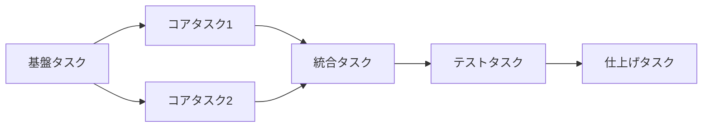

# Task Breakdown - タスク分解

技術設計書（`*_design.md`）を読み込み、独立してテスト可能な小タスクに分解します。

## 前提条件

### プラグイン更新チェック

**実行前に `.sdd/UPDATE_REQUIRED.md` の存在を確認してください。**

このファイルが存在する場合、AI-SDDプラグインの更新が必要です。ユーザーに警告を表示し、以下のコマンドを実行するよう促してください：

```
/sdd_init
```

### AI-SDD原則ドキュメントの読み込み

**実行前に AI-SDD原則ドキュメントを読み込んでください。**

AI-SDD原則ドキュメントのパス: `.sdd/AI-SDD-PRINCIPLES.md`

**注意**: このファイルはセッション開始時に自動的に最新化されます。

AI-SDDの原則を理解してください。

このコマンドはAI-SDD原則に従ってタスク分解を行います。

### ディレクトリパスの解決

**環境変数 `SDD_*` を使用してディレクトリパスを解決します。**

| 環境変数                     | デフォルト値               | 説明              |
|:-------------------------|:---------------------|:----------------|
| `SDD_ROOT`               | `.sdd`               | ルートディレクトリ       |
| `SDD_REQUIREMENT_PATH`   | `.sdd/requirement`   | PRD/要求仕様書ディレクトリ |
| `SDD_SPECIFICATION_PATH` | `.sdd/specification` | 仕様書・設計書ディレクトリ   |
| `SDD_TASK_PATH`          | `.sdd/task`          | タスクログディレクトリ     |

**パス解決の優先順位:**

1. 環境変数 `SDD_*` が設定されている場合はそれを使用
2. 環境変数がない場合は `.sdd-config.json` を確認
3. どちらもない場合はデフォルト値を使用

以下のドキュメントでは、デフォルト値を使用して説明しますが、環境変数または設定ファイルが存在する場合はカスタム値に置き換えてください。

### Tasks フェーズの位置づけ（参照）

| フェーズ      | 目的                   | 成果物        |
|:----------|:---------------------|:-----------|
| **Tasks** | 設計を独立してテスト可能な小タスクに分解 | `task/` 配下 |

## 入力

$ARGUMENTS

### 入力例

```
/task_breakdown user-auth
/task_breakdown task-management TICKET-123
```

## 処理フロー

### 1. 関連ドキュメントの読み込み

フラット構造と階層構造の両方をサポートします。

**フラット構造の場合**:

```
.sdd/requirement/{機能名}.md を読み込む（PRD、存在する場合）
.sdd/specification/{機能名}_spec.md を読み込む（存在する場合）
.sdd/specification/{機能名}_design.md を読み込む（必須）
```

**階層構造の場合**（引数に `/` が含まれる場合）:

```
.sdd/requirement/{親機能名}/index.md を読み込む（親機能のPRD、存在する場合）
.sdd/requirement/{親機能名}/{機能名}.md を読み込む（子機能のPRD、存在する場合）
.sdd/specification/{親機能名}/index_spec.md を読み込む（親機能のspec、存在する場合）
.sdd/specification/{親機能名}/{機能名}_spec.md を読み込む（子機能のspec、存在する場合）
.sdd/specification/{親機能名}/index_design.md を読み込む（親機能のdesign、存在する場合）
.sdd/specification/{親機能名}/{機能名}_design.md を読み込む（子機能のdesign、必須）
```

**⚠️ 命名規則の違いに注意**:

- **requirement 配下**: サフィックスなし（`index.md`, `{機能名}.md`）
- **specification 配下**: `_spec` または `_design` サフィックス必須（`index_spec.md`, `{機能名}_spec.md`）

**入力例（階層構造）**:

```
/task_breakdown auth/user-login
/task_breakdown auth/user-login TICKET-123
```

- 設計書が存在しない場合は、先に `/generate_spec` で作成を促す
- PRD/specが存在する場合は、タスクが要求をカバーしているか確認に使用

### 2. 設計書の分析

設計書から以下の情報を抽出：

| 抽出項目         | 説明                |
|:-------------|:------------------|
| **モジュール構成**  | 作成するファイル・ディレクトリ   |
| **依存関係**     | モジュール間の依存         |
| **インターフェース** | 各モジュールの公開API      |
| **技術スタック**   | 使用するライブラリ・フレームワーク |

### 3. タスク分解の原則

#### 独立性（Independence）

- 各タスクは他のタスクに依存せずに実装可能
- 並行して作業可能な粒度に分解

#### テスト可能性（Testability）

- 各タスクは単独でテスト可能
- 完了条件が明確

#### 適切な粒度（Granularity）

- 1タスク = 数時間〜1日程度で完了可能
- 大きすぎず、小さすぎない

### 4. タスクの分類

| カテゴリ    | 説明            | 例                 |
|:--------|:--------------|:------------------|
| **基盤**  | 他のタスクの前提となる作業 | ディレクトリ構成、型定義      |
| **コア**  | 主要な機能実装       | ビジネスロジック、API      |
| **統合**  | モジュール間の連携     | サービス層、イベント処理      |
| **テスト** | テストの作成        | 単体テスト、統合テスト       |
| **仕上げ** | 最終調整          | ドキュメント更新、リファクタリング |

### 5. 依存関係の整理

タスク間の依存関係を明確化：



## 出力フォーマット

`output-templates` スキルを使用してタスク分解結果を生成し、`.sdd/task/{チケット番号}/tasks.md` または `.sdd/task/{機能名}/tasks.md` に保存してください。

## 要求カバレッジの確認

PRD/specが存在する場合、生成したタスクリストに対して以下を確認してください：

### チェック項目

| チェック項目        | 確認内容                                |
|:--------------|:------------------------------------|
| **機能要求の網羅性**  | PRD/specの機能要求（FR-xxx）がタスクでカバーされているか |
| **非機能要求の考慮**  | 非機能要求（NFR-xxx）がテストタスクに含まれているか       |
| **API実装の網羅性** | specのAPIがすべてコアタスクに含まれているか           |

### 要求カバレッジ表の出力

タスクリストの末尾に以下を追記（PRD/specが存在する場合）：

````markdown
## 要求カバレッジ

| 要求ID    | 要求内容   | 対応タスク    |
|:--------|:-------|:---------|
| FR-001  | {要求内容} | 2.1, 2.2 |
| FR-002  | {要求内容} | 2.3      |
| NFR-001 | {要求内容} | 4.1      |
````

### カバレッジ不足時の対応

- カバーされていない要求がある場合、タスクを追加
- タスクに対応する要求がない場合、スコープ外の可能性を確認

## 生成後のアクション

1. **ファイル保存**:
    - `.sdd/task/{対象}/tasks.md`

2. **要求カバレッジ確認**:
    - PRD/specが存在する場合: すべての要求がタスクでカバーされているか確認
    - カバレッジ表をタスクリストに追記

## Serena MCP 統合（オプション）

Serena MCP が有効な場合、セマンティックコード分析を活用してタスク分解の精度を向上できます。

### 利用条件

- `.mcp.json` に `serena` が設定されていること
- 対象言語の Language Server がサポートされていること

### Serena 有効時の追加機能

#### 影響範囲の分析

| 機能                         | 活用方法                  |
|:---------------------------|:----------------------|
| `find_symbol`              | 変更対象のシンボルを特定          |
| `find_referencing_symbols` | 変更による影響範囲（依存するコード）を把握 |

#### タスク分解強化項目

1. **依存関係の自動検出**: 既存コードの依存関係を分析し、タスク間の依存を正確に定義
2. **影響範囲の特定**: 変更が波及するモジュールを検出し、統合タスクを適切に設定
3. **既存テストの把握**: 関連するテストコードを検索し、テストタスクの精度を向上
4. **リファクタリング対象の特定**: 変更に伴い修正が必要な既存コードを検出

#### タスクリストへの追加情報

````markdown
## Serena 分析結果

### 影響を受けるシンボル

| シンボル             | ファイル              | 参照数 | 対応タスク |
|:-----------------|:------------------|:----|:------|
| `UserService`    | `src/services/`   | 12  | 2.1   |
| `AuthMiddleware` | `src/middleware/` | 8   | 2.3   |

### 追加で検討すべきタスク

- `UserService` を参照する 12 箇所の更新確認
- 関連テスト `user.test.ts` の更新

````

### Serena 未設定時の動作

Serena が利用できない場合でも、設計書に基づいてタスク分解を実行します。
影響範囲の分析が必要な場合は、ユーザーに手動確認を推奨してください。

## 生成後の検証

### 自動検証（実行済み）

生成時に以下の検証が自動実行されます：

- [x] **要求カバレッジ確認**: PRD/spec の要求がタスクでカバーされているか検証
- [x] **依存関係の整合性**: タスク間の依存関係に矛盾がないか確認
- [x] **完了条件の具体性**: 各タスクに明確な完了条件があるか確認

## 注意事項

- 設計書がない状態でのタスク分解は避ける
- タスクが大きすぎる場合は、さらに分解を検討
- 依存関係を無視した実装順序は避ける
- 完了条件は具体的かつ検証可能にする
