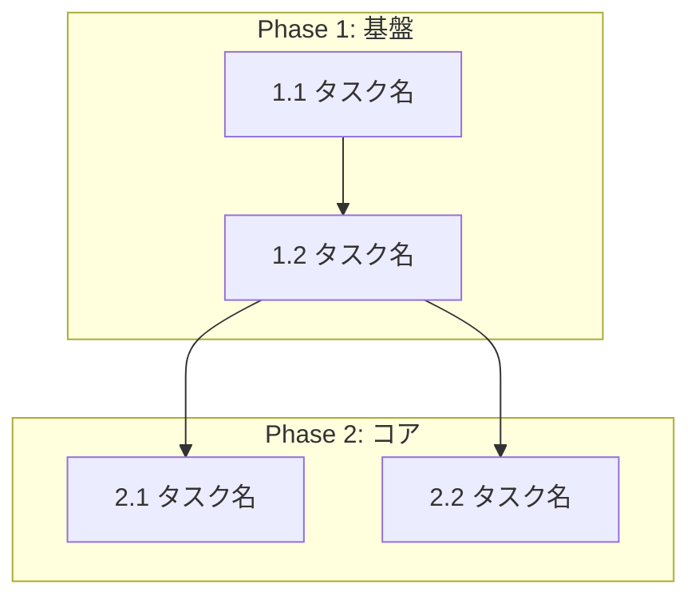

# {機能名} タスク分解

## メタ情報

| 項目     | 内容                                   |
|:-------|:-------------------------------------|
| 機能名    | {機能名}                                |
| チケット番号 | {チケット番号}（指定がある場合）                    |
| 設計書    | `.sdd/specification/{機能名}_design.md` |
| 作成日    | YYYY-MM-DD                           |

## タスク一覧

### Phase 1: 基盤

| #   | タスク    | 説明     | 完了条件   | 依存  |
|:----|:-------|:-------|:-------|:----|
| 1.1 | {タスク名} | {詳細説明} | {完了条件} | -   |
| 1.2 | {タスク名} | {詳細説明} | {完了条件} | 1.1 |

### Phase 2: コア実装

| #   | タスク    | 説明     | 完了条件   | 依存  |
|:----|:-------|:-------|:-------|:----|
| 2.1 | {タスク名} | {詳細説明} | {完了条件} | 1.x |
| 2.2 | {タスク名} | {詳細説明} | {完了条件} | 1.x |

### Phase 3: 統合

| #   | タスク    | 説明     | 完了条件   | 依存  |
|:----|:-------|:-------|:-------|:----|
| 3.1 | {タスク名} | {詳細説明} | {完了条件} | 2.x |

### Phase 4: テスト

| #   | タスク    | 説明     | 完了条件   | 依存  |
|:----|:-------|:-------|:-------|:----|
| 4.1 | {タスク名} | {詳細説明} | {完了条件} | 3.x |

### Phase 5: 仕上げ

| #   | タスク    | 説明     | 完了条件   | 依存  |
|:----|:-------|:-------|:-------|:----|
| 5.1 | {タスク名} | {詳細説明} | {完了条件} | 4.x |

## 依存関係図

## 実装の注意事項

- {注意事項1}
- {注意事項2}

## 参照ドキュメント

- 抽象仕様書: `.sdd/specification/[{親機能名}/]{機能名}_spec.md`
- 技術設計書: `.sdd/specification/[{親機能名}/]{機能名}_design.md`

※ 階層構造の場合、親機能は `index_spec.md`、`index_design.md`
