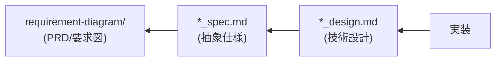

# SDD Templates - AI-SDDドキュメントテンプレート

AI-SDD ワークフローで使用する各種ドキュメントのテンプレートを提供します。

## 前提条件

**実行前に必ず `sdd-workflow-ja:sdd-workflow` エージェントの内容を読み込み、AI-SDDの原則を理解してください。**

このスキルはsdd-workflowエージェントの原則に従ったテンプレートを提供します。

## 提供テンプレート

| テンプレート | ファイル | 用途 |
|:---|:---|:---|
| **PRD（要求仕様書）** | [templates/prd_template.md](templates/prd_template.md) | `/generate_prd` コマンドで使用 |
| **抽象仕様書** | [templates/spec_template.md](templates/spec_template.md) | `/generate_spec` コマンドで使用 |
| **技術設計書** | [templates/design_template.md](templates/design_template.md) | `/generate_spec` コマンドで使用 |

## 使用方法

### 1. テンプレートの参照

各コマンド（`/generate_prd`, `/generate_spec`）実行時に、対応するテンプレートを読み込んで使用してください。

```
/generate_prd {要求内容}
→ templates/prd_template.md を参照して PRD を生成

/generate_spec {仕様内容}
→ templates/spec_template.md を参照して抽象仕様書を生成
→ templates/design_template.md を参照して技術設計書を生成
```

### 2. プロジェクトテンプレートとの優先順位

プロジェクトに独自のテンプレートが存在する場合の優先順位：

1. **プロジェクトテンプレート**（`.docs/SPECIFICATION_TEMPLATE.md` など）
2. **プラグインテンプレート**（このスキルのテンプレート）
3. **デフォルト形式**（コマンド内に定義された形式）

### 3. テンプレートのカスタマイズ

プロジェクト固有のカスタマイズが必要な場合：

1. このスキルのテンプレートを `.docs/` にコピー
2. プロジェクトに合わせて修正
3. 以後、プロジェクトテンプレートが優先される

## テンプレートの概要

### PRD（要求仕様書）テンプレート

SysML要求図形式で以下を定義：

- 背景と目的
- ユーザ要求（UR-xxx）
- 機能要求（FR-xxx）
- 非機能要求（NFR-xxx）
- 要求図（Mermaid）
- 制約事項・前提条件

### 抽象仕様書テンプレート

システムの論理構造を定義：

- 背景・概要
- 機能要件（PRD要求IDとの対応）
- 公開API（SysML bdd形式）
- データモデル
- 振る舞い（シーケンス図）

### 技術設計書テンプレート

具体的な実装計画を定義：

- 実装ステータス
- 設計目標
- 技術スタック
- アーキテクチャ
- 設計判断と根拠

## ドキュメント間の依存関係



各テンプレートは、この依存関係に基づいてトレーサビリティを確保するよう設計されています。

## 注意事項

- テンプレートは**構造のガイドライン**であり、すべてのセクションが必須ではありません
- プロジェクトの規模・性質に応じて必要なセクションを選択してください
- 要求ID（UR-xxx, FR-xxx, NFR-xxx）は一意に管理し、ドキュメント間で参照可能にしてください
