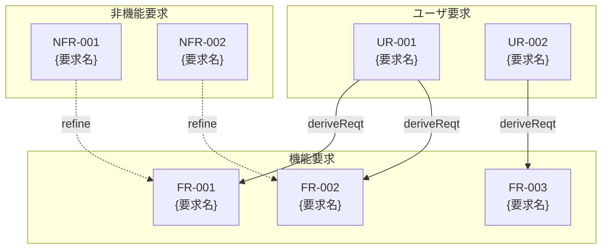

# {機能名} 要求仕様書 (PRD)

## 文書情報

| 項目       | 内容                                                                                   |
|:---------|:-------------------------------------------------------------------------------------|
| 機能名      | {機能名}                                                                                |
| 作成日      | YYYY-MM-DD                                                                           |
| ステータス    | Draft / Review / Approved                                                            |
| 関連ドキュメント | [仕様書](.docs/specification/{機能名}_spec.md), [設計書](.docs/specification/{機能名}_design.md) |

## 背景と目的

### 背景

{なぜこの機能が必要か、現状の課題を記述}

### 目的

{この機能で達成したいこと、ビジネス価値を記述}

### 成功基準

- {定量的または定性的な成功指標1}
- {定量的または定性的な成功指標2}

## 要求定義

### ユーザ要求（User Requirements）

ユーザーの視点からの要求を定義します。

| ID     | 要求            | 優先度                   | 検証方法   |
|:-------|:--------------|:----------------------|:-------|
| UR-001 | {ユーザーが〜できること} | Must / Should / Could | {検証方法} |
| UR-002 | {ユーザーが〜できること} | Must / Should / Could | {検証方法} |

### 機能要求（Functional Requirements）

システムが提供すべき機能を定義します。

| ID     | 要求           | 派生元    | 優先度                   | 検証方法   |
|:-------|:-------------|:-------|:----------------------|:-------|
| FR-001 | {システムが〜すること} | UR-001 | Must / Should / Could | {検証方法} |
| FR-002 | {システムが〜すること} | UR-001 | Must / Should / Could | {検証方法} |
| FR-003 | {システムが〜すること} | UR-002 | Must / Should / Could | {検証方法} |

### 非機能要求（Non-Functional Requirements）

| ID      | カテゴリ    | 要求               | 優先度                   | 検証方法   |
|:--------|:--------|:-----------------|:----------------------|:-------|
| NFR-001 | パフォーマンス | {応答時間、スループットなど}  | Must / Should / Could | {検証方法} |
| NFR-002 | セキュリティ  | {認証、認可、暗号化など}    | Must / Should / Could | {検証方法} |
| NFR-003 | 可用性     | {稼働率、障害復旧など}     | Must / Should / Could | {検証方法} |
| NFR-004 | 保守性     | {コード品質、ドキュメントなど} | Must / Should / Could | {検証方法} |

## 要求図（SysML Requirements Diagram）

### 要求関係の凡例

| 関係         | 意味                | 表記   |
|:-----------|:------------------|:-----|
| deriveReqt | 派生（上位要求から下位要求を導出） | 実線矢印 |
| refine     | 詳細化（抽象的な要求を具体化）   | 点線矢印 |
| satisfy    | 充足（設計要素が要求を満たす）   | -    |
| verify     | 検証（テストケースが要求を検証）  | -    |
| trace      | トレース（要求間の一般的な関連）  | -    |

## 制約事項

### 技術的制約

- {技術的な制約1}
- {技術的な制約2}

### ビジネス的制約

- {ビジネス的な制約1}
- {スケジュール、予算などの制約}

### 法的・規制上の制約

- {該当する法規制}
- {コンプライアンス要件}

## 前提条件

- {この機能が動作するための前提1}
- {依存する他システム・機能}
- {ユーザーの前提知識・スキル}

## スコープ外

以下は本PRDのスコープ外とします：

- {この機能に含まれないこと1}
- {将来的に検討する可能性があるが、今回は対象外}
- {関連するが別PRDで扱う機能}

## 用語集

| 用語    | 定義   |
|:------|:-----|
| {用語1} | {定義} |
| {用語2} | {定義} |

## リスクと緩和策

| リスク    | 影響度   | 発生確率  | 緩和策   |
|:-------|:------|:------|:------|
| {リスク1} | 高/中/低 | 高/中/低 | {緩和策} |
| {リスク2} | 高/中/低 | 高/中/低 | {緩和策} |

## 承認

| 役割    | 名前   | 日付         | 署名 |
|:------|:-----|:-----------|:---|
| 作成者   | {名前} | YYYY-MM-DD | -  |
| レビュアー | {名前} | YYYY-MM-DD | -  |
| 承認者   | {名前} | YYYY-MM-DD | -  |

---

## 変更履歴

| 日付         | バージョン | 変更内容 | 変更者  |
|:-----------|:------|:-----|:-----|
| YYYY-MM-DD | 1.0   | 初版作成 | {名前} |
