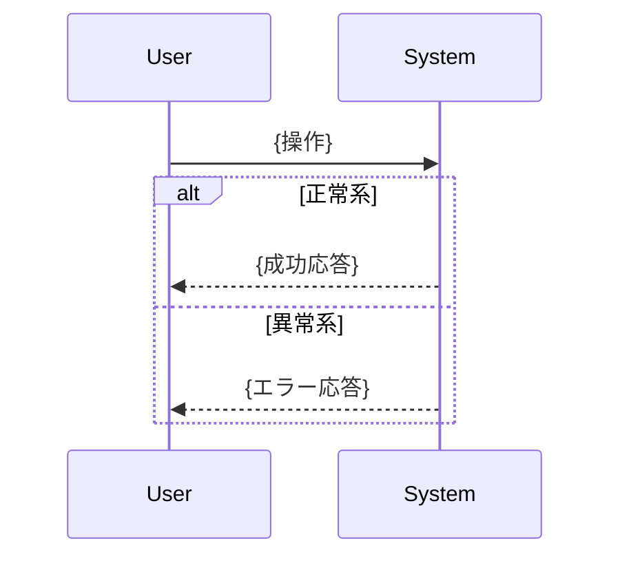

# {機能名} 仕様書

## 文書情報

| 項目       | 内容                          |
|:---------|:----------------------------|
| 機能名      | {機能名}                       |
| 作成日      | YYYY-MM-DD                  |
| ステータス    | Draft / Review / Approved |
| 関連ドキュメント | [PRD](.docs/requirement-diagram/{機能名}.md), [設計書](.docs/specification/{機能名}_design.md) |

## 背景

{なぜこの機能が必要か、解決する課題を記述}

## 概要

{この仕様書で定義する機能の概要を記述}

### 対象範囲

- {この仕様書がカバーする範囲1}
- {この仕様書がカバーする範囲2}

### 対象外

- {この仕様書ではカバーしない範囲}

## 機能要件

PRDの要求を実現するための機能要件を定義します。

### {機能カテゴリ1}

| 要件ID   | 要件                | 対応PRD要求              | 優先度                  |
|:-------|:------------------|:---------------------|:---------------------|
| SPEC-001 | {機能要件の説明}         | FR-001, FR-002       | Must / Should / Could |
| SPEC-002 | {機能要件の説明}         | FR-003               | Must / Should / Could |

#### SPEC-001: {要件名}

**説明**: {詳細な説明}

**入力**:
- {入力パラメータ1}: {型} - {説明}
- {入力パラメータ2}: {型} - {説明}

**出力**:
- {出力1}: {型} - {説明}

**振る舞い**:
1. {ステップ1}
2. {ステップ2}
3. {ステップ3}

**エラーケース**:
- {エラー条件1}: {対応}
- {エラー条件2}: {対応}

### {機能カテゴリ2}

| 要件ID   | 要件        | 対応PRD要求 | 優先度                  |
|:-------|:----------|:--------|:---------------------|
| SPEC-003 | {機能要件の説明} | FR-004  | Must / Should / Could |

## API

公開インターフェースを SysML ブロック定義図（bdd）形式で定義します。

### ブロック定義図

```mermaid
classDiagram
    class {機能名}Service {
        <<block>>
        +operation1(param1: Type1): ReturnType1
        +operation2(param2: Type2): ReturnType2
    }

    class {関連ブロック1} {
        <<block>>
        +property1: Type
        +property2: Type
    }

    class {関連ブロック2} {
        <<block>>
        +property1: Type
    }

    {機能名}Service --> {関連ブロック1} : uses
    {機能名}Service --> {関連ブロック2} : produces
```

### インターフェース定義

#### {操作名1}

```typescript
/**
 * {操作の説明}
 * @param {param1} - {パラメータの説明}
 * @returns {戻り値の説明}
 * @throws {エラー条件}
 */
function operation1(param1: Type1): ReturnType1;
```

**制約事項**:
- {制約1}
- {制約2}

#### {操作名2}

```typescript
function operation2(param2: Type2): ReturnType2;
```

## データモデル

### 型定義

```typescript
/**
 * {型の説明}
 */
interface {TypeName1} {
  /** {フィールドの説明} */
  field1: string;
  /** {フィールドの説明} */
  field2: number;
  /** {フィールドの説明} */
  field3?: OptionalType;
}

/**
 * {型の説明}
 */
interface {TypeName2} {
  field1: Type;
  field2: Type;
}

/**
 * {列挙型の説明}
 */
type {EnumName} = 'value1' | 'value2' | 'value3';
```

### エンティティ関係図

```mermaid
erDiagram
    {Entity1} ||--o{ {Entity2} : "has"
    {Entity1} {
        string id PK
        string name
        datetime createdAt
    }
    {Entity2} {
        string id PK
        string entity1Id FK
        string value
    }
```

## 振る舞い

### ユースケース1: {ユースケース名}

```mermaid
sequenceDiagram
    participant User
    participant System
    participant {ExternalService}

    User->>System: {操作1}
    System->>System: {内部処理}
    System->>>{ExternalService}: {外部呼び出し}
    {ExternalService}-->>System: {応答}
    System-->>User: {結果}
```

**前提条件**:
- {前提条件1}
- {前提条件2}

**事後条件**:
- {事後条件1}
- {事後条件2}

### ユースケース2: {ユースケース名}



## 状態遷移（該当する場合）

```mermaid
stateDiagram-v2
    [*] --> {初期状態}
    {初期状態} --> {状態1} : {イベント1}
    {状態1} --> {状態2} : {イベント2}
    {状態2} --> {状態1} : {イベント3}
    {状態2} --> [*] : {終了イベント}
```

| 状態     | 説明           | 遷移可能な状態        |
|:-------|:-------------|:----------------|
| {初期状態} | {状態の説明}      | {状態1}           |
| {状態1}  | {状態の説明}      | {状態2}           |
| {状態2}  | {状態の説明}      | {状態1}, 終了      |

## 制約事項

### 機能的制約

- {機能的な制約1}
- {機能的な制約2}

### 非機能的制約（PRD NFR参照）

| 制約        | 要件                 | 対応NFR   |
|:----------|:-------------------|:--------|
| パフォーマンス   | {具体的な要件}           | NFR-001 |
| セキュリティ    | {具体的な要件}           | NFR-002 |
| 可用性       | {具体的な要件}           | NFR-003 |

## 用語集

| 用語    | 定義                     |
|:------|:-----------------------|
| {用語1} | {定義}                   |
| {用語2} | {定義}                   |

## PRD参照

- 対応PRD: `.docs/requirement-diagram/{機能名}.md`
- カバーする要求: {UR-001, FR-001, FR-002, NFR-001, ...}

### 要求トレーサビリティマトリクス

| PRD要求ID | 本仕様書での対応        | ステータス   |
|:--------|:----------------|:--------|
| UR-001  | SPEC-001, SPEC-002 | カバー済み |
| FR-001  | SPEC-001        | カバー済み   |
| FR-002  | SPEC-002        | カバー済み   |
| NFR-001 | 制約事項に記載         | カバー済み   |

---

## 変更履歴

| 日付         | バージョン | 変更内容   | 変更者  |
|:-----------|:------|:-------|:-----|
| YYYY-MM-DD | 1.0   | 初版作成   | {名前} |
