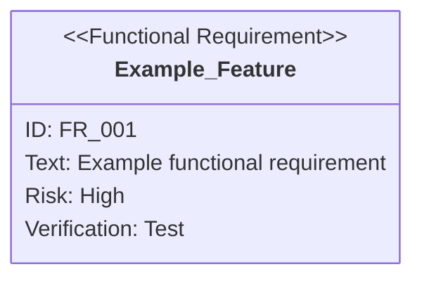

# Creating Requirement Diagrams in Mermaid Notation

## Basic Syntax

When describing requirement diagrams in Markdown, use Mermaid's `requirementDiagram` syntax.

```
requirementDiagram
    requirement <requirement-name> {
        id: <requirement-ID>
        text: <requirement-description>
        risk: <risk-level>
        verifymethod: <verification-method>
    }
```

## Attribute Value Notation Rules

**Important: Write all in lowercase**

### Risk Level (risk)

| Value    | Meaning                                      |
|:---------|:---------------------------------------------|
| `high`   | High risk (business-critical, difficult to implement) |
| `medium` | Medium risk (important but alternatives exist) |
| `low`    | Low risk (nice to have)                      |

### Verification Method (verifymethod)

| Value           | Meaning                    | Description                         |
|:----------------|:---------------------------|:------------------------------------|
| `analysis`      | Verification by analysis   | Design review, static analysis, etc. |
| `test`          | Verification by testing    | Unit test, integration test, E2E test |
| `demonstration` | Verification by demonstration | Operation verification on actual device |
| `inspection`    | Verification by inspection | Code review, document review        |

## Example



## Common Mistakes

| Incorrect                | Correct                     | Explanation                      |
|:------------------------|:----------------------------|:---------------------------------|
| `risk: High`            | `risk: high`                | Attribute values in lowercase    |
| `risk: HIGH`            | `risk: high`                | Cannot use uppercase             |
| `verifymethod: Test`    | `verifymethod: test`        | Attribute values in lowercase    |
| `text: description`     | `text: "description"`       | Enclose text in quotes           |
| `requirement name with space` | `requirement_name_with_underscore` | Cannot use spaces in requirement names (use symbols instead) |
