# Mermaid Notation Rules

Mermaid is a JavaScript-based tool that creates diagrams from markdown-like text syntax. This guide covers the essential syntax rules for creating diagrams in AI-SDD workflow documentation.

## Dark Theme Configuration

All diagrams should use dark theme for consistency. Add this directive at the beginning of each diagram:

```
%%{init: {'theme': 'dark'}}%%
```

---

## 1. Flowchart Syntax

Flowcharts are the most versatile diagram type, used for process flows, use case diagrams, and general visualizations.

### Diagram Direction

| Direction | Description       | Example                    |
|:----------|:------------------|:---------------------------|
| `TB`      | Top to Bottom     | Vertical flow (default)    |
| `TD`      | Top Down          | Same as TB                 |
| `BT`      | Bottom to Top     | Reverse vertical flow      |
| `LR`      | Left to Right     | Horizontal flow            |
| `RL`      | Right to Left     | Reverse horizontal flow    |

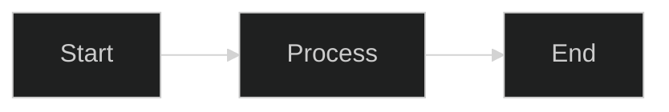

### Node Shapes

| Shape                | Syntax              | Use Case                       |
|:---------------------|:--------------------|:-------------------------------|
| Rectangle            | `[text]`            | Process, action                |
| Round edges          | `(text)`            | Start/End, general             |
| Stadium (pill)       | `([text])`          | Use cases (oval-like)          |
| Subroutine           | `[[text]]`          | Predefined process             |
| Cylinder             | `[(text)]`          | Database                       |
| Circle               | `((text))`          | Actors, connectors             |
| Asymmetric           | `>text]`            | Input/Output                   |
| Rhombus (diamond)    | `{text}`            | Decision                       |
| Hexagon              | `{{text}}`          | Preparation                    |
| Parallelogram        | `[/text/]`          | Input                          |
| Parallelogram alt    | `[\text\]`          | Output                         |
| Trapezoid            | `[/text\]`          | Manual operation               |
| Trapezoid alt        | `[\text/]`          | Manual operation               |
| Double circle        | `(((text)))`        | Double circle                  |


### Link Types

| Type              | Syntax            | Description                    |
|:------------------|:------------------|:-------------------------------|
| Arrow             | `-->`             | Standard directed link         |
| Open link         | `---`             | Undirected connection          |
| Dotted arrow      | `-.->`            | Dependency, optional           |
| Dotted line       | `-.-`             | Weak connection                |
| Thick arrow       | `==>`             | Strong/main flow               |
| Thick line        | `===`             | Strong undirected              |
| Invisible         | `~~~`             | Layout control (no line)       |

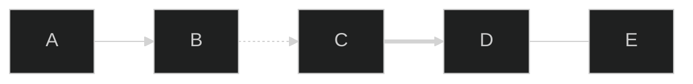

### Link Labels

Add text to links using `|text|` syntax:

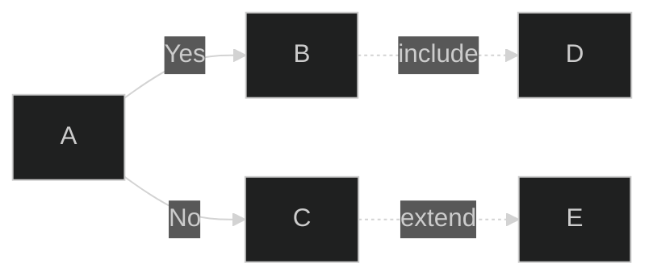

### Link Length

Control link length with additional dashes or equals:

| Length  | Syntax      | Description        |
|:--------|:------------|:-------------------|
| Normal  | `-->`       | Default length     |
| Long    | `--->`      | Longer link        |
| Longer  | `---->`     | Even longer        |

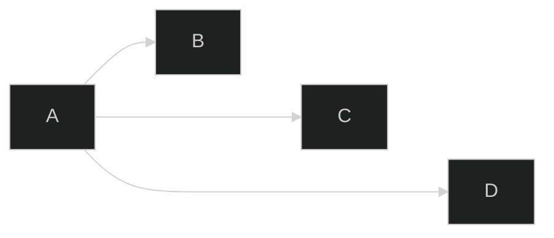

### Subgraphs (System Boundary)

Group nodes using subgraphs:


Nested subgraphs are supported:

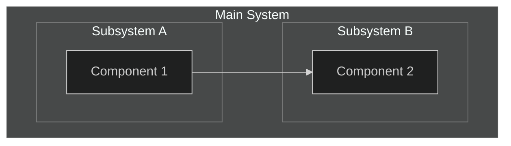

### Special Characters in Text

Use quotes for text with special characters:

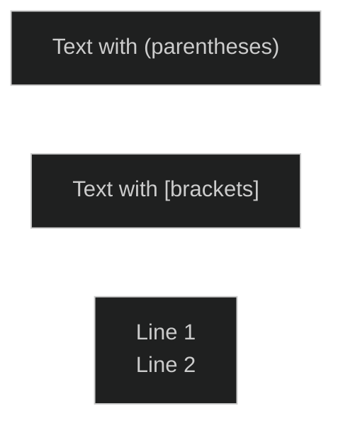

### Node IDs and Display Text

Separate ID from display text:


---

## 2. Requirement Diagram Syntax

For formal requirement diagrams, use the `requirementDiagram` type.

### Basic Structure

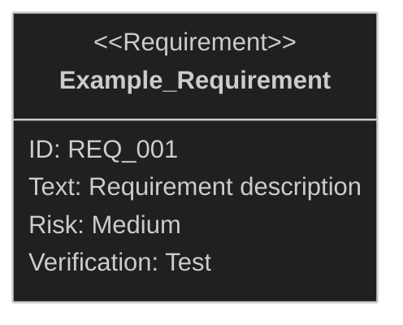

### Requirement Types

| Type                     | Description             | Example                          |
|:-------------------------|:------------------------|:---------------------------------|
| `requirement`            | General requirement     | Overall system requirements      |
| `functionalRequirement`  | Functional requirement  | Display function, operation      |
| `performanceRequirement` | Performance requirement | Response time, throughput        |
| `interfaceRequirement`   | Interface requirement   | API design, UI components        |
| `physicalRequirement`    | Physical requirement    | Size, weight constraints         |
| `designConstraint`       | Design constraint       | Technology stack, architecture   |

### Attribute Values

**Important: Write all attribute values in lowercase**

#### Risk Level (risk)

| Value    | Meaning                                               |
|:---------|:------------------------------------------------------|
| `high`   | High risk (business-critical, difficult to implement) |
| `medium` | Medium risk (important but alternatives exist)        |
| `low`    | Low risk (nice to have)                               |

#### Verification Method (verifymethod)

| Value           | Meaning                       | Description                             |
|:----------------|:------------------------------|:----------------------------------------|
| `analysis`      | Verification by analysis      | Design review, static analysis          |
| `test`          | Verification by testing       | Unit test, integration test, E2E test   |
| `demonstration` | Verification by demonstration | Operation verification on actual device |
| `inspection`    | Verification by inspection    | Code review, document review            |

### Relationship Types

| Relationship | Notation                            | Meaning                              |
|:-------------|:------------------------------------|:-------------------------------------|
| `contains`   | `A - contains -> B`                 | A contains B (parent-child)          |
| `derives`    | `A - derives -> B`                  | A derives from B                     |
| `satisfies`  | `A - satisfies -> B`                | A satisfies requirement B            |
| `verifies`   | `A - verifies -> B`                 | A verifies requirement B             |
| `refines`    | `A - refines -> B`                  | A refines requirement B              |
| `traces`     | `A - traces -> B`                   | A traces to B                        |
| `copies`     | `A - copies -> B`                   | A copies from B                      |

### Elements (Non-requirement nodes)

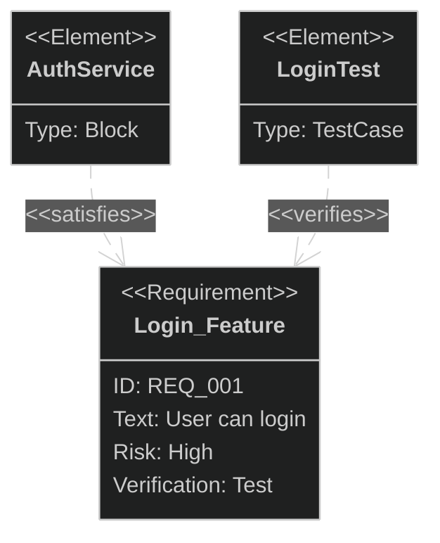

---

## 3. Styling

### Inline Node Styling

Apply styles directly to nodes:

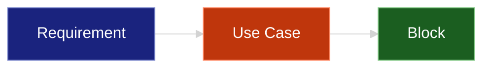

### Style Classes

Define reusable classes:

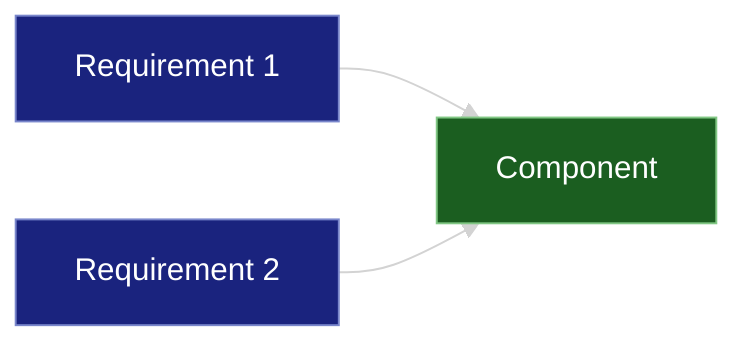

### Recommended Dark Theme Color Palette

| Element Type    | Fill Color | Stroke Color | Text Color |
|:----------------|:-----------|:-------------|:-----------|
| Requirement     | `#1a237e`  | `#7986cb`    | `#fff`     |
| Use Case        | `#bf360c`  | `#ff8a65`    | `#fff`     |
| Block/Component | `#1b5e20`  | `#81c784`    | `#fff`     |
| Actor           | `#4a148c`  | `#ba68c8`    | `#fff`     |
| Test Case       | `#006064`  | `#4dd0e1`    | `#fff`     |
| Rationale       | `#f57f17`  | `#ffee58`    | `#000`     |

---

## 4. Common Mistakes

| Incorrect                       | Correct                            | Explanation                           |
|:--------------------------------|:-----------------------------------|:--------------------------------------|
| `risk: High`                    | `risk: high`                       | Attribute values in lowercase         |
| `verifymethod: Test`            | `verifymethod: test`               | Attribute values in lowercase         |
| `text: description`             | `text: "description"`              | Enclose text in quotes                |
| `requirement name with space`   | `requirement_name_with_underscore` | No spaces in names (use underscores)  |
| `User((User))` without flowchart| `flowchart LR` then `User((User))` | Must declare diagram type first       |
| `--include-->`                  | `-. include .->`                   | Use dotted syntax for stereotypes     |
| `<<include>>`                   | `include` (as label)               | Mermaid doesn't support UML syntax    |
| Missing `end` for subgraph      | Always close with `end`            | Each subgraph needs matching end      |
| Spaces in node IDs              | `Create_Task` or `CreateTask`      | Use underscores or camelCase          |

---

## 5. Complete Example

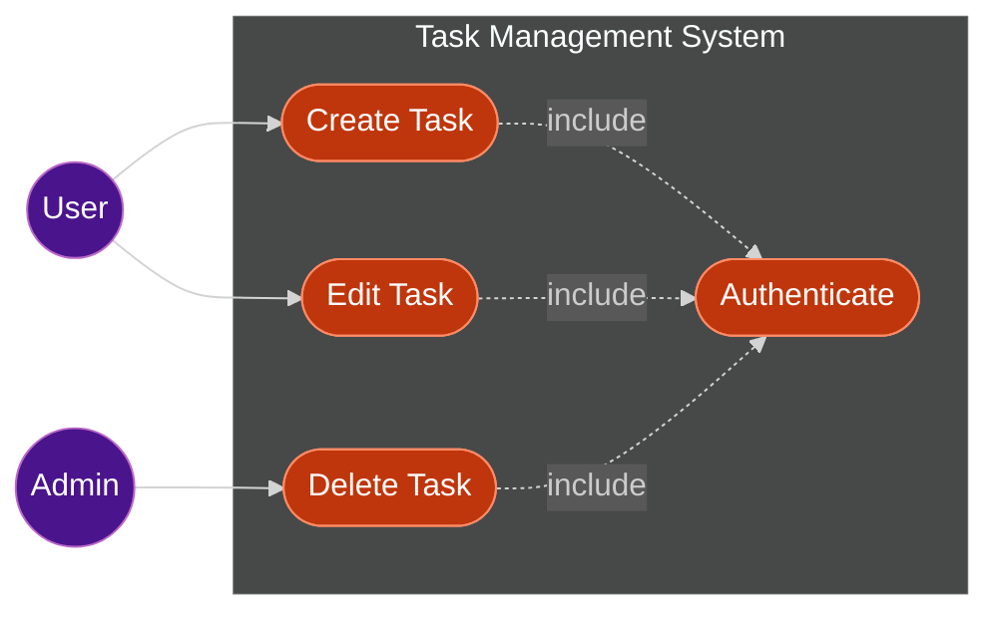

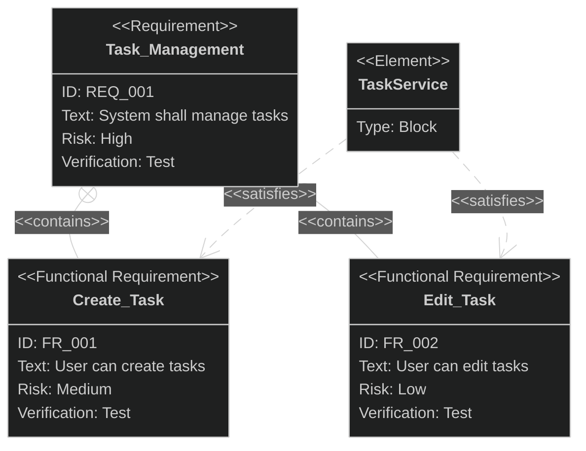

---

## References

- [Mermaid Official Documentation](https://mermaid.js.org/)
- [Mermaid Live Editor](https://mermaid.live/)
- [GitHub Mermaid Support](https://docs.github.com/en/get-started/writing-on-github/working-with-advanced-formatting/creating-diagrams)
