# Mermaid Notation Rules

Mermaid is a JavaScript-based tool that creates diagrams from markdown-like text syntax. This guide covers the essential
syntax rules for creating diagrams in AI-SDD workflow documentation.

## Dark Theme Configuration

All diagrams should use dark theme for consistency. Add this directive at the beginning of each diagram:

```
%%{init: {'theme': 'dark'}}%%
```

---

## 1. Flowchart Syntax

Flowcharts are the most versatile diagram type, used for process flows, use case diagrams, and general visualizations.

### Diagram Direction

| Direction | Description   | Example                 |
|:----------|:--------------|:------------------------|
| `TB`      | Top to Bottom | Vertical flow (default) |
| `TD`      | Top Down      | Same as TB              |
| `BT`      | Bottom to Top | Reverse vertical flow   |
| `LR`      | Left to Right | Horizontal flow         |
| `RL`      | Right to Left | Reverse horizontal flow |

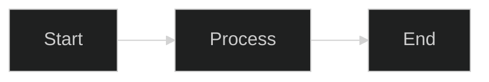

### Node Shapes

| Shape             | Syntax       | Use Case              |
|:------------------|:-------------|:----------------------|
| Rectangle         | `[text]`     | Process, action       |
| Round edges       | `(text)`     | Start/End, general    |
| Stadium (pill)    | `([text])`   | Use cases (oval-like) |
| Subroutine        | `[[text]]`   | Predefined process    |
| Cylinder          | `[(text)]`   | Database              |
| Circle            | `((text))`   | Actors, connectors    |
| Asymmetric        | `>text]`     | Input/Output          |
| Rhombus (diamond) | `{text}`     | Decision              |
| Hexagon           | `{{text}}`   | Preparation           |
| Parallelogram     | `[/text/]`   | Input                 |
| Parallelogram alt | `[\text\]`   | Output                |
| Trapezoid         | `[/text\]`   | Manual operation      |
| Trapezoid alt     | `[\text/]`   | Manual operation      |
| Double circle     | `(((text)))` | Double circle         |

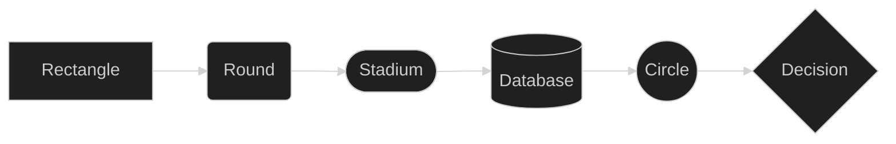

### Link Types

| Type         | Syntax | Description              |
|:-------------|:-------|:-------------------------|
| Arrow        | `-->`  | Standard directed link   |
| Open link    | `---`  | Undirected connection    |
| Dotted arrow | `-.->` | Dependency, optional     |
| Dotted line  | `-.-`  | Weak connection          |
| Thick arrow  | `==>`  | Strong/main flow         |
| Thick line   | `===`  | Strong undirected        |
| Invisible    | `~~~`  | Layout control (no line) |

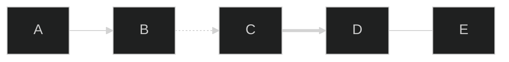

### Link Labels

Add text to links using `|text|` syntax:

> **Note**: `<` and `>` characters in labels must be escaped using HTML entities.
> Write `&lt;&lt;include&gt;&gt;` to display `<<include>>` correctly.

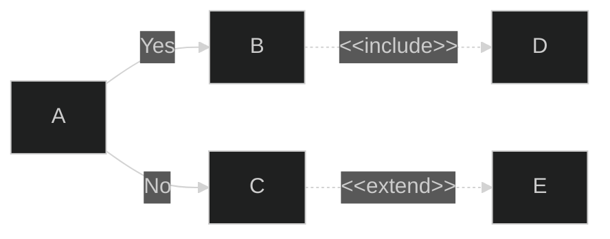

### Link Length

Control link length with additional dashes or equals:

| Length | Syntax  | Description    |
|:-------|:--------|:---------------|
| Normal | `-->`   | Default length |
| Long   | `--->`  | Longer link    |
| Longer | `---->` | Even longer    |

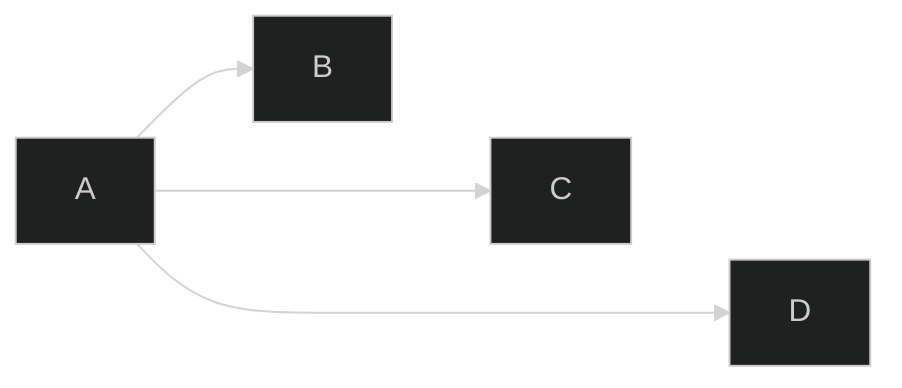

### Subgraphs (System Boundary)

Group nodes using subgraphs:

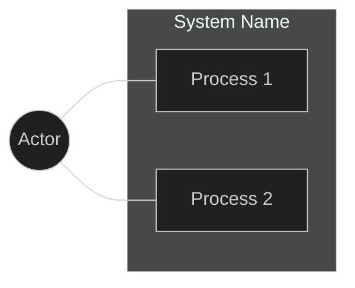

Nested subgraphs are supported:

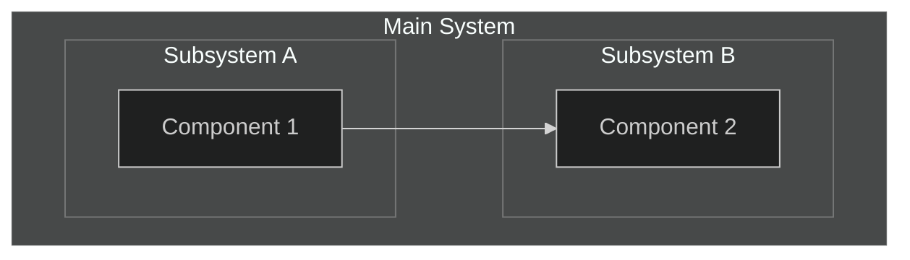

### Special Characters in Text

Use quotes for text with special characters:

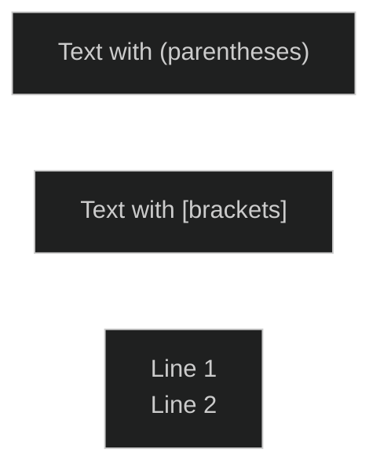

### Node IDs and Display Text

Separate ID from display text:

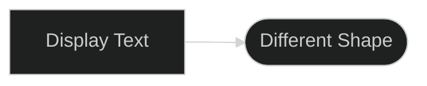

---

## 2. Class Diagram Syntax

Class diagrams describe the structure of a system by showing classes, their attributes, operations (methods), and
relationships.

### Basic Structure

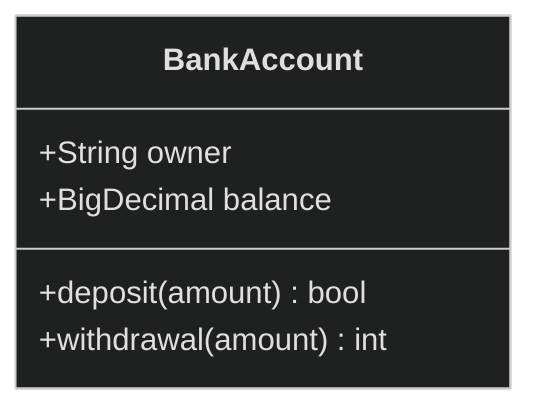

### Defining a Class

Two ways to define a class:

1. **Using `class` keyword:**

```
class Animal
```

2. **Via a relationship:**

```
Vehicle <|-- Car
```

### Class Labels

Provide a label for a class:

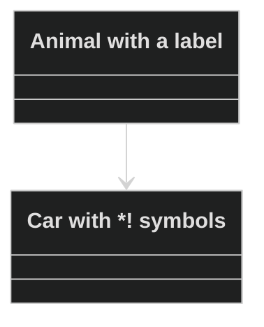

### Defining Members

**Using colon syntax:**

```
BankAccount : +String owner
BankAccount : +deposit(amount)
```

**Using curly braces:**

```
class BankAccount{
    +String owner
    +deposit(amount)
}
```

### Return Type

Specify return type after the method definition:


### Generic Types

Use tilde `~` to denote generics:

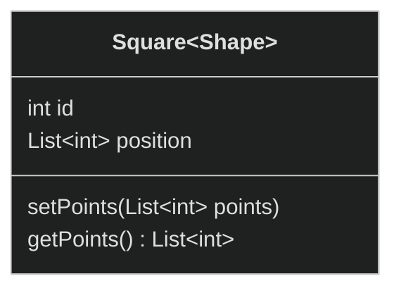

### Visibility

| Symbol | Meaning          |
|:-------|:-----------------|
| `+`    | Public           |
| `-`    | Private          |
| `#`    | Protected        |
| `~`    | Package/Internal |

Additional classifiers:

- `*` Abstract (e.g., `someAbstractMethod()*`)
- `$` Static (e.g., `someStaticMethod()$`)

### Relationships

| Type    | Description   |
|:--------|:--------------|
| `<\|--` | Inheritance   |
| `*--`   | Composition   |
| `o--`   | Aggregation   |
| `-->`   | Association   |
| `--`    | Link (Solid)  |
| `..>`   | Dependency    |
| `..\|>` | Realization   |
| `..`    | Link (Dashed) |

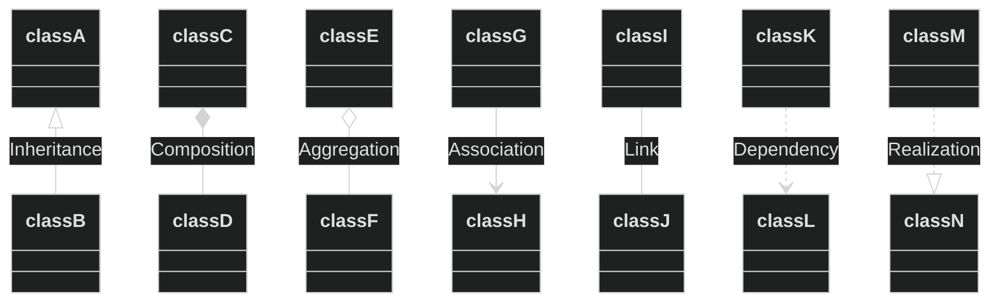

### Labels on Relations

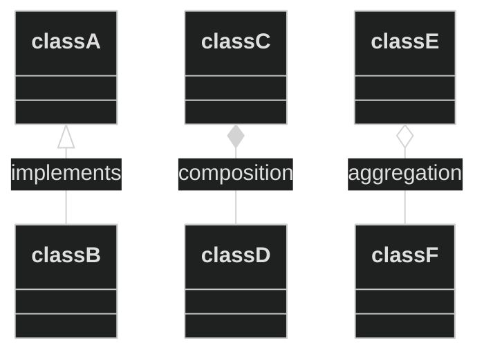

### Cardinality / Multiplicity

| Notation | Meaning       |
|:---------|:--------------|
| `1`      | Only 1        |
| `0..1`   | Zero or One   |
| `1..*`   | One or more   |
| `*`      | Many          |
| `n`      | n (where n>1) |
| `0..n`   | zero to n     |
| `1..n`   | one to n      |

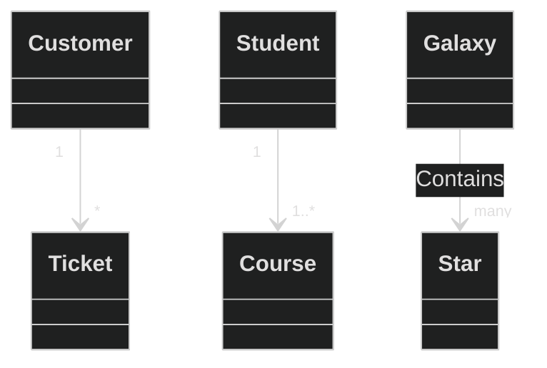

### Annotations on Classes

| Annotation        | Description     |
|:------------------|:----------------|
| `<<Interface>>`   | Interface class |
| `<<Abstract>>`    | Abstract class  |
| `<<Service>>`     | Service class   |
| `<<Enumeration>>` | Enum            |

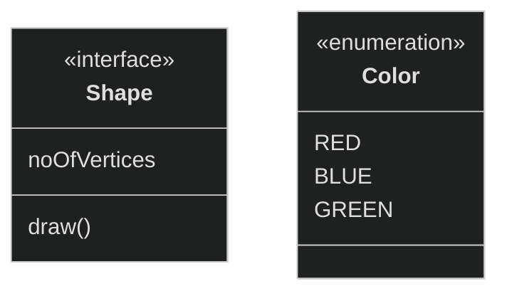

### Namespace

Group classes using namespace:

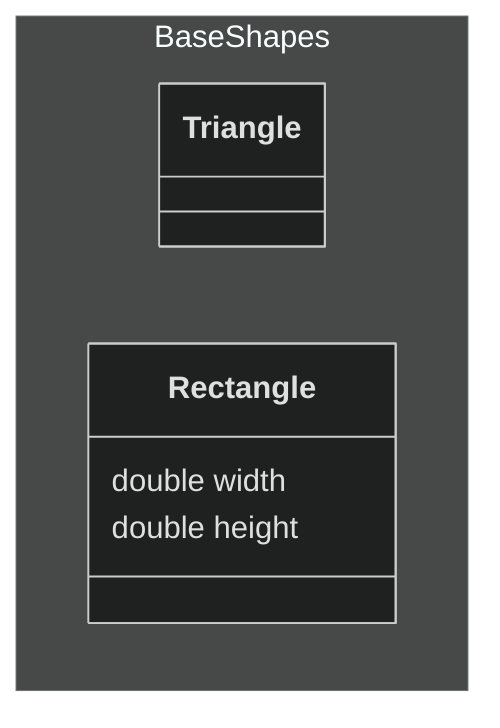

### Direction

Use `direction` statement to set a diagram direction:

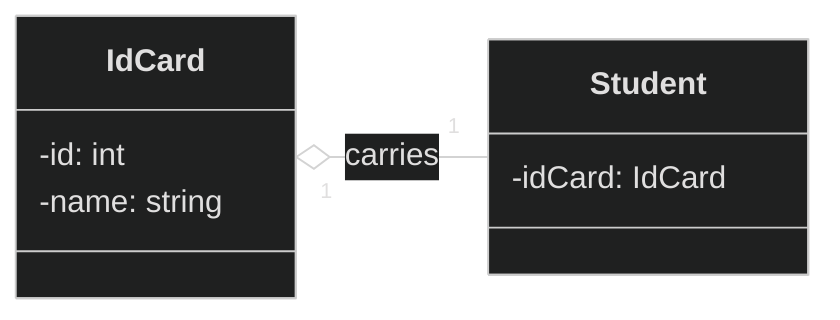

### Notes

Add notes using `note` keyword:

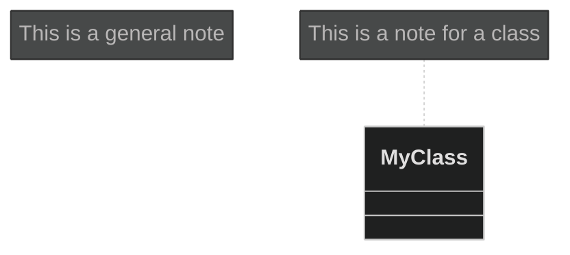

### Styling

**Direct styling:**

```mermaid
%%{init: {'theme': 'dark'}}%%
classDiagram
    class Animal
    class Mineral
    style Animal fill:#1a237e,stroke:#7986cb,color:#fff
    style Mineral fill:#1b5e20,stroke:#81c784,color:#fff
```

---

## 3. Sequence Diagram Syntax

Sequence diagrams show how processes operate with one another and in what order.

### Basic Syntax

```mermaid
%%{init: {'theme': 'dark'}}%%
sequenceDiagram
    Alice ->> John: Hello John, how are you?
    John -->> Alice: Great!
    Alice -) John: See you later!
```

### Participants

Define participants explicitly:

```mermaid
%%{init: {'theme': 'dark'}}%%
sequenceDiagram
    participant Alice
    participant Bob
    Bob ->> Alice: Hi Alice
    Alice ->> Bob: Hi Bob
```

### Actors

Use actor symbol instead of rectangle:

```mermaid
%%{init: {'theme': 'dark'}}%%
sequenceDiagram
    actor Alice
    actor Bob
    Alice ->> Bob: Hi Bob
    Bob ->> Alice: Hi Alice
```

### Participant Types

> **Note**: Participant types (boundary, control, entity, database, collections, queue) require **Mermaid 11.5+**.
> GitHub and older renderers may not support this syntax.

| Type        | Description                           |
|:------------|:--------------------------------------|
| Boundary    | System boundary / interface component |
| Control     | Controller / business logic component |
| Entity      | Data entity / domain object           |
| Database    | Database / persistent storage         |
| Collections | Collection / aggregate                |
| Queue       | Message queue / async handler         |

**Syntax (Mermaid 11.5+)**:

```
participant Name@{ "type" : "database" }
```

**Standard Alternative** (all versions):

```mermaid
%%{init: {'theme': 'dark'}}%%
sequenceDiagram
    participant DB as Database
    participant App as Application
    App ->> DB: Query
    DB -->> App: Result
```

### Aliases

```mermaid
%%{init: {'theme': 'dark'}}%%
sequenceDiagram
    participant A as Alice
    participant J as John
    A ->> J: Hello John, how are you?
    J ->> A: Great!
```

### Message Arrow Types

| Type     | Description                               |
|:---------|:------------------------------------------|
| `->`     | Solid line without arrow                  |
| `-->`    | Dotted line without arrow                 |
| `->>`    | Solid line with arrowhead                 |
| `-->>`   | Dotted line with arrowhead                |
| `<<->>`  | Solid line with bidirectional arrowheads  |
| `<<-->>` | Dotted line with bidirectional arrowheads |
| `-x`     | Solid line with a cross at the end        |
| `--x`    | Dotted line with a cross at the end       |
| `-)`     | Solid line with an open arrow (async)     |
| `--)`    | Dotted line with an open arrow (async)    |

### Activations

```mermaid
%%{init: {'theme': 'dark'}}%%
sequenceDiagram
    Alice ->> John: Hello John, how are you?
    activate John
    John -->> Alice: Great!
    deactivate John
```

Shortcut notation with `+` / `-`:

```mermaid
%%{init: {'theme': 'dark'}}%%
sequenceDiagram
    Alice ->>+ John: Hello John, how are you?
    John -->>- Alice: Great!
```

Stacked activations:

```mermaid
%%{init: {'theme': 'dark'}}%%
sequenceDiagram
    Alice ->>+ John: Hello John, how are you?
    Alice ->>+ John: John, can you hear me?
    John -->>- Alice: Hi Alice, I can hear you!
    John -->>- Alice: I feel great!
```

### Notes

```mermaid
%%{init: {'theme': 'dark'}}%%
sequenceDiagram
    participant John
    Note right of John: Text in note
```

Notes spanning two participants:

```mermaid
%%{init: {'theme': 'dark'}}%%
sequenceDiagram
    Alice -> John: Hello John, how are you?
    Note over Alice, John: A typical interaction
```

### Line Breaks

Use `<br/>` for line breaks:

```mermaid
%%{init: {'theme': 'dark'}}%%
sequenceDiagram
    Alice -> John: Hello John,<br/>how are you?
    Note over Alice, John: A typical interaction<br/>But now in two lines
```

### Loops

```mermaid
%%{init: {'theme': 'dark'}}%%
sequenceDiagram
    Alice -> John: Hello John, how are you?
    loop Every minute
        John --> Alice: Great!
    end
```

### Alternatives (Alt)

```mermaid
%%{init: {'theme': 'dark'}}%%
sequenceDiagram
    Alice ->> Bob: Hello Bob, how are you?
    alt is sick
        Bob ->> Alice: Not so good :(
    else is well
        Bob ->> Alice: Feeling fresh like a daisy
    end
    opt Extra response
        Bob ->> Alice: Thanks for asking
    end
```

### Parallel

```mermaid
%%{init: {'theme': 'dark'}}%%
sequenceDiagram
    par Alice to Bob
        Alice ->> Bob: Hello guys!
    and Alice to John
        Alice ->> John: Hello guys!
    end
    Bob -->> Alice: Hi Alice!
    John -->> Alice: Hi Alice!
```

### Critical Region

```mermaid
%%{init: {'theme': 'dark'}}%%
sequenceDiagram
    critical Establish a connection to the DB
        Service --> DB: connect
    option Network timeout
        Service --> Service: Log error
    option Credentials rejected
        Service --> Service: Log different error
    end
```

### Break

```mermaid
%%{init: {'theme': 'dark'}}%%
sequenceDiagram
    Consumer --> API: Book something
    API --> BookingService: Start booking process
    break when the booking process fails
        API --> Consumer: show failure
    end
    API --> BillingService: Start billing process
```

### Background Highlighting

```mermaid
%%{init: {'theme': 'dark'}}%%
sequenceDiagram
    participant Alice
    participant John
    rect rgb(50, 50, 100)
        note right of Alice: Alice calls John.
        Alice ->>+ John: Hello John, how are you?
        rect rgb(80, 50, 100)
            Alice ->>+ John: John, can you hear me?
            John -->>- Alice: Hi Alice, I can hear you!
        end
        John -->>- Alice: I feel great!
    end
    Alice ->>+ John: Did you want to go to the game tonight?
    John -->>- Alice: Yeah! See you there.
```

### Grouping / Box

```mermaid
%%{init: {'theme': 'dark'}}%%
sequenceDiagram
    box rgb(50, 50, 100) Alice & John
        participant A
        participant J
    end
    box rgb(80, 50, 100) Another Group
        participant B
        participant C
    end
    A ->> J: Hello John, how are you?
    J ->> A: Great!
    A ->> B: Hello Bob, how is Charley?
    B ->> C: Hello Charley, how are you?
```

### Sequence Numbers

```mermaid
%%{init: {'theme': 'dark'}}%%
sequenceDiagram
    autonumber
    Alice ->> John: Hello John, how are you?
    loop HealthCheck
        John ->> John: Fight against hypochondria
    end
    Note right of John: Rational thoughts!
    John -->> Alice: Great!
    John ->> Bob: How about you?
    Bob -->> John: Jolly good!
```

### Actor Creation and Destruction

```mermaid
%%{init: {'theme': 'dark'}}%%
sequenceDiagram
    Alice ->> Bob: Hello Bob, how are you ?
    Bob ->> Alice: Fine, thank you. And you?
    create participant Carl
    Alice ->> Carl: Hi Carl!
    create actor D as Donald
    Carl ->> D: Hi!
    destroy Carl
    Alice -x Carl: We are too many
    destroy Bob
    Bob ->> Alice: I agree
```

---

## 4. Requirement Diagram Syntax

For formal requirement diagrams, use the `requirementDiagram` type. The modeling specs follow those defined by SysML
v1.6.

### Three Components

A requirement diagram has three types of components:

1. **Requirement** - The requirement definition
2. **Element** - External elements (blocks, test cases, etc.)
3. **Relationship** - Connections between requirements and elements

### Basic Structure

```mermaid
%%{init: {'theme': 'dark'}}%%
requirementDiagram
    requirement Example_Requirement {
        id: REQ_001
        text: "Requirement description"
        risk: medium
        verifymethod: test
    }

    element Example_Element {
        type: simulation
    }

    Example_Element - satisfies -> Example_Requirement
```

### Requirement Definition

```
<type> user_defined_name {
    id: user_defined_id
    text: user_defined_text
    risk: <risk>
    verifymethod: <method>
}
```

### Requirement Types

| Type                     | Description             | Example                        |
|:-------------------------|:------------------------|:-------------------------------|
| `requirement`            | General requirement     | Overall system requirements    |
| `functionalRequirement`  | Functional requirement  | Display function, operation    |
| `performanceRequirement` | Performance requirement | Response time, throughput      |
| `interfaceRequirement`   | Interface requirement   | API design, UI components      |
| `physicalRequirement`    | Physical requirement    | Size, weight constraints       |
| `designConstraint`       | Design constraint       | Technology stack, architecture |

### Attribute Values

**Important: Attribute values are case-insensitive but lowercase is recommended**

#### Risk Level (risk)

| Value    | Meaning                                               |
|:---------|:------------------------------------------------------|
| `low`    | Low risk (nice to have)                               |
| `medium` | Medium risk (important but alternatives exist)        |
| `high`   | High risk (business-critical, difficult to implement) |

#### Verification Method (verifymethod)

| Value           | Meaning                       | Description                             |
|:----------------|:------------------------------|:----------------------------------------|
| `analysis`      | Verification by analysis      | Design review, static analysis          |
| `inspection`    | Verification by inspection    | Code review, document review            |
| `test`          | Verification by testing       | Unit test, integration test, E2E test   |
| `demonstration` | Verification by demonstration | Operation verification on actual device |

### Element Definition

Elements connect requirements to portions of other documents (blocks, test cases, etc.):

```
element user_defined_name {
    type: user_defined_type
    docref: user_defined_ref
}
```

| Attribute | Description                                 | Example                                |
|:----------|:--------------------------------------------|:---------------------------------------|
| `type`    | Type of element (user-defined)              | `simulation`, `word doc`, `test suite` |
| `docref`  | Document reference (optional, user-defined) | `reqs/test_entity`, `github.com/repo`  |

```mermaid
%%{init: {'theme': 'dark'}}%%
requirementDiagram
    element Test_Suite {
        type: "test suite"
        docref: "github.com/project/tests"
    }

    element Design_Doc {
        type: "word doc"
        docref: "docs/design.docx"
    }
```

### Relationship Types

| Relationship | Notation             | Meaning                     |
|:-------------|:---------------------|:----------------------------|
| `contains`   | `A - contains -> B`  | A contains B (parent-child) |
| `copies`     | `A - copies -> B`    | A copies from B             |
| `derives`    | `A - derives -> B`   | A derives from B            |
| `satisfies`  | `A - satisfies -> B` | A satisfies requirement B   |
| `verifies`   | `A - verifies -> B`  | A verifies requirement B    |
| `refines`    | `A - refines -> B`   | A refines requirement B     |
| `traces`     | `A - traces -> B`    | A traces to B               |

#### Bidirectional Notation

Relationships can be written in either direction:

```
{source} - <type> -> {destination}
{destination} <- <type> - {source}
```

Both are equivalent:

```
test_entity - satisfies -> test_req
test_req <- satisfies - test_entity
```

### Markdown Formatting in Text

Text fields support markdown formatting inside quotes:

```mermaid
%%{init: {'theme': 'dark'}}%%
requirementDiagram
    requirement Formatted_Req {
        id: 1
        text: "the *italicized* and **bold** text"
        risk: high
        verifymethod: test
    }
```

**Note**: Use quotes for text containing special characters or markdown.

### Styling Requirement Diagrams

> **Note**: Native styling (`style`, `classDef`, `direction`) in `requirementDiagram` is **not yet supported** in most
> Mermaid renderers (including GitHub). Use `flowchart` for styled requirement visualizations.

**For styled requirements, use the flowchart instead:**

```mermaid
%%{init: {'theme': 'dark'}}%%
flowchart TB
    REQ1["《requirement》<br/>High Risk Requirement"]
    REQ2["《requirement》<br/>Low Risk Requirement"]
    ELEM["《element》<br/>Implementation"]
    ELEM -->|satisfies| REQ1
    REQ2 -->|derives| REQ1
    classDef important fill:#bf360c,stroke:#ff8a65,color:#fff,stroke-width:2px
    classDef normal fill:#1a237e,stroke:#7986cb,color:#fff
    classDef element fill:#1b5e20,stroke:#81c784,color:#fff
    class REQ1 important
    class REQ2 normal
    class ELEM element
```

---

## 5. Flowchart Styling

### Inline Node Styling

Apply styles directly to nodes:

```mermaid
%%{init: {'theme': 'dark'}}%%
flowchart LR
    A[Requirement]
    B[Use Case]
    C[Block]
    style A fill:#1a237e,stroke:#7986cb,color:#fff
    style B fill:#bf360c,stroke:#ff8a65,color:#fff
    style C fill:#1b5e20,stroke:#81c784,color:#fff
    A --> B --> C
```

### Style Classes

Define reusable classes:

```mermaid
%%{init: {'theme': 'dark'}}%%
flowchart LR
    A[Requirement 1]:::req
    B[Requirement 2]:::req
    C[Component]:::block
    A --> C
    B --> C
    classDef req fill:#1a237e,stroke:#7986cb,color:#fff
    classDef block fill:#1b5e20,stroke:#81c784,color:#fff
```

### Recommended Dark Theme Color Palette

| Element Type    | Fill Color | Stroke Color | Text Color |
|:----------------|:-----------|:-------------|:-----------|
| Requirement     | `#1a237e`  | `#7986cb`    | `#fff`     |
| Use Case        | `#bf360c`  | `#ff8a65`    | `#fff`     |
| Block/Component | `#1b5e20`  | `#81c784`    | `#fff`     |
| Actor           | `#4a148c`  | `#ba68c8`    | `#fff`     |
| Test Case       | `#006064`  | `#4dd0e1`    | `#fff`     |
| Rationale       | `#f57f17`  | `#ffee58`    | `#000`     |

---

## 6. Common Mistakes

| Incorrect                        | Correct                            | Explanation                          |
|:---------------------------------|:-----------------------------------|:-------------------------------------|
| `risk: High`                     | `risk: high`                       | Attribute values in lowercase        |
| `verifymethod: Test`             | `verifymethod: test`               | Attribute values in lowercase        |
| `text: description with space`   | `text: "description with space"`   | Use quotes for multi-word text       |
| `requirement name with space`    | `requirement_name_with_underscore` | No spaces in names (use underscores) |
| `User((User))` without flowchart | `flowchart LR` then `User((User))` | Must declare diagram type first      |
| `Actor --> UC` (association)     | `Actor --- UC`                     | Use solid line for associations      |
| `-. include .->`                 | `-.->│"<<include>>"│`              | Use dotted arrow with stereotype     |
| `-. extend .->`                  | `-.->│"<<extend>>"│`               | Use dotted arrow with stereotype     |
| Missing `end` for subgraph       | Always close with `end`            | Each subgraph needs matching end     |
| Spaces in node IDs               | `Create_Task` or `CreateTask`      | Use underscores or camelCase         |
| Unquoted text with keywords      | `text: "the analysis result"`      | Quote text containing keywords       |

---

## 7. Complete Examples

### Use Case Diagram (Flowchart)

```mermaid
%%{init: {'theme': 'dark'}}%%
flowchart LR
    User((User))
    Admin((Admin))

    subgraph System [Task Management System]
        UC1(["Create Task"])
        UC2(["Edit Task"])
        UC3(["Delete Task"])
        UC4(["Authenticate"])
    end

    User --- UC1
    User --- UC2
    Admin --- UC3
    UC1 -.->|"&lt;&lt;include&gt;&gt;"| UC4
    UC2 -.->|"&lt;&lt;include&gt;&gt;"| UC4
    UC3 -.->|"&lt;&lt;include&gt;&gt;"| UC4
    classDef actor fill:#4a148c,stroke:#ba68c8,color:#fff
    classDef usecase fill:#bf360c,stroke:#ff8a65,color:#fff
    class User,Admin actor
    class UC1,UC2,UC3,UC4 usecase
```

### Comprehensive Requirement Diagram

```mermaid
%%{init: {'theme': 'dark'}}%%
requirementDiagram
    requirement Task_Management {
        id: REQ_001
        text: "System shall manage tasks"
        risk: high
        verifymethod: test
    }

    functionalRequirement Create_Task {
        id: FR_001
        text: "User can create tasks"
        risk: medium
        verifymethod: test
    }

    performanceRequirement Response_Time {
        id: PR_001
        text: "Response time under 2 seconds"
        risk: low
        verifymethod: demonstration
    }

    interfaceRequirement API_Design {
        id: IR_001
        text: "RESTful API endpoints"
        risk: medium
        verifymethod: inspection
    }

    designConstraint Tech_Stack {
        id: DC_001
        text: "Use TypeScript and React"
        risk: low
        verifymethod: analysis
    }

    element TaskService {
        type: "Block"
        docref: "src/services/TaskService.ts"
    }

    element TaskAPI_Test {
        type: "test suite"
        docref: "tests/api/task.test.ts"
    }

    element Requirements_Doc {
        type: "word doc"
        docref: "docs/requirements.docx"
    }

    Task_Management - contains -> Create_Task
    Task_Management - contains -> Response_Time
    Create_Task - derives -> API_Design
    API_Design - refines -> Tech_Stack
    TaskService - satisfies -> Create_Task
    TaskService - satisfies -> API_Design
    TaskAPI_Test - verifies -> Create_Task
    Requirements_Doc - copies -> Task_Management
    Response_Time - traces -> Create_Task
```

### Class Diagram Example

```mermaid
%%{init: {'theme': 'dark'}}%%
classDiagram
    note "Animal Kingdom Example"
    Animal <|-- Duck
    note for Duck "can fly\ncan swim\ncan dive"
    Animal <|-- Fish
    Animal <|-- Zebra
    Animal: +int age
    Animal: +String gender
    Animal: +isMammal()
    Animal: +mate()
    class Duck {
        +String beakColor
        +swim()
        +quack()
    }
    class Fish {
        -int sizeInFeet
        -canEat()
    }
    class Zebra {
        +bool is_wild
        +run()
    }
```

### Sequence Diagram Example

```mermaid
%%{init: {'theme': 'dark'}}%%
sequenceDiagram
    autonumber
    participant C as Client
    participant S as Server
    participant D as Database
    C ->>+ S: HTTP Request
    S ->>+ D: Query
    D -->>- S: Result
    S -->>- C: HTTP Response
    Note over C, D: Typical request-response flow

    alt Success
        C ->> S: Process data
    else Failure
        C ->> S: Retry request
    end
```

---

## References

- [Mermaid Official Documentation](https://mermaid.js.org/)
- [Mermaid Requirement Diagram](https://mermaid.js.org/syntax/requirementDiagram.html)
- [Mermaid Class Diagram](https://mermaid.js.org/syntax/classDiagram.html)
- [Mermaid Sequence Diagram](https://mermaid.js.org/syntax/sequenceDiagram.html)
- [Mermaid Live Editor](https://mermaid.live/)
- [GitHub Mermaid Support](https://docs.github.com/en/get-started/writing-on-github/working-with-advanced-formatting/creating-diagrams)
- [SysML v1.6 Specification](https://www.omg.org/spec/SysML/1.6/)
