# Requirements Diagram Guide

## 1. Introduction

### What is a Requirements Diagram?

A **Requirements Diagram** is a SysML diagram used to document system requirements and their relationships. It captures what the system must accomplish (functional requirements) and constraints the system must satisfy (non-functional requirements).

### Purpose and Benefits

Requirements diagrams serve several critical purposes in systems engineering:

1. **Capture stakeholder needs**: Document what users and stakeholders expect from the system
2. **Establish traceability**: Show how requirements relate to each other and to design elements
3. **Enable impact analysis**: Understand how changes to one requirement affect others
4. **Validate completeness**: Ensure all requirements are addressed by design elements

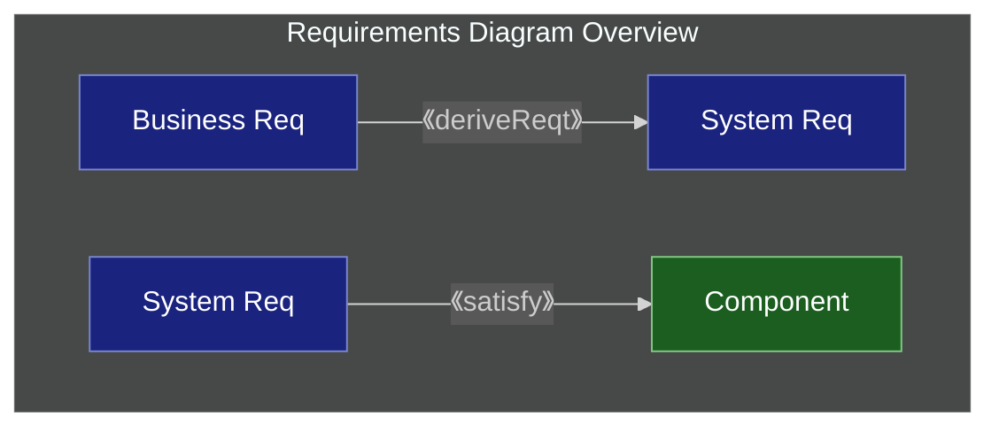

---

## 2. Requirement Classification

### User Requirements vs Technical Requirements

Requirements can be classified by their origin and audience:

| Classification            | Description                                                                | Example                               |
|:--------------------------|:---------------------------------------------------------------------------|:--------------------------------------|
| **User Requirement**      | What users want the system to do. Describes desired features and functions | "Purchase beverages", "Pay with cash" |
| **Technical Requirement** | System capabilities needed to fulfill user requirements                    | "Communicate with payment server"     |

**Example**: If a user requirement specifies "Pay with electronic money", this generates a technical requirement for "Communication with e-money server". Users don't care about server communication, but it's technically necessary to fulfill the user requirement.

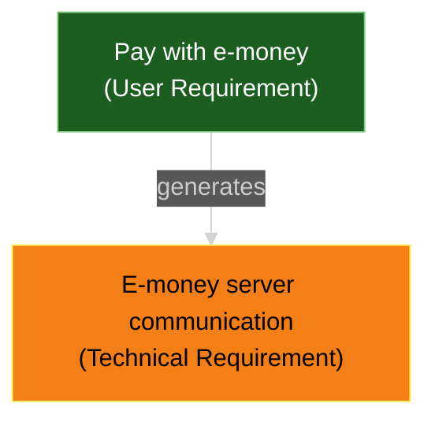

### Functional vs Non-functional Requirements

Requirements can also be classified by their nature:

| Classification               | Description                                                     | Example                             |
|:-----------------------------|:----------------------------------------------------------------|:------------------------------------|
| **Functional Requirement**   | Describes what the system must do                               | "Allow users to purchase beverages" |
| **Non-functional Requirement** | Describes quality attributes (performance, usability, security) | "Response time under 2 seconds"     |

**Example**: A vending machine must dispense beverages (functional). But if it takes several minutes after pressing the button, it fails as a system. Response time is a non-functional requirement that constrains how the function is performed.

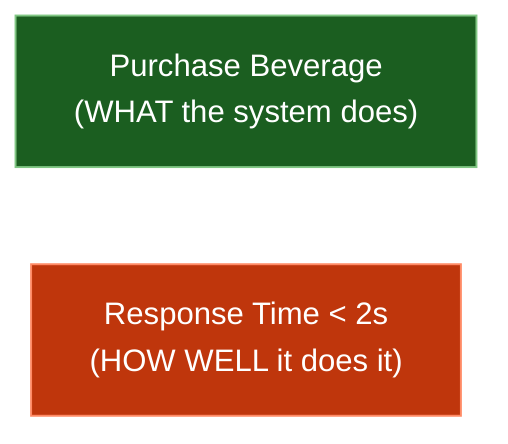

---

## 3. Requirement Element

### Structure

A requirement element in SysML is represented as a rectangle with stereotype `《requirement》`:

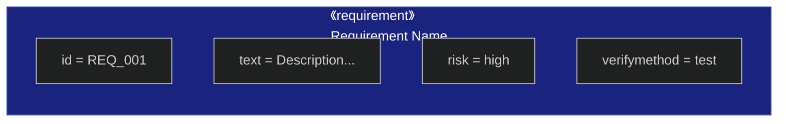

### Attributes

| Attribute        | Description                                                | Example Values                                    |
|:-----------------|:-----------------------------------------------------------|:--------------------------------------------------|
| **id**           | Unique identifier for the requirement                      | `REQ_001`, `FR_001`, `PR_001`                     |
| **text**         | Detailed description of what is required                   | "System shall allow users to login"               |
| **risk**         | Risk level associated with implementing this requirement   | `high`, `medium`, `low`                           |
| **verifymethod** | Method used to verify the requirement is satisfied         | `test`, `analysis`, `demonstration`, `inspection` |

**Note**: The `id` and `text` attributes are optional. If both are omitted, the compartment can be omitted entirely.

---

## 4. Relationships

Requirements diagrams use several relationship types to show how requirements relate to each other and to other model elements.

### Containment

**Containment** represents a parent requirement that contains child requirements.

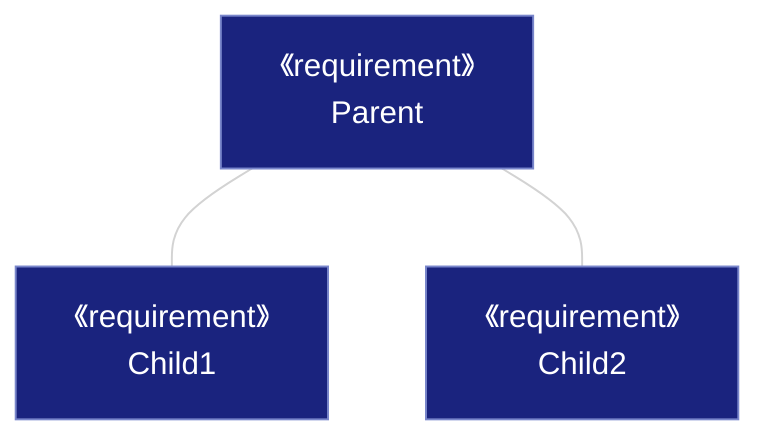

#### Characteristics

- **Indivisible**: Contained requirements cannot be split or separated from the parent
- **All-or-nothing**: When the parent requirement is required, **ALL child requirements must also be realized**
- **Single parent**: A child requirement cannot be contained by multiple parents
- **Granularity**: Children are typically more detailed than the parent

#### Example: Beverage Purchase

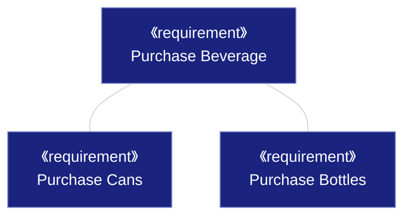

This diagram states: "A vending machine that can purchase beverages MUST be able to purchase both cans AND bottles." These three requirements exist as an indivisible unit.

---

### Derive Dependency

**Derive** (`《deriveReqt》`) indicates that one requirement is derived from another, more abstract requirement.

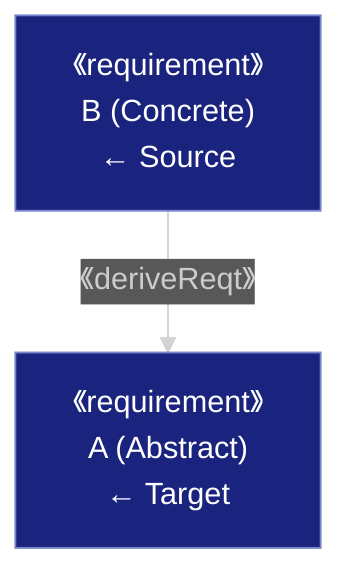

#### Arrow Direction Semantics

The arrow direction may seem counterintuitive, but it represents dependency:

- **Changes to A affect B**: If the abstract requirement A changes, the concrete requirement B must also change
- **Changes to B do NOT affect A**: There may be multiple ways to concretize A, so changing B doesn't change what A states

#### Example: Payment Methods

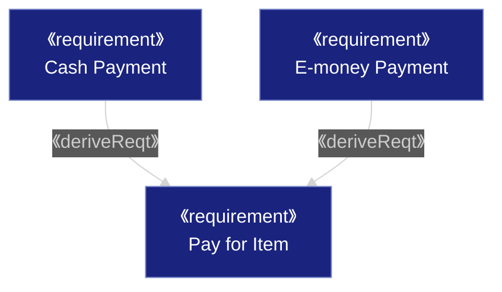

"Pay for Item" is concretely realized by either "Cash Payment" or "E-money Payment".

#### Business vs System Requirements

System requirements are typically derived from business requirements:

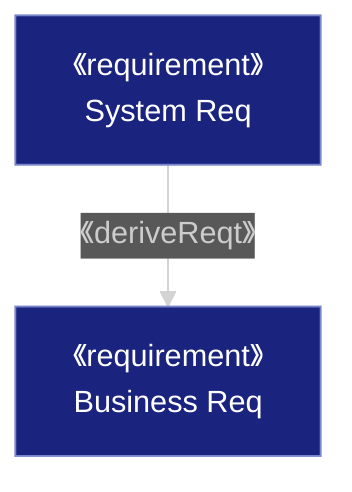

---

### Rationale

**Rationale** (`《rationale》`) documents WHY a requirement exists. Without rationale, the reason for a requirement may be forgotten during development.

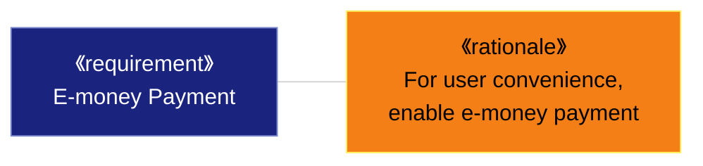

#### Benefits of Rationale

Recording rationale helps prevent incorrect implementation. In this example, e-money is needed for user convenience. From this rationale, we can judge that "a payment method requiring pre-registration does NOT satisfy this requirement" because it doesn't improve convenience.

---

### Refine Dependency

**Refine** (`《refine》`) connects requirements to Use Cases, showing how a requirement will be realized through system behavior.

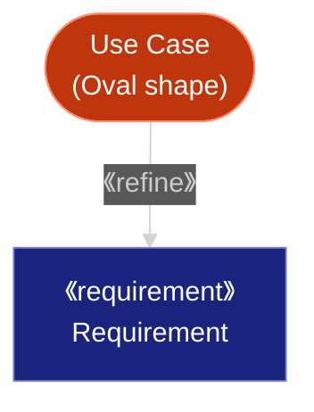

#### Purpose

- **Clarify realization**: Shows what behavior (use case) realizes the requirement
- **Verify completeness**: Confirm use cases are neither excessive nor insufficient
- Requirements state WHAT the system must do; Use Cases describe HOW

#### Example: Beverage Purchase

To purchase a beverage, users must "Select Item" and "Buy Item" - these use cases refine the requirement.

---

### Satisfy Dependency

**Satisfy** (`《satisfy》`) connects requirements to Blocks (design elements), showing which component realizes the requirement.

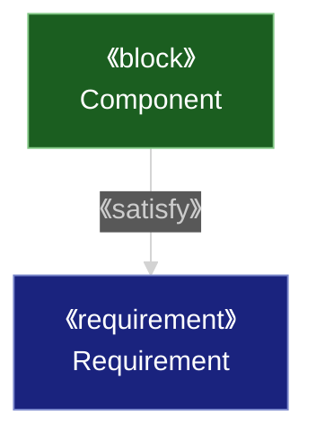

#### Purpose

- **Traceability**: Explicitly shows which hardware/software elements realize requirements
- **Impact analysis**: Clarifies scope of impact when requirements change
- **Verification**: Confirms all necessary blocks are modeled

#### Example: E-money Payment

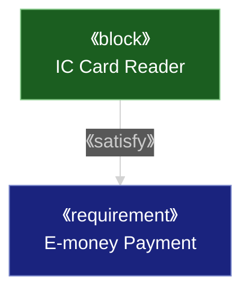

This diagram shows:
- IC Card Reader is needed to satisfy E-money Payment requirement
- If the E-money Payment requirement changes (e.g., more e-money types), IC Card Reader must also change
- For a machine without E-money Payment requirement, IC Card Reader is not needed

---

### Verify Dependency

**Verify** (`《verify》`) connects test cases to requirements, showing how requirements will be tested.

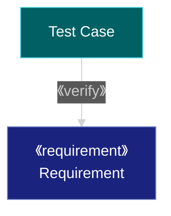

---

### Trace Dependency

**Trace** (`《trace》`) shows a general traceability relationship between requirements, useful when no more specific relationship applies.

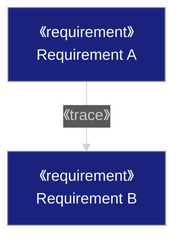

---

## 5. Mermaid Syntax Reference

Mermaid supports requirement diagrams with the following syntax.

### Requirement Types

| Type                     | Description             | Example                                    |
|:-------------------------|:------------------------|:-------------------------------------------|
| `requirement`            | General requirement     | Overall system requirements                |
| `functionalRequirement`  | Functional requirement  | Display function, operation function       |
| `performanceRequirement` | Performance requirement | Response time, throughput                  |
| `interfaceRequirement`   | Interface requirement   | API design, UI components                  |
| `designConstraint`       | Design constraint       | Technology stack, architecture constraints |

### Attributes

- **id**: Unique identifier for requirement (e.g., `REQ_001`, `FR_001`, `PR_001`)
- **text**: Requirement description
- **risk**: Risk level (`high`, `medium`, `low`) *written in lowercase*
- **verifymethod**: Verification method (`test`, `analysis`, `demonstration`, `inspection`) *written in lowercase*

### Relationship Notation

| Relationship | Notation                                 | Meaning                                                 |
|:-------------|:-----------------------------------------|:--------------------------------------------------------|
| `contains`   | `Parent Req - contains -> Child Req`     | Containment (parent contains child)                     |
| `derives`    | `Concrete Req - derives -> Abstract Req` | Derivation (concrete requirement derives from abstract) |
| `satisfies`  | `Implementation - satisfies -> Req`      | Satisfaction (implementation satisfies requirement)     |
| `verifies`   | `Test Case - verifies -> Req`            | Verification (test verifies requirement)                |
| `refines`    | `Detailed Req - refines -> Req`          | Refinement (defines requirement in more detail)         |
| `traces`     | `Req A - traces -> Req B`                | Traceability (shows traceability between requirements)  |

### Example Mermaid Diagram

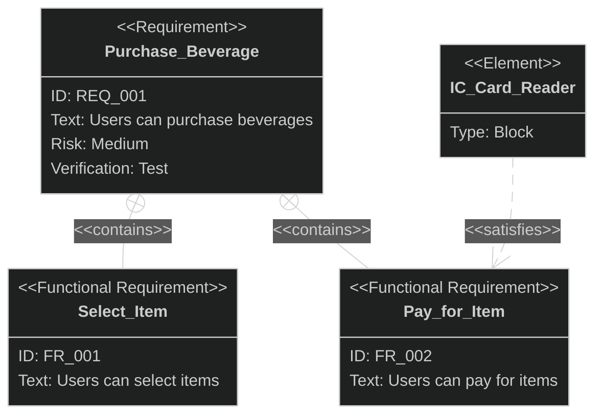
