# Requirements Diagram Guide

## 1. Introduction

### What is a Requirements Diagram?

A **Requirements Diagram** is a SysML diagram used to document system requirements and their relationships. It captures what the system must accomplish (functional requirements) and constraints the system must satisfy (non-functional requirements).

### Purpose and Benefits

Requirements diagrams serve several critical purposes in systems engineering:

1. **Capture stakeholder needs**: Document what users and stakeholders expect from the system
2. **Establish traceability**: Show how requirements relate to each other and to design elements
3. **Enable impact analysis**: Understand how changes to one requirement affect others
4. **Validate completeness**: Ensure all requirements are addressed by design elements

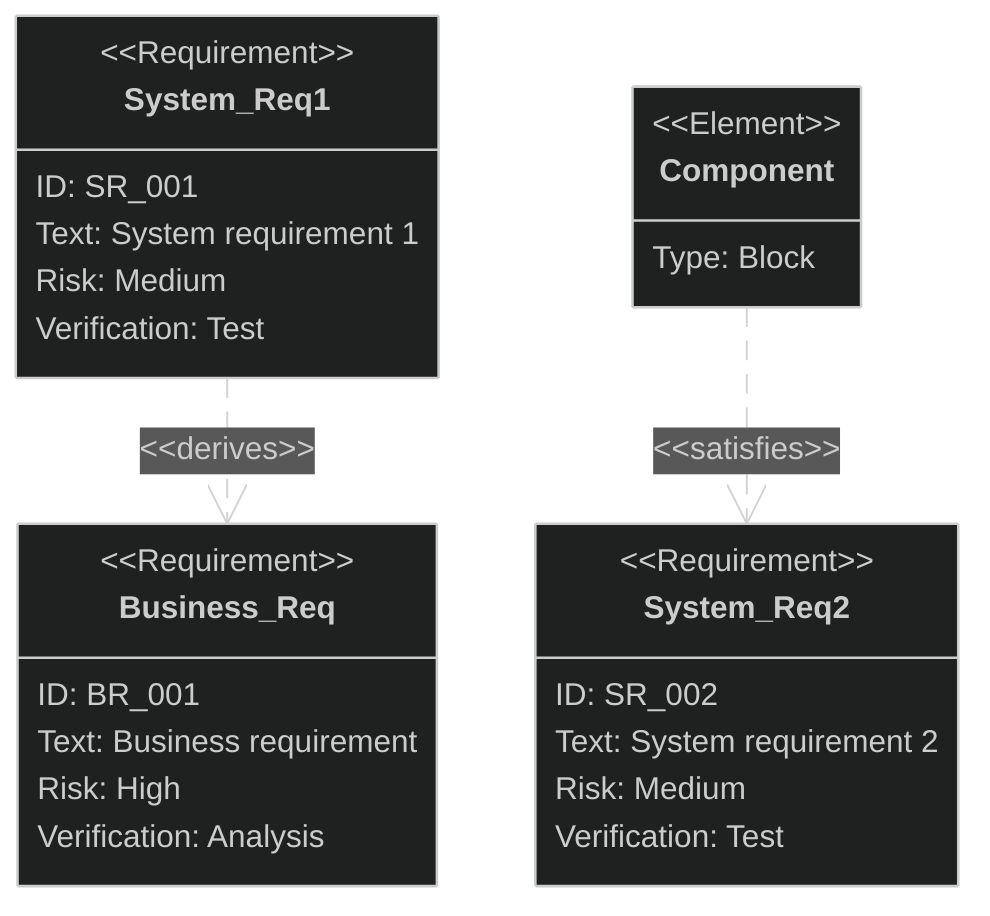

---

## 2. Requirement Classification

### User Requirements vs Technical Requirements

Requirements can be classified by their origin and audience:

| Classification            | Description                                                                | Example                               |
|:--------------------------|:---------------------------------------------------------------------------|:--------------------------------------|
| **User Requirement**      | What users want the system to do. Describes desired features and functions | "Purchase beverages", "Pay with cash" |
| **Technical Requirement** | System capabilities needed to fulfill user requirements                    | "Communicate with payment server"     |

**Example**: If a user requirement specifies "Pay with electronic money", this generates a technical requirement for "Communication with e-money server". Users don't care about server communication, but it's technically necessary to fulfill the user requirement.

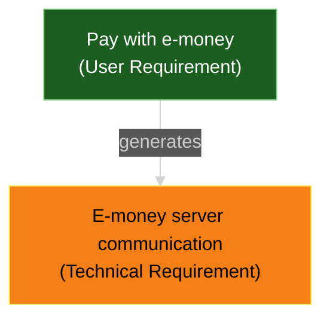

### Functional vs Non-functional Requirements

Requirements can also be classified by their nature:

| Classification               | Description                                                     | Example                             |
|:-----------------------------|:----------------------------------------------------------------|:------------------------------------|
| **Functional Requirement**   | Describes what the system must do                               | "Allow users to purchase beverages" |
| **Non-functional Requirement** | Describes quality attributes (performance, usability, security) | "Response time under 2 seconds"     |

**Example**: A vending machine must dispense beverages (functional). But if it takes several minutes after pressing the button, it fails as a system. Response time is a non-functional requirement that constrains how the function is performed.

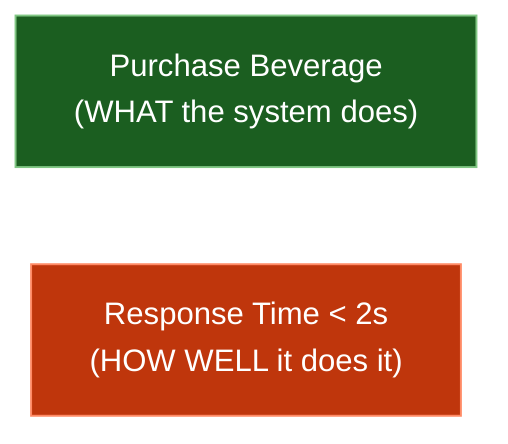

---

## 3. Mermaid Requirement Diagram Syntax

Mermaid provides native support for requirement diagrams following SysML v1.6 specifications.

### Three Components

A requirement diagram has three types of components:

1. **Requirement** - The requirement definition with attributes
2. **Element** - External elements (blocks, test cases, documents, etc.)
3. **Relationship** - Connections between requirements and elements

### Basic Structure

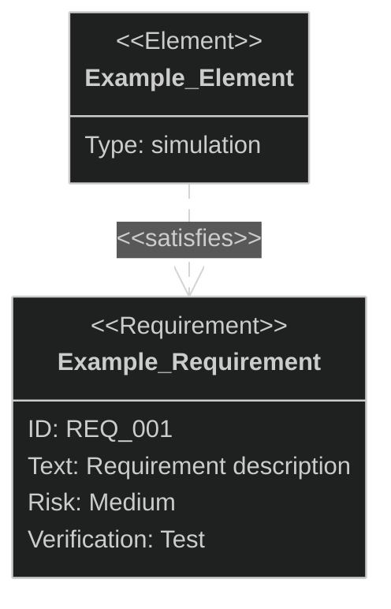

### Requirement Types

| Type                     | Description             | Example Use Case                       |
|:-------------------------|:------------------------|:---------------------------------------|
| `requirement`            | General requirement     | Overall system requirements            |
| `functionalRequirement`  | Functional requirement  | Display function, operation function   |
| `performanceRequirement` | Performance requirement | Response time, throughput              |
| `interfaceRequirement`   | Interface requirement   | API design, UI components              |
| `physicalRequirement`    | Physical requirement    | Size, weight, environmental constraints|
| `designConstraint`       | Design constraint       | Technology stack, architecture limits  |

### Requirement Definition Syntax

```
<type> user_defined_name {
    id: user_defined_id
    text: user_defined_text
    risk: <risk>
    verifymethod: <method>
}
```

### Attributes

**Important: Attribute values are case-insensitive but lowercase is recommended**

| Attribute        | Description                                              | Example Values                                    |
|:-----------------|:---------------------------------------------------------|:--------------------------------------------------|
| **id**           | Unique identifier for the requirement                    | `REQ_001`, `FR_001`, `PR_001`                     |
| **text**         | Detailed description of what is required                 | `"System shall allow users to login"`             |
| **risk**         | Risk level associated with implementing this requirement | `high`, `medium`, `low`                           |
| **verifymethod** | Method used to verify the requirement is satisfied       | `test`, `analysis`, `demonstration`, `inspection` |

**Note**: The `id` and `text` attributes are optional. If both are omitted, the compartment can be omitted entirely.

#### Syntax Restrictions

> **Important: ID naming restriction**
>
> Mermaid's `requirementDiagram` does **NOT support hyphens (`-`) in `id` values**. Hyphens are interpreted as relationship operators.
>
> - ❌ Invalid: `id: FR-001`, `id: user-auth-001`
> - ✅ Valid: `id: FR_001`, `id: user_auth_001`
>
> **Always replace hyphens with underscores (`_`) in requirement IDs.**

> **Important: Text value quoting**
>
> When using **non-ASCII characters** (Japanese, Chinese, etc.) or **special characters** in the `text` attribute, you **MUST enclose the value in double quotes**.
>
> - ❌ Invalid: `text: ユーザーがログインできること`
> - ✅ Valid: `text: "ユーザーがログインできること"`
> - ✅ Valid: `text: "User can login with email & password"`
>
> **Always use double quotes for `text` values containing non-ASCII or special characters.**

#### Risk Level Values

| Value    | Meaning                                               |
|:---------|:------------------------------------------------------|
| `low`    | Low risk (nice to have)                               |
| `medium` | Medium risk (important but alternatives exist)        |
| `high`   | High risk (business-critical, difficult to implement) |

#### Verification Method Values

| Value           | Meaning                       | Description                             |
|:----------------|:------------------------------|:----------------------------------------|
| `analysis`      | Verification by analysis      | Design review, static analysis          |
| `inspection`    | Verification by inspection    | Code review, document review            |
| `test`          | Verification by testing       | Unit test, integration test, E2E test   |
| `demonstration` | Verification by demonstration | Operation verification on actual device |

---

## 4. Element Definition

Elements connect requirements to portions of other documents (blocks, test cases, documents, etc.).

### Element Syntax

```
element user_defined_name {
    type: user_defined_type
    docref: user_defined_ref
}
```

### Element Attributes

| Attribute | Description                                 | Example Values                              |
|:----------|:--------------------------------------------|:--------------------------------------------|
| `type`    | Type of element (user-defined)              | `simulation`, `Block`, `word doc`, `test suite` |
| `docref`  | Document reference (optional, user-defined) | `reqs/test_entity`, `github.com/repo`       |

### Element Examples

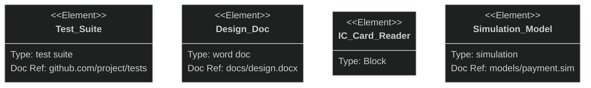

---

## 5. Relationships

Requirements diagrams use several relationship types to show how requirements relate to each other and to other model elements.

### Relationship Types

| Relationship | Notation              | Meaning                              |
|:-------------|:----------------------|:-------------------------------------|
| `contains`   | `A - contains -> B`   | A contains B (parent-child)          |
| `copies`     | `A - copies -> B`     | A copies from B                      |
| `derives`    | `A - derives -> B`    | A derives from B                     |
| `satisfies`  | `A - satisfies -> B`  | A satisfies requirement B            |
| `verifies`   | `A - verifies -> B`   | A verifies requirement B             |
| `refines`    | `A - refines -> B`    | A refines requirement B              |
| `traces`     | `A - traces -> B`     | A traces to B                        |

### Bidirectional Notation

Relationships can be written in either direction:

```
{source} - <type> -> {destination}
{destination} <- <type> - {source}
```

Both are equivalent:
```
test_entity - satisfies -> test_req
test_req <- satisfies - test_entity
```

### Containment

**Containment** represents a parent requirement that contains child requirements.

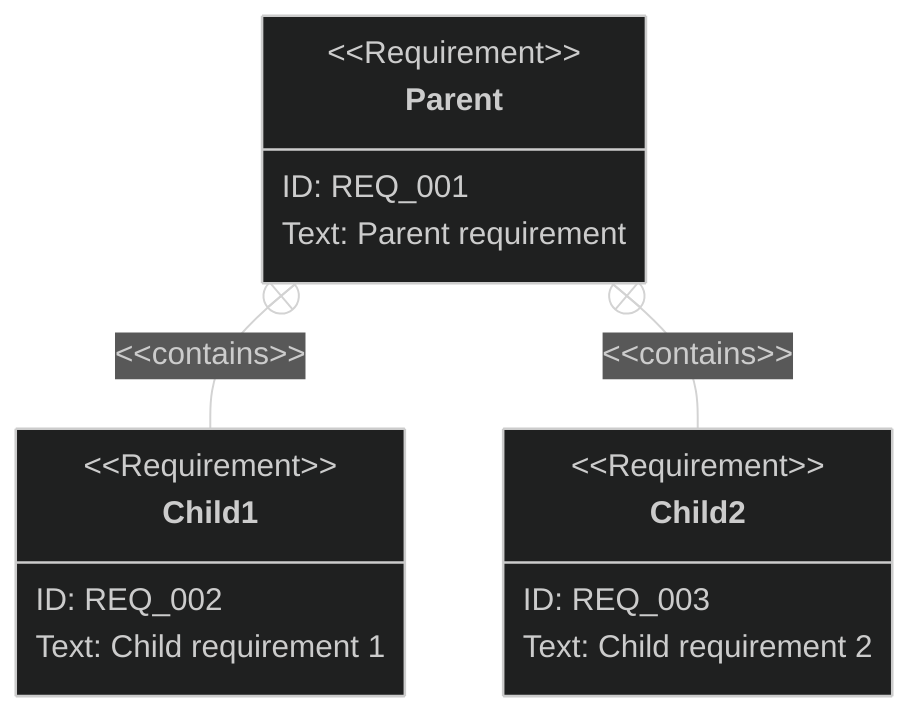

#### Characteristics

- **Indivisible**: Contained requirements cannot be split or separated from the parent
- **All-or-nothing**: When the parent requirement is required, **ALL child requirements must also be realized**
- **Single parent**: A child requirement cannot be contained by multiple parents
- **Granularity**: Children are typically more detailed than the parent

#### Example: Beverage Purchase

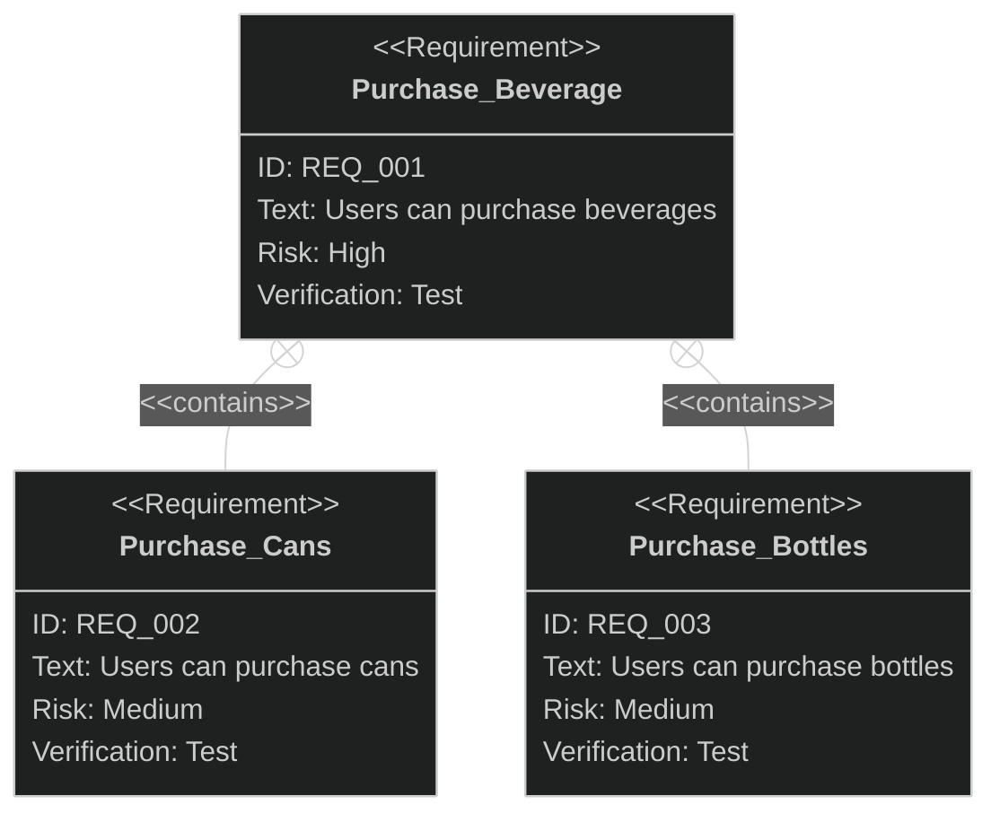

This diagram states: "A vending machine that can purchase beverages MUST be able to purchase both cans AND bottles." These three requirements exist as an indivisible unit.

---

### Derive Dependency

**Derive** (`derives`) indicates that one requirement is derived from another, more abstract requirement.

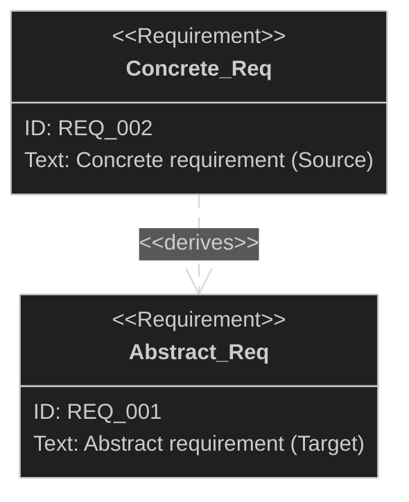

#### Arrow Direction Semantics

The arrow direction may seem counterintuitive, but it represents dependency:

- **Changes to Abstract affect Concrete**: If the abstract requirement changes, the concrete requirement must also change
- **Changes to Concrete do NOT affect Abstract**: There may be multiple ways to concretize, so changing concrete doesn't change what abstract states

#### Example: Payment Methods

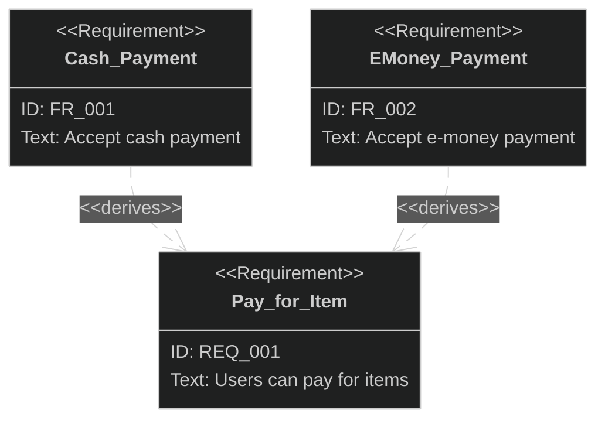

"Pay for Item" is concretely realized by either "Cash Payment" or "E-money Payment".

---

### Refine Dependency

**Refine** (`refines`) connects requirements to Use Cases or more detailed requirements, showing how a requirement will be realized.

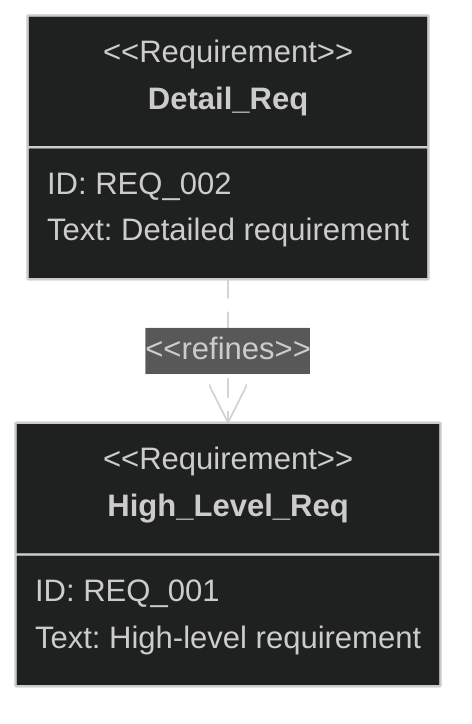

#### Purpose

- **Clarify realization**: Shows what behavior realizes the requirement
- **Verify completeness**: Confirm detailed requirements are neither excessive nor insufficient
- High-level requirements state WHAT; detailed requirements describe HOW

---

### Satisfy Dependency

**Satisfy** (`satisfies`) connects design elements to requirements, showing which component realizes the requirement.

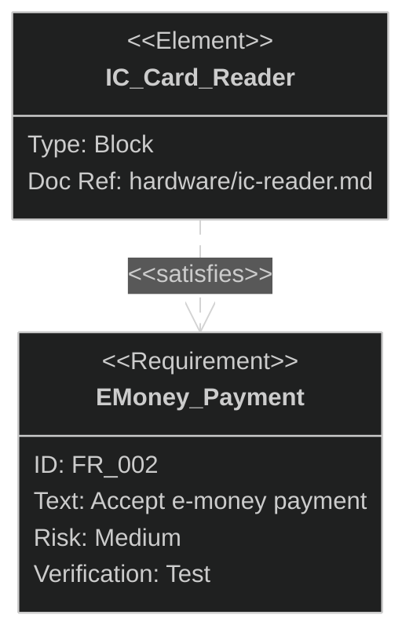

#### Purpose

- **Traceability**: Explicitly shows which hardware/software elements realize requirements
- **Impact analysis**: Clarifies scope of impact when requirements change
- **Verification**: Confirms all necessary elements are modeled

---

### Verify Dependency

**Verify** (`verifies`) connects test cases to requirements, showing how requirements will be tested.

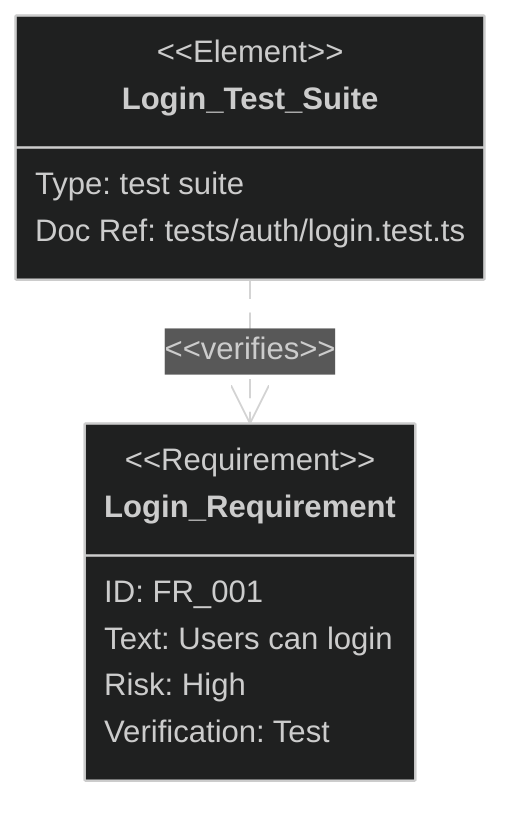

---

### Trace Dependency

**Trace** (`traces`) shows a general traceability relationship between requirements, useful when no more specific relationship applies.

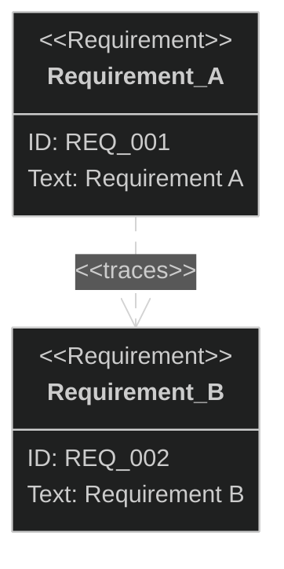

---

### Copies Dependency

**Copies** (`copies`) indicates that one requirement is copied from another source.

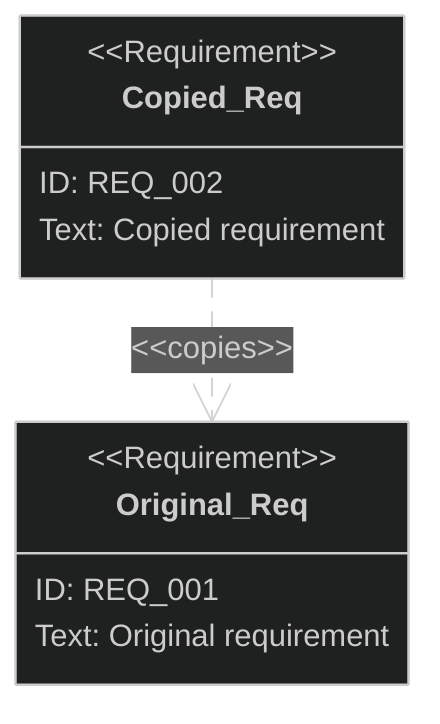

---

## 6. Styling Requirement Diagrams

> **Note**: Native styling (`style`, `classDef`, `direction`) in `requirementDiagram` is **not yet supported** in most Mermaid renderers (including GitHub). Use `flowchart` for styled requirement visualizations.

### Using Flowchart for Styled Requirements

For styled requirements with custom colors, use `flowchart` instead:

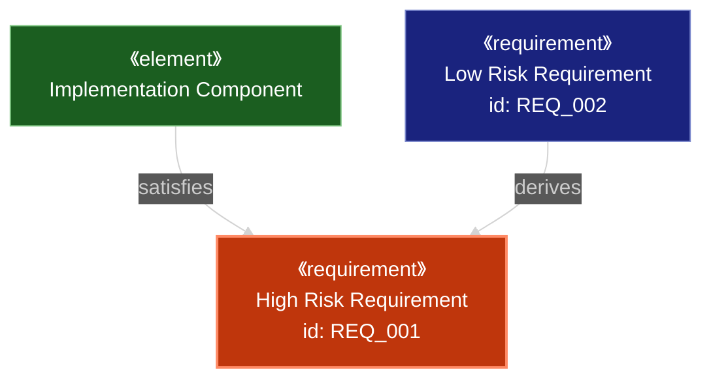

### Recommended Dark Theme Color Palette

| Element Type    | Fill Color | Stroke Color | Text Color |
|:----------------|:-----------|:-------------|:-----------|
| Requirement     | `#1a237e`  | `#7986cb`    | `#fff`     |
| Use Case        | `#bf360c`  | `#ff8a65`    | `#fff`     |
| Block/Component | `#1b5e20`  | `#81c784`    | `#fff`     |
| Actor           | `#4a148c`  | `#ba68c8`    | `#fff`     |
| Test Case       | `#006064`  | `#4dd0e1`    | `#fff`     |
| Rationale       | `#f57f17`  | `#ffee58`    | `#000`     |

---

## 8. Markdown Formatting in Text

Text fields support markdown formatting inside quotes:

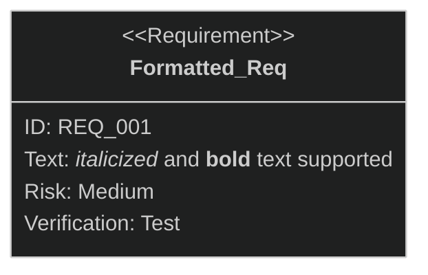

**Note**: Use quotes for text containing special characters or markdown.

---

## 9. Common Mistakes

| Incorrect                       | Correct                              | Explanation                           |
|:--------------------------------|:-------------------------------------|:--------------------------------------|
| `risk: High`                    | `risk: high`                         | Attribute values in lowercase         |
| `verifymethod: Test`            | `verifymethod: test`                 | Attribute values in lowercase         |
| `text: description with space`  | `text: "description with space"`     | Use quotes for multi-word text        |
| `requirement name with space`   | `requirement_name_with_underscore`   | No spaces in names (use underscores)  |
| `A -> satisfies -> B`           | `A - satisfies -> B`                 | Use single dash before relationship   |
| `A - satisfies - B`             | `A - satisfies -> B`                 | Must include arrow `->` at end        |
| `A - Satisfies -> B`            | `A - satisfies -> B`                 | Relationship names in lowercase       |
| Unquoted text with keywords     | `text: "the analysis result"`        | Quote text containing keywords        |

---

## 10. Complete Examples

### Comprehensive Requirement Diagram

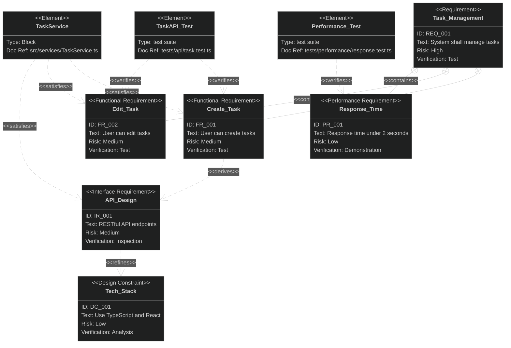

### Vending Machine Requirements

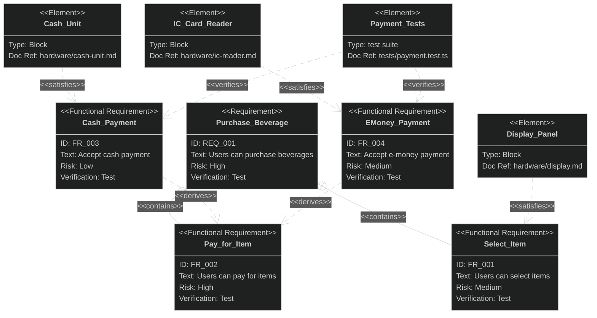

---

## 11. Flowchart Alternative Representation

When requirement diagrams need more visual flexibility, use `flowchart` as an alternative:

### Rationale Element

**Rationale** documents WHY a requirement exists:

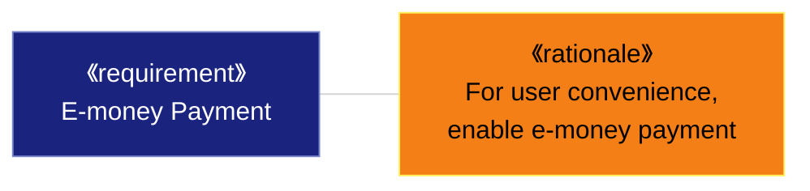

### Use Case Refinement

Connect use cases to requirements using `《refine》`:

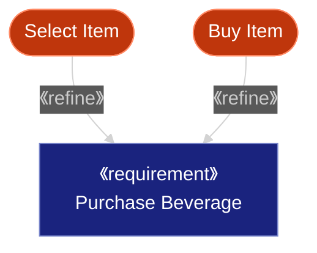

---

## References

- [Mermaid Official Documentation](https://mermaid.js.org/)
- [Mermaid Requirement Diagram](https://mermaid.js.org/syntax/requirementDiagram.html)
- [SysML v1.6 Specification](https://www.omg.org/spec/SysML/1.6/)
- [Mermaid Live Editor](https://mermaid.live/)
