# Use Case Diagram Guide

## 1. Introduction

### What is a Use Case Diagram?

A **Use Case Diagram** describes the behavior that a system provides to external entities. It shows what functionality the system must offer and what roles (actors) interact with that functionality.


From this diagram we can understand:
- The vending machine provides functionality for users to select and purchase beverages
- Payment can be made with cash or electronic money
- An external "E-money System" exists outside the vending machine and is necessary for e-money payments

### Purpose

Use case diagrams serve two critical purposes in system design:

#### 1. Clarify System Responsibilities

Use cases represent the functions a system provides to the outside world. By analyzing system behavior from an external perspective and documenting it as use cases, we can **clearly define what the system must do**.

#### 2. Define System Boundaries

Defining the system scope is crucial in system design. Without clear boundaries:
- Parts of the system may be overlooked during design
- Multiple engineers may redundantly design the same components

Use case diagrams include a **System Boundary** element that explicitly defines what is inside vs. outside the system scope.

---

## 2. Elements

### Use Case

A **Use Case** describes a behavior that the system must perform in response to external requests. It is represented as an oval (ellipse) containing the behavior description.


#### Use Case Granularity

The level of detail for use cases is not strictly defined:

| Granularity | Example                                 |
|:------------|:----------------------------------------|
| Coarse      | "Buy Item"                              |
| Fine        | "Reduce Inventory", "Dispense Beverage" |

**Important**: Use cases within a single diagram should have consistent granularity. Mixing coarse and fine-grained use cases creates confusion by placing overview functions alongside detailed functions.

---

### Actor

An **Actor** represents an external entity that interacts with the system. Actors are depicted as stick figures with the actor name below.

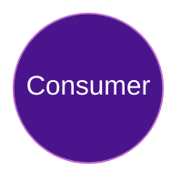

#### Types of Actors

| Type            | Example        | Description                                          |
|:----------------|:---------------|:-----------------------------------------------------|
| Human           | Consumer       | A user who purchases beverages from the machine      |
| External System | E-money System | An external server needed for electronic payment     |

**Note**: Actors are not limited to humans. When the system interacts with external systems, those systems become actors.

---

### System Boundary (Subject)

The **System Boundary** clearly separates what is inside the system from what is outside. It helps distinguish internal elements (use cases) from external elements (actors).

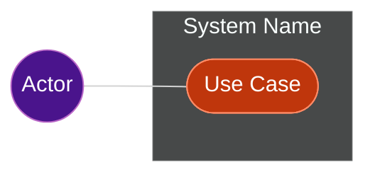

#### Benefits of System Boundary

By drawing the system boundary, we can clarify:
- The "Consumer" operating the machine is OUTSIDE the vending machine system
- The "E-money System" handling payments is also OUTSIDE the system
- These elements are NOT part of the vending machine being designed

**Note**: The system boundary is optional and can be omitted when the scope is clear.

---

### Association (Communication Path)

Since use cases are functions the system exposes externally, there must be correspondence between external actors and internal use cases. This correspondence is called an **Association**, shown as a solid line connecting an actor to a use case.

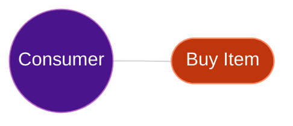

#### Association Semantics

Associations can represent two directions of interaction:

| Direction        | Meaning                                 | Example                                                      |
|:-----------------|:----------------------------------------|:-------------------------------------------------------------|
| Actor → Use Case | Actor uses the use case                 | "Consumer" uses "Buy Item" functionality                     |
| Use Case → Actor | Use case requests processing from actor | "Pay with E-money" requests processing from "E-money System" |

**Important**: In SysML, associations are bidirectional by default, meaning communication can flow in either direction.

---

### Include Relationship

**Include** indicates that one use case contains another use case's behavior.

When analyzing use cases, you may find:
- Multiple use cases performing the same processing
- Processing that varies by condition

In these cases, the include relationship helps split use cases for clarity.

> **Note**: In Mermaid, `<` and `>` characters in labels must be escaped using HTML entities.
> Write `&lt;&lt;include&gt;&gt;` to display `<<include>>` correctly.

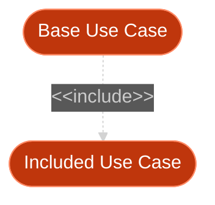

**Arrow Direction**: From the base use case TO the included use case.

**Semantics**: The base use case **ALWAYS** executes the included use case.

#### Example: Buy Item

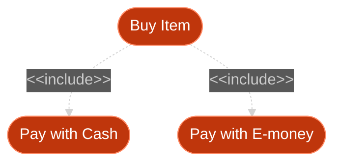

This shows that "Buy Item" includes two payment use cases. Since there are two payment methods, one of them will be selected during the purchase.

---

### Extend Relationship

**Extend** indicates that one use case optionally extends another use case's behavior under certain conditions.

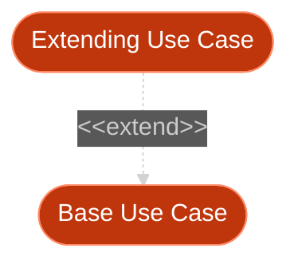

**Arrow Direction**: From the extending use case TO the base use case.

**Semantics**: The extending use case **OPTIONALLY** adds behavior to the base use case.

#### Include vs Extend Comparison

| Aspect        | Include                                 | Extend                                       |
|:--------------|:----------------------------------------|:---------------------------------------------|
| **Execution** | Base ALWAYS executes included           | Extending OPTIONALLY adds to base            |
| **Arrow**     | Base → Included                         | Extending → Base                             |
| **Example**   | "Login" includes "Validate Credentials" | "Checkout" may be extended by "Apply Coupon" |

---

### Generalization (Inheritance)

**Generalization** shows inheritance relationships between actors or use cases.

#### Actor Generalization

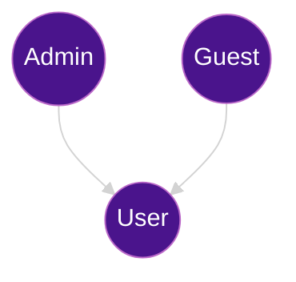

This shows that Admin and Guest are specialized types of User, inheriting the base actor's capabilities.

#### Use Case Generalization

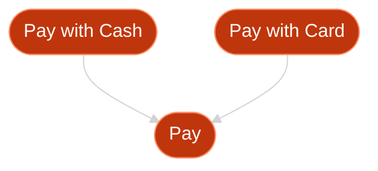

---

## 3. Use Case Diagram & Requirements Diagram

### Relationship Between Diagrams

Use cases describe behaviors the system must provide. In other words, use cases are **means to realize requirements** documented in requirements diagrams.

As described in the Requirements Diagram Guide under "Refine Dependency", requirements and their realization methods are connected through the **refine** relationship.

### Documenting Use Cases in Requirements Diagrams

SysML allows use cases to be shown in requirements diagrams to document the relationship between requirements and use cases. They are connected using the **Refine dependency** (`《refine》`).

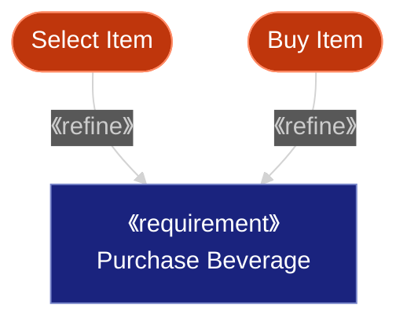

### Key Points

- **Every use case must trace to a requirement**: Use cases without corresponding requirements are not valid
- **Requirements need use cases for realization**: Use cases define HOW requirements are fulfilled
- **Verify completeness**: By documenting both in one diagram, you can confirm use cases are neither excessive nor insufficient

---

## 4. Use Case Diagram & Sequence Diagram

### Relationship Between Diagrams

Use cases describe WHAT the system does. **Sequence diagrams** describe HOW those use cases are executed by showing the interaction between objects over time.

### Linking Use Cases to Sequences

Each use case can be detailed with one or more sequence diagrams:

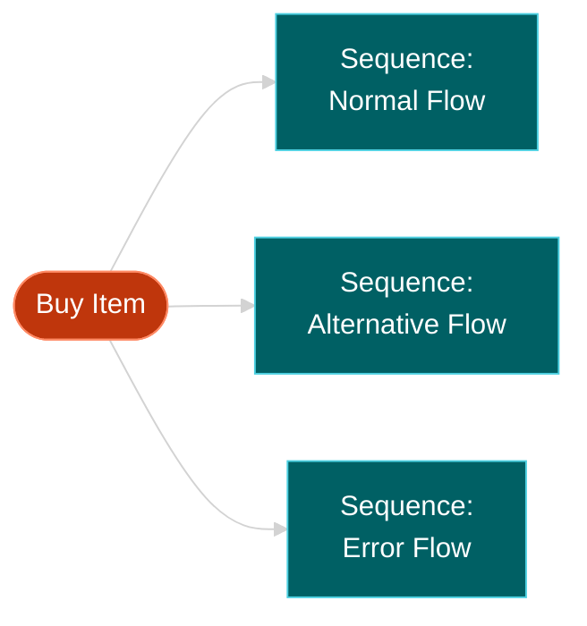

### Example: Buy Item Sequence

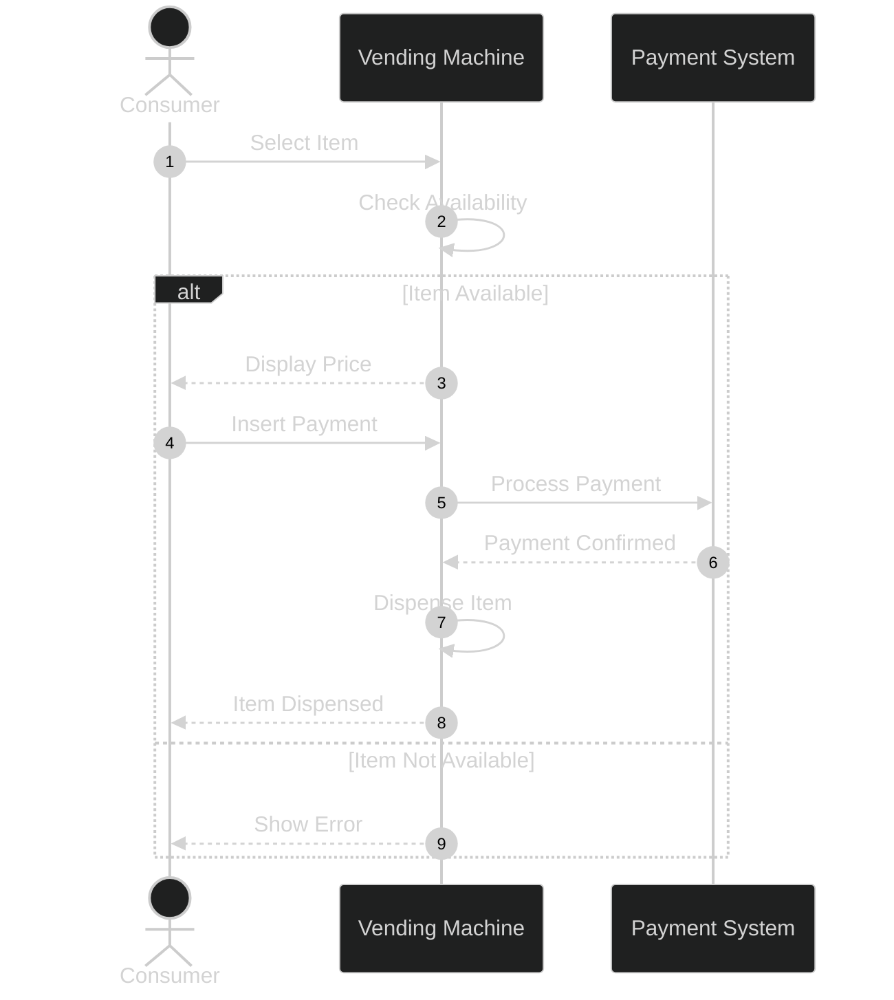

---

## 5. Mermaid Implementation Guide

### Mermaid Constraints

Mermaid does **NOT** have native support for use case diagrams. Use `flowchart` (graph) as an alternative representation.

### Basic Notation

#### Diagram Direction

| Direction | Description   | Use Case                        |
|:----------|:--------------|:--------------------------------|
| `TB`      | Top to Bottom | Standard vertical layout        |
| `TD`      | Top Down      | Same as TB                      |
| `BT`      | Bottom to Top | Reverse vertical flow           |
| `LR`      | Left to Right | Horizontal layout (recommended) |
| `RL`      | Right to Left | Reverse horizontal flow         |

#### Actor Representation

Use double parentheses `(( ))` for circular nodes representing actors:


#### Use Case Representation

Use stadium shape `([ ])` for oval-like nodes representing use cases:

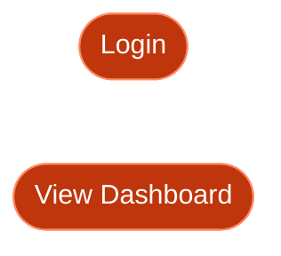

#### System Boundary

Use `subgraph` to represent the system boundary:


### Link Types

| Type              | Syntax            | Description                    |
|:------------------|:------------------|:-------------------------------|
| Arrow             | `-->`             | Standard directed link         |
| Open link         | `---`             | Undirected connection          |
| Dotted arrow      | `-.->`            | Dependency, optional           |
| Dotted line       | `-.-`             | Weak connection                |
| Thick arrow       | `==>`             | Strong/main flow               |
| Thick line        | `===`             | Strong undirected              |

### Link Labels

Add text to links using `|text|` syntax:

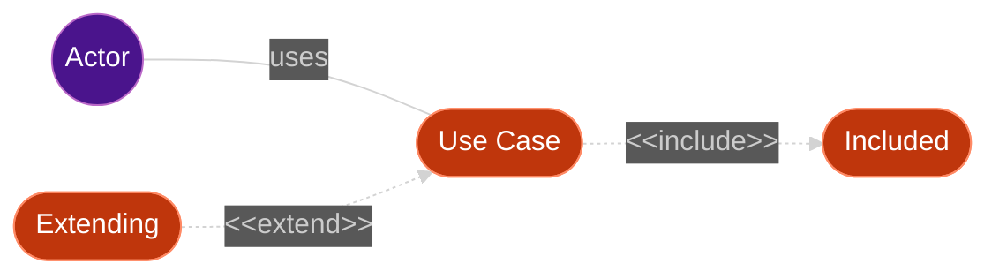

### Relationships

#### Association (Actor to Use Case)

Use solid lines `---` for associations (bidirectional by default in SysML):

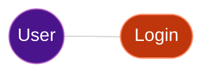

#### Include Relationship

Use dotted arrows with `<<include>>` stereotype label. The base use case **always** includes the included use case:


**Direction**: Arrow points from base use case **to** included use case.

#### Extend Relationship

Use dotted arrows with `<<extend>>` stereotype label. The extending use case **optionally** extends the base use case:


**Direction**: Arrow points from extending use case **to** base use case.

---

## 6. Styling

### Using classDef

Define reusable styles with `classDef`:

```mermaid
%%{init: {'theme': 'dark'}}%%
flowchart LR
    User((User))
    UC1(["Primary Use Case"])
    UC2(["Secondary Use Case"])

    User --> UC1
    User --> UC2

    classDef actor fill:#4a148c,stroke:#ba68c8,color:#fff
    classDef primary fill:#bf360c,stroke:#ff8a65,color:#fff,stroke-width:2px
    classDef secondary fill:#bf360c,stroke:#ff8a65,color:#fff,stroke-dasharray:5

    class User actor
    class UC1 primary
    class UC2 secondary
```

### Inline Class Application

Apply classes inline using `:::`:

```mermaid
%%{init: {'theme': 'dark'}}%%
flowchart LR
    User((User)):::actor --> UC(["Action"]):::usecase

    classDef actor fill:#4a148c,stroke:#ba68c8,color:#fff
    classDef usecase fill:#bf360c,stroke:#ff8a65,color:#fff
```

### Recommended Dark Theme Color Palette

| Element Type    | Fill Color | Stroke Color | Text Color |
|:----------------|:-----------|:-------------|:-----------|
| Actor           | `#4a148c`  | `#ba68c8`    | `#fff`     |
| Use Case        | `#bf360c`  | `#ff8a65`    | `#fff`     |
| Requirement     | `#1a237e`  | `#7986cb`    | `#fff`     |
| Block/Component | `#1b5e20`  | `#81c784`    | `#fff`     |
| Test Case       | `#006064`  | `#4dd0e1`    | `#fff`     |
| Rationale       | `#f57f17`  | `#ffee58`    | `#000`     |

---

## 7. Complete Examples

### Task Management System

```mermaid
%%{init: {'theme': 'dark'}}%%
flowchart LR
    User((User))
    Admin((Admin))

    subgraph TaskManagement [Task Management System]
        UC1(["Create Task"])
        UC2(["Edit Task"])
        UC3(["Delete Task"])
        UC4(["View Tasks"])
        UC5(["Validate Authentication"])
        UC6(["Send Notification"])
        UC7(["Bulk Delete"])
    end

    User --- UC1
    User --- UC2
    User --- UC4
    Admin --- UC3
    Admin --- UC4

    UC1 -.->|"&lt;&lt;include&gt;&gt;"| UC5
    UC2 -.->|"&lt;&lt;include&gt;&gt;"| UC5
    UC3 -.->|"&lt;&lt;include&gt;&gt;"| UC5

    UC6 -.->|"&lt;&lt;extend&gt;&gt;"| UC1
    UC7 -.->|"&lt;&lt;extend&gt;&gt;"| UC3

    classDef actor fill:#4a148c,stroke:#ba68c8,color:#fff
    classDef usecase fill:#bf360c,stroke:#ff8a65,color:#fff

    class User,Admin actor
    class UC1,UC2,UC3,UC4,UC5,UC6,UC7 usecase
```

### E-Commerce System

```mermaid
%%{init: {'theme': 'dark'}}%%
flowchart TB
    Customer((Customer))
    Guest((Guest))
    PaymentGateway((Payment<br/>Gateway))

    subgraph ECommerce [E-Commerce System]
        subgraph Browse [Browsing]
            UC1(["Browse Products"])
            UC2(["Search Products"])
            UC3(["View Product Details"])
        end

        subgraph Cart [Shopping Cart]
            UC4(["Add to Cart"])
            UC5(["Update Cart"])
            UC6(["Remove from Cart"])
        end

        subgraph Checkout [Checkout Process]
            UC7(["Checkout"])
            UC8(["Apply Discount"])
            UC9(["Process Payment"])
        end

        UC10(["Login"])
    end

    Customer --- UC1
    Customer --- UC4
    Customer --- UC7
    Guest --- UC1
    Guest --- UC2

    UC4 -.->|"&lt;&lt;include&gt;&gt;"| UC10
    UC7 -.->|"&lt;&lt;include&gt;&gt;"| UC9
    UC8 -.->|"&lt;&lt;extend&gt;&gt;"| UC7
    UC9 --- PaymentGateway

    classDef actor fill:#4a148c,stroke:#ba68c8,color:#fff
    classDef usecase fill:#bf360c,stroke:#ff8a65,color:#fff

    class Customer,Guest,PaymentGateway actor
    class UC1,UC2,UC3,UC4,UC5,UC6,UC7,UC8,UC9,UC10 usecase
```

### With Requirements Traceability

```mermaid
%%{init: {'theme': 'dark'}}%%
flowchart TB
    subgraph Requirements [Requirements]
        REQ1["《requirement》<br/>User Authentication"]
        REQ2["《requirement》<br/>Task Management"]
    end

    subgraph UseCases [Use Cases]
        UC1(["Login"])
        UC2(["Register"])
        UC3(["Create Task"])
        UC4(["Edit Task"])
    end

    UC1 -->|《refine》| REQ1
    UC2 -->|《refine》| REQ1
    UC3 -->|《refine》| REQ2
    UC4 -->|《refine》| REQ2

    classDef req fill:#1a237e,stroke:#7986cb,color:#fff
    classDef usecase fill:#bf360c,stroke:#ff8a65,color:#fff

    class REQ1,REQ2 req
    class UC1,UC2,UC3,UC4 usecase
```

---

## 8. Common Mistakes

| Incorrect                          | Correct                                 | Explanation                                             |
|:-----------------------------------|:----------------------------------------|:--------------------------------------------------------|
| `User((User))` without `flowchart` | `flowchart LR` then `User((User))`      | Must declare diagram type first                         |
| `Actor --> UC` (association)       | `Actor --- UC`                          | Use solid line (not arrow) for associations             |
| `-. include .->`                   | `-.->│"<<include>>"│`                   | Use dotted arrow with stereotype label                  |
| `-. extend .->`                    | `-.->│"<<extend>>"│`                    | Use dotted arrow with stereotype label                  |
| `<<include>>`                      | `│"<<include>>"│`                       | Use Mermaid link label syntax                           |
| `Actor[User]`                      | `User((User))`                          | Use `(( ))` for actors, `([ ])` for use cases           |
| `system { ... }`                   | `subgraph System [ ... ] ... end`       | Use subgraph for system boundary                        |
| Spaces in node names               | Use underscores or camelCase            | `Create Task` → `CreateTask` or `Create_Task`           |
| Missing `end` for subgraph         | Always close with `end`                 | Each `subgraph` must have matching `end`                |
| `User -> UC`                       | `User --- UC`                           | Use double/triple dash in flowchart                     |

---

## 9. Limitations

1. **No native use case shape**: Mermaid uses stadium `([ ])` or rectangles `[ ]` instead of true ovals
2. **No generalization arrows**: Actor/use case inheritance requires workarounds with solid arrows
3. **Limited styling**: Use CSS classes for custom styling if needed
4. **Label positioning**: Stereotype labels (`include`, `extend`) appear on the line, not above it
5. **No extension points**: Cannot specify extension points in extend relationships
6. **No notes on actors**: Notes can only be attached to nodes, not positioned freely

---

## References

- [Mermaid Official Documentation](https://mermaid.js.org/)
- [Mermaid Flowchart Syntax](https://mermaid.js.org/syntax/flowchart.html)
- [Mermaid Sequence Diagram](https://mermaid.js.org/syntax/sequenceDiagram.html)
- [SysML v1.6 Specification](https://www.omg.org/spec/SysML/1.6/)
- [Mermaid Live Editor](https://mermaid.live/)
- [GitHub Mermaid Support](https://docs.github.com/en/get-started/writing-on-github/working-with-advanced-formatting/creating-diagrams)
