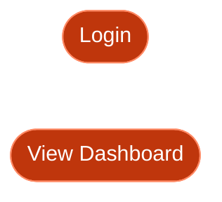

# Use Case Diagram Guide

## 1. Introduction

### What is a Use Case Diagram?

A **Use Case Diagram** describes the behavior that a system provides to external entities. It shows what functionality the system must offer and what roles (actors) interact with that functionality.

From this diagram we can understand:
- The vending machine provides functionality for users to select and purchase beverages
- Payment can be made with cash or electronic money
- An external "E-money System" exists outside the vending machine and is necessary for e-money payments

### Purpose

Use case diagrams serve two critical purposes in system design:

#### 1. Clarify System Responsibilities

Use cases represent the functions a system provides to the outside world. By analyzing system behavior from an external perspective and documenting it as use cases, we can **clearly define what the system must do**.

#### 2. Define System Boundaries

Defining the system scope is crucial in system design. Without clear boundaries:
- Parts of the system may be overlooked during design
- Multiple engineers may redundantly design the same components

Use case diagrams include a **System Boundary** element that explicitly defines what is inside vs. outside the system scope.

---

## 2. Elements

### Use Case

A **Use Case** describes a behavior that the system must perform in response to external requests. It is represented as an oval (ellipse) containing the behavior description.

#### Use Case Granularity

The level of detail for use cases is not strictly defined:

| Granularity | Example                                 |
|:------------|:----------------------------------------|
| Coarse      | "Buy Item"                              |
| Fine        | "Reduce Inventory", "Dispense Beverage" |

**Important**: Use cases within a single diagram should have consistent granularity. Mixing coarse and fine-grained use cases creates confusion by placing overview functions alongside detailed functions.

---

### Actor

An **Actor** represents an external entity that interacts with the system. Actors are depicted as stick figures with the actor name below.

#### Types of Actors

| Type            | Example        | Description                                          |
|:----------------|:---------------|:-----------------------------------------------------|
| Human           | Consumer       | A user who purchases beverages from the machine      |
| External System | E-money System | An external server needed for electronic payment     |

**Note**: Actors are not limited to humans. When the system interacts with external systems, those systems become actors.

---

### System Boundary (Subject)

The **System Boundary** clearly separates what is inside the system from what is outside. It helps distinguish internal elements (use cases) from external elements (actors).

#### Benefits of System Boundary

By drawing the system boundary, we can clarify:
- The "Consumer" operating the machine is OUTSIDE the vending machine system
- The "E-money System" handling payments is also OUTSIDE the system
- These elements are NOT part of the vending machine being designed

**Note**: The system boundary is optional and can be omitted when the scope is clear.

---

### Association (Communication Path)

Since use cases are functions the system exposes externally, there must be correspondence between external actors and internal use cases. This correspondence is called an **Association**, shown as a solid line connecting an actor to a use case.

#### Association Semantics

Associations can represent two directions of interaction:

| Direction        | Meaning                                 | Example                                                      |
|:-----------------|:----------------------------------------|:-------------------------------------------------------------|
| Actor → Use Case | Actor uses the use case                 | "Consumer" uses "Buy Item" functionality                     |
| Use Case → Actor | Use case requests processing from actor | "Pay with E-money" requests processing from "E-money System" |

**Important**: In SysML, associations are bidirectional by default, meaning communication can flow in either direction.

---

### Include Relationship

**Include** indicates that one use case contains another use case's behavior.

When analyzing use cases, you may find:
- Multiple use cases performing the same processing
- Processing that varies by condition

In these cases, the include relationship helps split use cases for clarity.

**Arrow Direction**: From the base use case TO the included use case.

**Semantics**: The base use case **ALWAYS** executes the included use case.

#### Example: Buy Item

This shows that "Buy Item" includes two payment use cases. Since there are two payment methods, one of them will be selected during the purchase.

---

### Extend Relationship

**Extend** indicates that one use case optionally extends another use case's behavior under certain conditions.

**Arrow Direction**: From the extending use case TO the base use case.

**Semantics**: The extending use case **OPTIONALLY** adds behavior to the base use case.

#### Include vs Extend Comparison

| Aspect        | Include                                 | Extend                                       |
|:--------------|:----------------------------------------|:---------------------------------------------|
| **Execution** | Base ALWAYS executes included           | Extending OPTIONALLY adds to base            |
| **Arrow**     | Base → Included                         | Extending → Base                             |
| **Example**   | "Login" includes "Validate Credentials" | "Checkout" may be extended by "Apply Coupon" |

---

## 3. Use Case Diagram & Requirements Diagram

### Relationship Between Diagrams

Use cases describe behaviors the system must provide. In other words, use cases are **means to realize requirements** documented in requirements diagrams.

As described in the Requirements Diagram Guide under "Refine Dependency", requirements and their realization methods are connected through the **refine** relationship.

### Documenting Use Cases in Requirements Diagrams

SysML allows use cases to be shown in requirements diagrams to document the relationship between requirements and use cases. They are connected using the **Refine dependency** (`《refine》`).

### Key Points

- **Every use case must trace to a requirement**: Use cases without corresponding requirements are not valid
- **Requirements need use cases for realization**: Use cases define HOW requirements are fulfilled
- **Verify completeness**: By documenting both in one diagram, you can confirm use cases are neither excessive nor insufficient

---

## 4. Mermaid Implementation Guide

### Mermaid Constraints

Mermaid does **NOT** have native support for use case diagrams. Use `flowchart` (graph) as an alternative representation.

### Basic Notation

#### Diagram Direction

| Direction | Description   | Use Case                        |
|:----------|:--------------|:--------------------------------|
| `TB`      | Top to Bottom | Standard vertical layout        |
| `LR`      | Left to Right | Horizontal layout (recommended) |

#### Actor Representation

Use double parentheses `(( ))` for circular nodes representing actors:

#### Use Case Representation

Use stadium shape `([ ])` for oval-like nodes representing use cases (or brackets `[ ]` for rectangles):

#### System Boundary

Use `subgraph` to represent the system boundary:

### Relationships

#### Association (Actor to Use Case)

Use solid arrows `-->` for associations:

#### Include Relationship

Use dotted arrows with label for include relationships. The base use case **always** includes the included use case:

**Direction**: Arrow points from base use case **to** included use case.

#### Extend Relationship

Use dotted arrows with label for extend relationships. The extending use case **optionally** extends the base use case:

**Direction**: Arrow points from extending use case **to** base use case.

### Complete Example

### Common Mistakes

| Incorrect                          | Correct                            | Explanation                                   |
|:-----------------------------------|:-----------------------------------|:----------------------------------------------|
| `User((User))` without `flowchart` | `flowchart LR` then `User((User))` | Must declare diagram type first               |
| `--include-->`                     | `-. include .->`                   | Use dotted line syntax for stereotypes        |
| `<<include>>`                      | `include`                          | Mermaid doesn't support UML stereotype        |
| `Actor[User]`                      | `User((User))`                     | Use `(( ))` for actors, `([ ])` for use cases |
| `UC1 -. include .-> UC2` (extend)  | `UC2 -. extend .-> UC1`            | Extend arrow goes FROM extending TO base      |
| `system { ... }`                   | `subgraph System [ ... ] ... end`  | Use subgraph for system boundary              |
| Spaces in node names               | Use underscores or camelCase       | `Create Task` → `CreateTask`                  |
| Missing `end` for subgraph         | Always close with `end`            | Each `subgraph` must have matching `end`      |

### Style Tips

#### Adding Descriptions

Use node text for brief descriptions:

#### Grouping Related Use Cases

Use nested subgraphs for categorization:

### Limitations

1. **No native use case shape**: Mermaid uses stadium `([ ])` or rectangles `[ ]` instead of true ovals
2. **No generalization arrows**: Actor/use case inheritance not directly supported
3. **Limited styling**: Use CSS classes for custom styling if needed
4. **Label positioning**: Stereotype labels (`include`, `extend`) appear on the line, not above it
