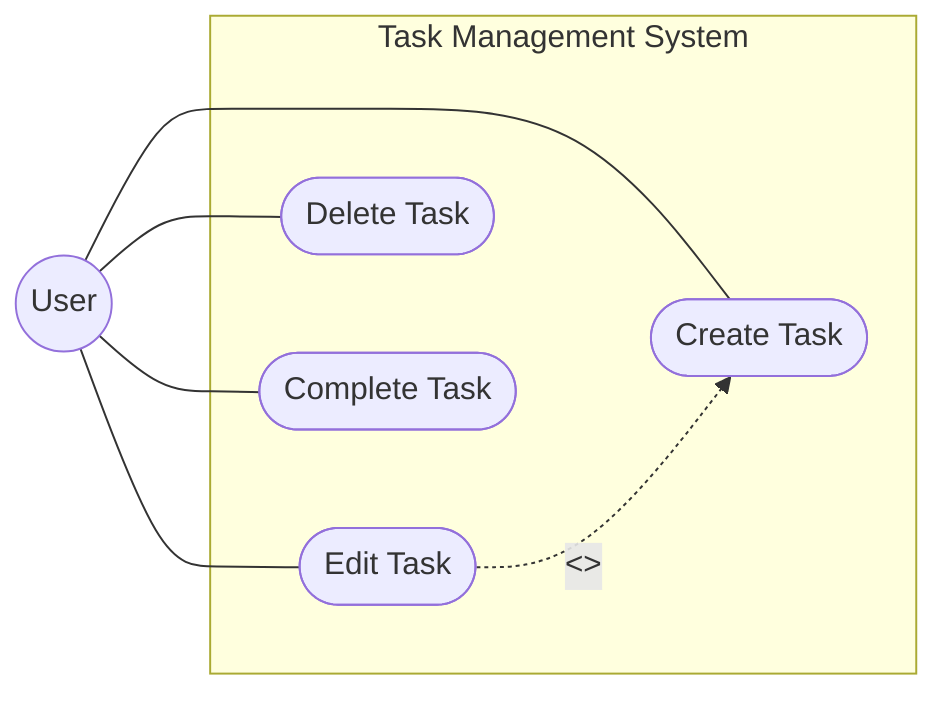

# Input Examples for analyze-requirements

## Use Case Diagram Text Input

When providing a use case diagram directly as input:

```
/analyze-requirements ## Use Case Diagram



## Actors

| Actor | Description |
|:------|:------------|
| User  | End user who manages tasks |

## Use Cases

| ID  | Use Case      | Description                |
|:----|:--------------|:---------------------------|
| UC1 | Create Task   | Create a new task          |
| UC2 | Edit Task     | Modify existing task       |
| UC3 | Delete Task   | Remove a task              |
| UC4 | Complete Task | Mark a task as completed   |
```

## Feature Name Reference

When referencing an existing PRD by feature name:

```
/analyze-requirements task-management
```

The skill will look for:
- `${CLAUDE_PROJECT_DIR}/${SDD_REQUIREMENT_PATH}/task-management.md`
- Extract use case diagrams from the PRD

## CI Mode

When called from generate-prd in CI mode:

```
/analyze-requirements task-management --ci
```

In CI mode:
- No clarifying questions are asked
- Reasonable assumptions are made for ambiguous requirements
- Output is optimized for pipeline consumption
