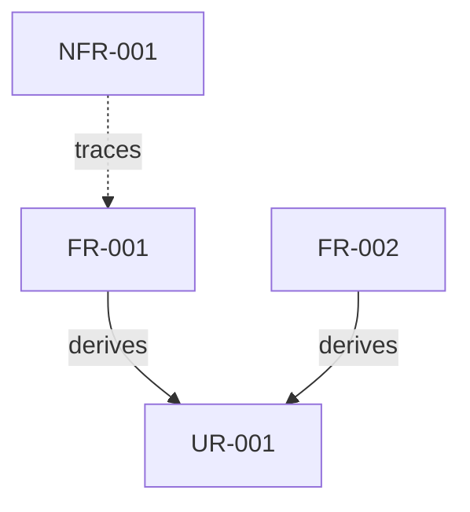

# Requirements Analysis Output Format

**IMPORTANT: This skill returns TEXT only. It does NOT write files.**

Return the following sections:

## Requirements Analysis

### User Requirements (UR)

| ID     | Requirement                    | Priority | Risk   | Verification  |
|:-------|:-------------------------------|:---------|:-------|:--------------|
| UR-001 | {User requirement description} | Must     | High   | Demonstration |
| UR-002 | {User requirement description} | Should   | Medium | Demonstration |

### Functional Requirements (FR)

| ID     | Requirement              | Derived From | Priority | Risk   | Verification |
|:-------|:-------------------------|:-------------|:---------|:-------|:-------------|
| FR-001 | {Functional requirement} | UR-001       | Must     | High   | Test         |
| FR-002 | {Functional requirement} | UR-001       | Must     | Medium | Test         |
| FR-003 | {Functional requirement} | UR-002       | Should   | Low    | Test         |

### Non-Functional Requirements (NFR)

| ID      | Requirement       | Category    | Related FR     | Priority | Risk   | Verification |
|:--------|:------------------|:------------|:---------------|:---------|:-------|:-------------|
| NFR-001 | {NFR description} | Performance | FR-001, FR-002 | Should   | Medium | Test         |
| NFR-002 | {NFR description} | Security    | FR-001         | Must     | High   | Test         |

### Requirement Relationships

### Summary

| Category                    | Count | Must | Should | Could |
|:----------------------------|------:|-----:|-------:|------:|
| User Requirements           |     X |    X |      X |     X |
| Functional Requirements     |     X |    X |      X |     X |
| Non-Functional Requirements |     X |    X |      X |     X |
| **Total**                   |     X |    X |      X |     X |
