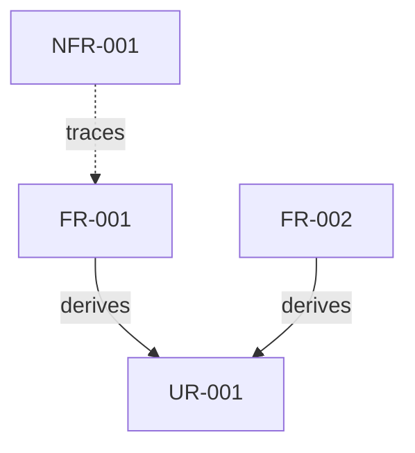

# 要求分析 出力フォーマット

**重要: このスキルはテキストのみを返します。ファイルへの書き込みは行いません。**

以下のセクションを返してください：

## 要求分析

### ユーザー要求 (UR)

| ID     | 要求内容     | 優先度    | リスク    | 検証方法          |
|:-------|:---------|:-------|:-------|:--------------|
| UR-001 | {ユーザー要求} | Must   | High   | Demonstration |
| UR-002 | {ユーザー要求} | Should | Medium | Demonstration |

### 機能要求 (FR)

| ID     | 要求内容   | 派生元    | 優先度    | リスク    | 検証方法 |
|:-------|:-------|:-------|:-------|:-------|:-----|
| FR-001 | {機能要求} | UR-001 | Must   | High   | Test |
| FR-002 | {機能要求} | UR-001 | Must   | Medium | Test |
| FR-003 | {機能要求} | UR-002 | Should | Low    | Test |

### 非機能要求 (NFR)

| ID      | 要求内容    | カテゴリ        | 関連FR           | 優先度    | リスク    | 検証方法 |
|:--------|:--------|:------------|:---------------|:-------|:-------|:-----|
| NFR-001 | {非機能要求} | Performance | FR-001, FR-002 | Should | Medium | Test |
| NFR-002 | {非機能要求} | Security    | FR-001         | Must   | High   | Test |

### 要求間の関係

### サマリー

| カテゴリ   | 件数 | Must | Should | Could |
|:-------|---:|-----:|-------:|------:|
| ユーザー要求 |  X |    X |      X |     X |
| 機能要求   |  X |    X |      X |     X |
| 非機能要求  |  X |    X |      X |     X |
| **合計** |  X |    X |      X |     X |
