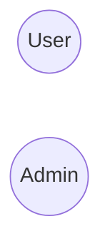
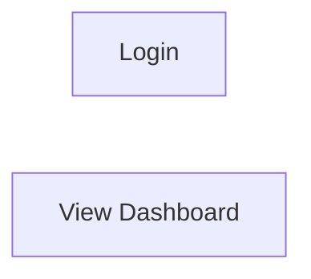
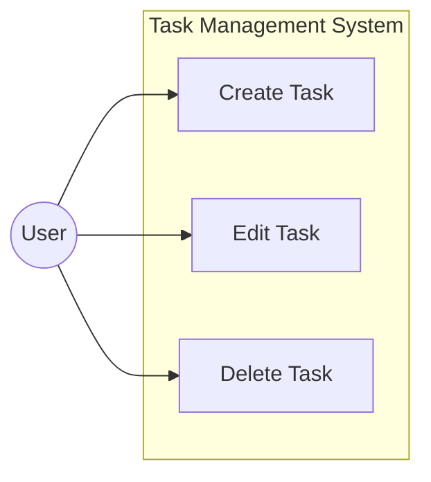
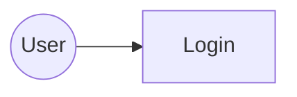
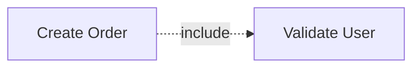
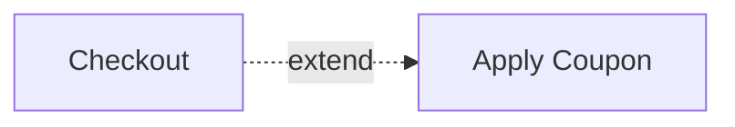
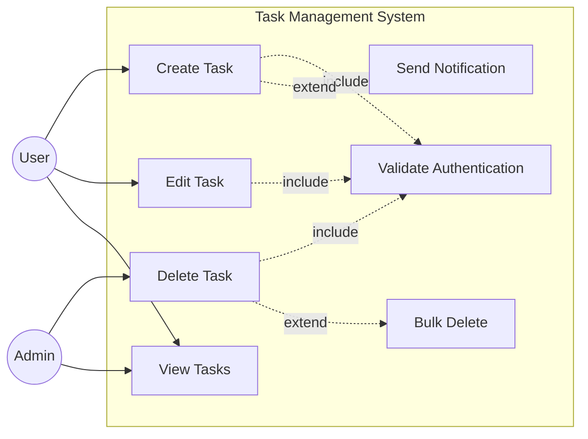
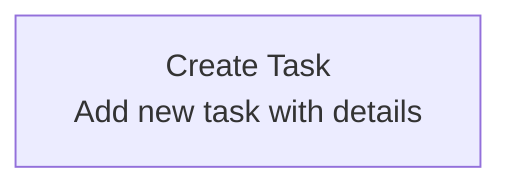
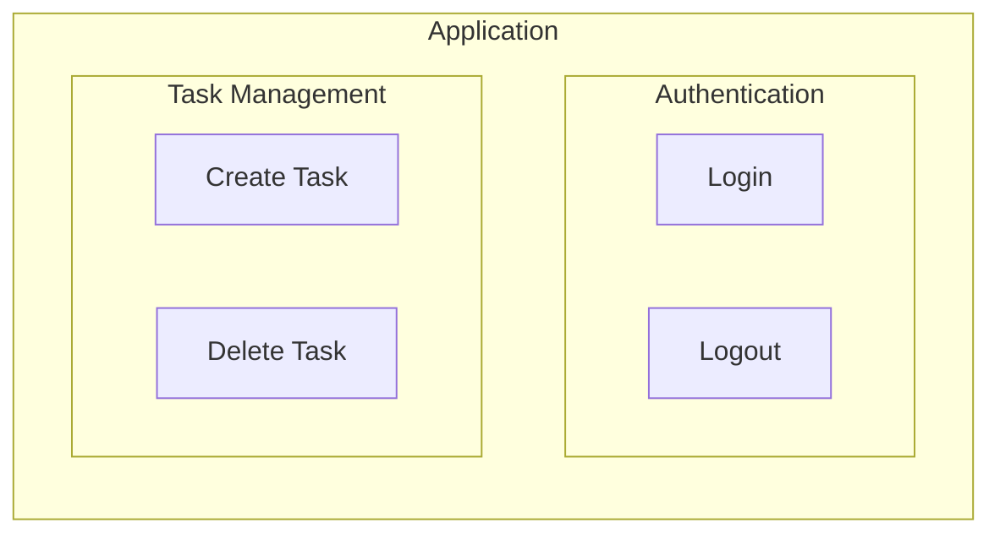

# Use Case Diagram Guide for Mermaid

## Mermaid Constraints

Mermaid does **NOT** have native support for use case diagrams. Use `flowchart` (graph) as an alternative representation.

## Basic Notation

### Diagram Direction

| Direction | Description          | Use Case                          |
|:----------|:---------------------|:----------------------------------|
| `TB`      | Top to Bottom        | Standard vertical layout          |
| `LR`      | Left to Right        | Horizontal layout (recommended)   |

### Actor Representation

Use double parentheses `(( ))` for circular nodes representing actors:

### Use Case Representation

Use brackets `[ ]` for rectangular nodes representing use cases:

### System Boundary

Use `subgraph` to represent the system boundary:

## Relationships

### Association (Actor to Use Case)

Use solid arrows `-->` for associations:

### Include Relationship

Use dotted arrows with label for include relationships. The base use case **always** includes the included use case:

**Direction**: Arrow points from base use case **to** included use case.

### Extend Relationship

Use dotted arrows with label for extend relationships. The extending use case **optionally** extends the base use case:

**Direction**: Arrow points from extending use case **to** base use case.

## Complete Example

## Common Mistakes

| Incorrect                           | Correct                              | Explanation                                              |
|:------------------------------------|:-------------------------------------|:---------------------------------------------------------|
| `User((User))` without `flowchart`  | `flowchart LR` then `User((User))`   | Must declare diagram type first                          |
| `--include-->`                      | `-. include .->`                     | Use dotted line syntax for stereotypes                   |
| `<<include>>`                       | `include`                            | Mermaid doesn't support UML stereotype syntax            |
| `Actor[User]`                       | `User((User))`                       | Use `(( ))` for actors, `[ ]` for use cases              |
| `UC1 -. include .-> UC2` (extend)   | `UC2 -. extend .-> UC1`              | Extend arrow goes FROM extending TO base                 |
| `system { ... }`                    | `subgraph System [ ... ] ... end`    | Use subgraph for system boundary                         |
| Spaces in node names                | Use underscores or camelCase         | `Create Task` → `CreateTask` or `Create_Task`            |
| Missing `end` for subgraph          | Always close with `end`              | Each `subgraph` must have matching `end`                 |

## Include vs Extend

| Aspect      | Include                                  | Extend                                           |
|:------------|:-----------------------------------------|:-------------------------------------------------|
| **Meaning** | Base use case ALWAYS includes the target | Extending use case OPTIONALLY extends the base   |
| **Arrow**   | Base → Included                          | Extending → Base                                 |
| **Example** | Login **includes** Validate Credentials  | Checkout **extended by** Apply Coupon            |

## Style Tips

### Adding Descriptions

Use node text for brief descriptions:

### Grouping Related Use Cases

Use nested subgraphs for categorization:

## Limitations

1. **No native use case shape**: Mermaid uses rectangles `[ ]` instead of ovals
2. **No generalization arrows**: Actor/use case inheritance not directly supported
3. **Limited styling**: Use CSS classes for custom styling if needed
4. **Label positioning**: Stereotype labels (`include`, `extend`) appear on the line, not above it
