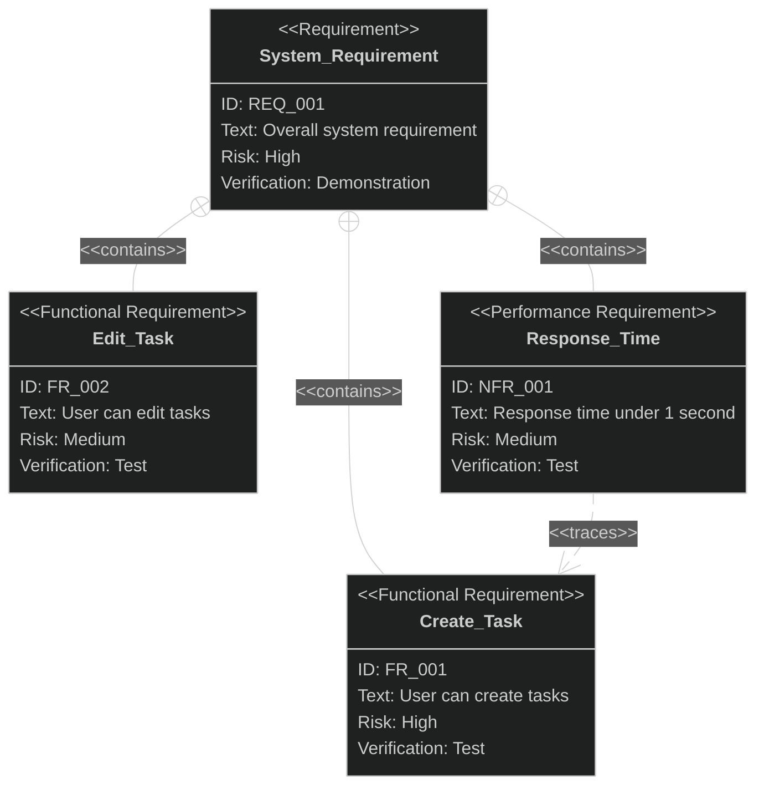

# Requirements Diagram Output Format

**IMPORTANT: This skill returns TEXT only. It does NOT write files.**

Return the following sections:

## Requirements Diagram (SysML)



## Diagram Structure

### Requirement Hierarchy

```
REQ_001 (System Requirement)
├── FR_001 (Create Task)
├── FR_002 (Edit Task)
└── NFR_001 (Response Time)
    └── traces -> FR_001
```

### Relationship Summary

| Source  | Relationship | Target | Rationale                        |
|:--------|:-------------|:-------|:---------------------------------|
| REQ_001 | contains     | FR_001 | Core functionality               |
| REQ_001 | contains     | FR_002 | Core functionality               |
| NFR_001 | traces       | FR_001 | Performance applies to creation  |
