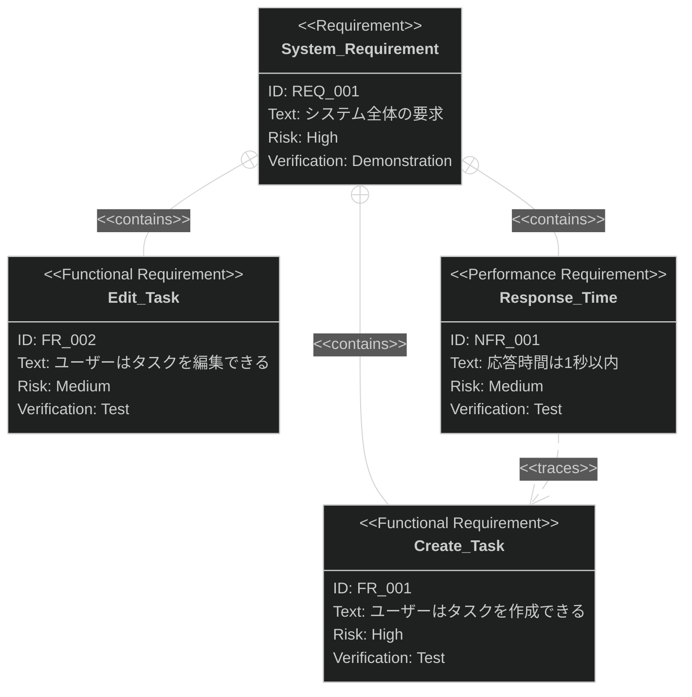

# 要求図 出力フォーマット

**重要: このスキルはテキストのみを返します。ファイルへの書き込みは行いません。**

以下のセクションを返してください：

## 要求図 (SysML)



## 図の構造

### 要求階層

```
REQ_001 (システム要求)
├── FR_001 (タスク作成)
├── FR_002 (タスク編集)
└── NFR_001 (応答時間)
    └── traces -> FR_001
```

### 関係性サマリー

| ソース   | 関係性    | ターゲット | 根拠                       |
|:--------|:---------|:---------|:--------------------------|
| REQ_001 | contains | FR_001   | コア機能                    |
| REQ_001 | contains | FR_002   | コア機能                    |
| NFR_001 | traces   | FR_001   | パフォーマンスはタスク作成に適用 |
