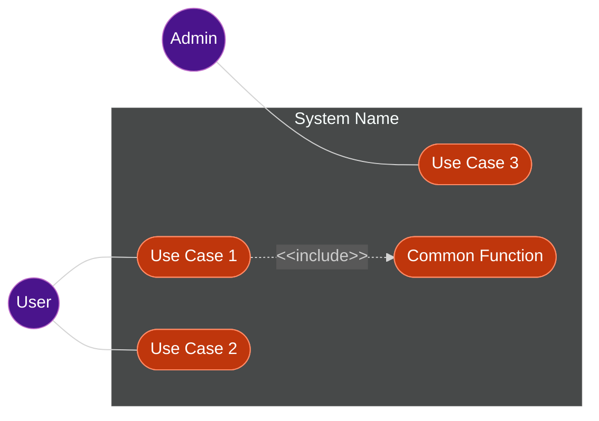

# Generate Use Case Diagram

Generates a use case diagram in Mermaid flowchart format from business requirements or feature name.

## Prerequisites

**Read the following reference guides before generation:**

- `references/usecase_diagram_guide.md` - Use case diagram notation and examples
- `references/mermaid_notation_rules.md` - Mermaid flowchart syntax and styling

## Hybrid Approach

This skill operates in two modes:

| Mode                      | Behavior | Description                                                    |
|:--------------------------|:---------|:---------------------------------------------------------------|
| **Interactive** (default) | Guide    | May ask clarifying questions, provides detailed output         |
| **CI (`--ci`)**           | Silent   | No user interaction, concise output for pipeline integration   |

## Input

$ARGUMENTS

| Argument                   | Required | Description                                                |
|:---------------------------|:---------|:-----------------------------------------------------------|
| `requirements-description` | Yes      | Business requirements text OR feature name                 |
| `--ci`                     | -        | CI/non-interactive mode. Skips clarifying questions        |

**When feature name is provided**, look for existing PRD at `${CLAUDE_PROJECT_DIR}/${SDD_REQUIREMENT_PATH}/{feature-name}.md`.

### Input Examples

**Feature name (looks up PRD):**

```
/generate-usecase-diagram user-authentication
```

**Requirements description:**

```
/generate-usecase-diagram Users can register, login, and reset passwords. Admin can manage user accounts.
```

**CI mode (called by generate-prd):**

```
/generate-usecase-diagram user-authentication --ci
```

## Generation Flow

### Interactive Mode (Default)

1. **Analyze Input**: Extract actors, use cases, and relationships
2. **Clarify** (if needed): Ask user about ambiguous requirements
3. **Read References**: Load diagram guides for correct syntax
4. **Generate Diagram**: Create Mermaid flowchart with proper styling
5. **Validate**: Check Quality Checks items
    - If issues found: Fix and repeat from step 4
6. **Return Text**: Output diagram and documentation (no file write)

### CI Mode (`--ci`)

> Skips step 2 (Clarify). Does not use AskUserQuestion tool.

1. **Analyze Input**: Extract actors, use cases, and relationships
2. **Read References**: Load diagram guides for correct syntax
3. **Generate Diagram**: Create Mermaid flowchart with proper styling
4. **Validate**: Check Quality Checks items
    - If issues found: Fix and repeat from step 3
5. **Return Text**: Output diagram only (minimal documentation)

## Output Format

**IMPORTANT**: This skill returns text only. It does NOT write files.

Return the following markdown structure:

```markdown
## Use Case Diagram



## Actors

| Actor | Description |
|:------|:------------|
| User  | Logged-in user who performs main operations |
| Admin | Administrator with elevated privileges |

## Use Cases

| ID  | Use Case       | Description                        | Actor(s) |
|:----|:---------------|:-----------------------------------|:---------|
| UC1 | Use Case 1     | Brief description of use case 1    | User     |
| UC2 | Use Case 2     | Brief description of use case 2    | User     |
| UC3 | Use Case 3     | Brief description of use case 3    | Admin    |
| UC4 | Common Function| Shared function included by others | -        |
```

## Quality Checks

Before returning, verify:

- [ ] All actors from requirements are represented
- [ ] All major functions are captured as use cases
- [ ] System boundary defined
- [ ] Mermaid syntax is valid
- [ ] Consistent styling applied

## Notes

### Diagram Design

- Use consistent granularity within the diagram
- Keep diagram readable by limiting to 7-10 use cases per diagram
- For large systems, create separate diagrams per subsystem or feature group
- Actors represent roles (e.g., "Admin", "Guest"), not specific users

### Relationships

- **Include**: Always executed as part of the base use case (mandatory)
- **Extend**: Optional behavior that may or may not occur
- Avoid deep nesting of include/extend relationships (max 2 levels)

### Naming Conventions

- Use verb phrases for use cases (e.g., "Login", "Register Account")
- Use noun phrases for actors (e.g., "User", "System Administrator")
- Keep names concise but descriptive

### Integration

- This skill is typically called by `/generate-prd --ci` with `--ci` flag
- Output is text only; the caller is responsible for file operations
- When called standalone (Interactive mode), suggest next step: `/analyze-requirements`
- In CI mode, output is optimized for pipeline consumption (minimal text, diagram focus)
