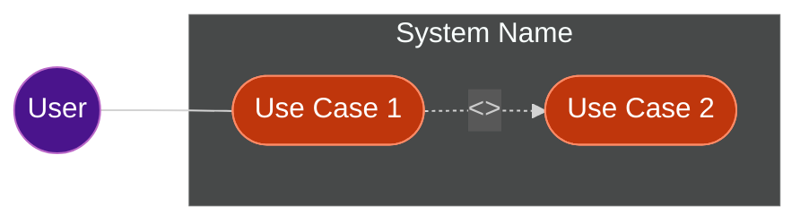

# Use Case Diagram Output Format

**IMPORTANT: This skill returns TEXT only. It does NOT write files.**

Return the following sections:

## 1. Use Case Diagram (Mermaid)

## 2. Actors Table

| Actor | Description      |
|:------|:-----------------|
| User  | Role description |

## 3. Use Cases Table

| ID  | Use Case | Description | Related Actors |
|:----|:---------|:------------|:---------------|
| UC1 | Name     | Description | Actor          |

## 4. Relationships (if any include/extend exists)

| Relationship | From | To  | Description                    |
|:-------------|:-----|:----|:-------------------------------|
| include      | UC1  | UC2 | Always executed as part of UC1 |
| extend       | UC3  | UC1 | Optional behavior for UC1      |