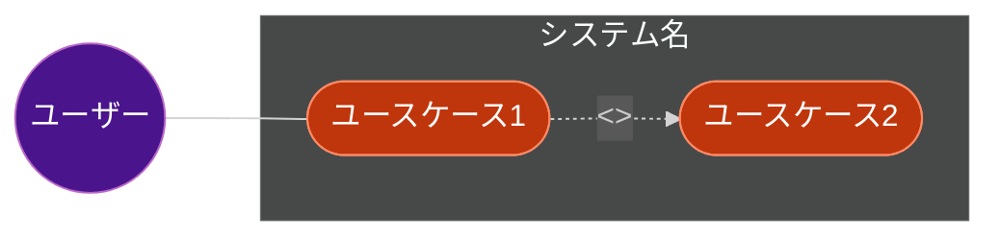

# ユースケース図 出力フォーマット

**重要: このスキルはテキストのみを返します。ファイルへの書き込みは行いません。**

以下のセクションを返してください：

## 1. ユースケース図 (Mermaid)

## 2. アクター一覧

| アクター | 説明   |
|:-----|:-----|
| ユーザー | 役割説明 |

## 3. ユースケース一覧

| ID  | ユースケース | 説明 | 関連アクター |
|:----|:-------|:---|:-------|
| UC1 | 名称     | 説明 | アクター   |

## 4. 関係性（include/extend がある場合）

| 関係性     | 元   | 先   | 説明                  |
|:--------|:----|:----|:--------------------|
| include | UC1 | UC2 | UC1 の一部として常に実行される   |
| extend  | UC3 | UC1 | UC1 のオプション動作として実行可能 |