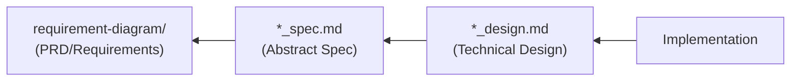

# SDD Templates - AI-SDD Document Templates

Provides templates for various documents used in the AI-SDD workflow.

## Prerequisites

**Before execution, you must read `sdd-workflow:sdd-workflow` agent content to understand AI-SDD principles.**

This skill provides templates that follow the sdd-workflow agent principles.

## Available Templates

| Template | File | Usage |
|:---|:---|:---|
| **PRD (Requirements Specification)** | [templates/prd_template.md](templates/prd_template.md) | Used with `/generate_prd` command |
| **Abstract Specification** | [templates/spec_template.md](templates/spec_template.md) | Used with `/generate_spec` command |
| **Technical Design Doc** | [templates/design_template.md](templates/design_template.md) | Used with `/generate_spec` command |

## Usage

### 1. Template Reference

When executing commands (`/generate_prd`, `/generate_spec`), read and use the corresponding template.

```
/generate_prd {requirements}
→ Reference templates/prd_template.md to generate PRD

/generate_spec {specifications}
→ Reference templates/spec_template.md to generate abstract specification
→ Reference templates/design_template.md to generate technical design doc
```

### 2. Priority with Project Templates

When project-specific templates exist, priority order is:

1. **Project templates** (`.docs/SPECIFICATION_TEMPLATE.md`, etc.)
2. **Plugin templates** (templates in this skill)
3. **Default format** (format defined in commands)

### 3. Customizing Templates

When project-specific customization is needed:

1. Copy templates from this skill to `.docs/`
2. Modify according to project requirements
3. Project templates will take priority thereafter

## Template Overview

### PRD (Requirements Specification) Template

Defines the following in SysML Requirements Diagram format:

- Background and Purpose
- User Requirements (UR-xxx)
- Functional Requirements (FR-xxx)
- Non-Functional Requirements (NFR-xxx)
- Requirements Diagram (Mermaid)
- Constraints and Assumptions

### Abstract Specification Template

Defines the logical structure of the system:

- Background and Overview
- Functional Requirements (with PRD requirement ID mapping)
- Public API (SysML bdd format)
- Data Model
- Behavior (Sequence Diagrams)

### Technical Design Doc Template

Defines concrete implementation plans:

- Implementation Status
- Design Goals
- Technology Stack
- Architecture
- Design Decisions and Rationale

## Document Dependencies



Each template is designed to ensure traceability based on this dependency relationship.

## Notes

- Templates are **structural guidelines**; not all sections are mandatory
- Select necessary sections according to project scale and nature
- Manage requirement IDs (UR-xxx, FR-xxx, NFR-xxx) uniquely and enable cross-document references
