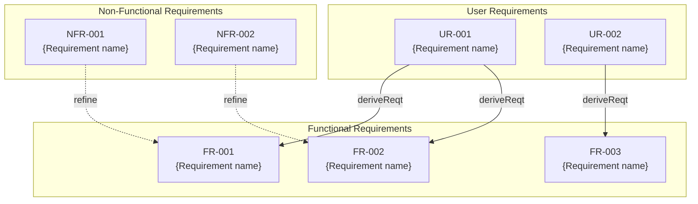

# {Feature Name} Product Requirements Document (PRD)

## Document Information

| Item | Content |
|:---|:---|
| Feature Name | {Feature Name} |
| Created | YYYY-MM-DD |
| Status | Draft / Review / Approved |
| Related Documents | [Spec](.docs/specification/{feature-name}_spec.md), [Design](.docs/specification/{feature-name}_design.md) |

## Background and Purpose

### Background

{Describe why this feature is needed and current challenges}

### Purpose

{Describe what this feature aims to achieve and its business value}

### Success Criteria

- {Quantitative or qualitative success metric 1}
- {Quantitative or qualitative success metric 2}

## Requirements Definition

### User Requirements

Requirements from the user's perspective.

| ID | Requirement | Priority | Verification Method |
|:---|:---|:---|:---|
| UR-001 | {User can do...} | Must / Should / Could | {Verification method} |
| UR-002 | {User can do...} | Must / Should / Could | {Verification method} |

### Functional Requirements

Functions the system must provide.

| ID | Requirement | Derived From | Priority | Verification Method |
|:---|:---|:---|:---|:---|
| FR-001 | {System shall...} | UR-001 | Must / Should / Could | {Verification method} |
| FR-002 | {System shall...} | UR-001 | Must / Should / Could | {Verification method} |
| FR-003 | {System shall...} | UR-002 | Must / Should / Could | {Verification method} |

### Non-Functional Requirements

| ID | Category | Requirement | Priority | Verification Method |
|:---|:---|:---|:---|:---|
| NFR-001 | Performance | {Response time, throughput, etc.} | Must / Should / Could | {Verification method} |
| NFR-002 | Security | {Authentication, authorization, encryption, etc.} | Must / Should / Could | {Verification method} |
| NFR-003 | Availability | {Uptime, disaster recovery, etc.} | Must / Should / Could | {Verification method} |
| NFR-004 | Maintainability | {Code quality, documentation, etc.} | Must / Should / Could | {Verification method} |

## Requirements Diagram (SysML Requirements Diagram)

### Requirements Relationship Legend

| Relationship | Meaning | Notation |
|:---|:---|:---|
| deriveReqt | Derivation (derive lower requirements from higher) | Solid arrow |
| refine | Refinement (make abstract requirements concrete) | Dashed arrow |
| satisfy | Satisfaction (design element satisfies requirement) | - |
| verify | Verification (test case verifies requirement) | - |
| trace | Trace (general association between requirements) | - |

## Constraints

### Technical Constraints

- {Technical constraint 1}
- {Technical constraint 2}

### Business Constraints

- {Business constraint 1}
- {Schedule, budget constraints}

### Legal/Regulatory Constraints

- {Applicable regulations}
- {Compliance requirements}

## Assumptions

- {Assumption for this feature to work 1}
- {Dependent systems/features}
- {User prerequisites/skills}

## Out of Scope

The following are out of scope for this PRD:

- {Not included in this feature 1}
- {May be considered in the future but not included now}
- {Related but handled in separate PRD}

## Glossary

| Term | Definition |
|:---|:---|
| {Term 1} | {Definition} |
| {Term 2} | {Definition} |

## Risks and Mitigations

| Risk | Impact | Probability | Mitigation |
|:---|:---|:---|:---|
| {Risk 1} | High/Medium/Low | High/Medium/Low | {Mitigation} |
| {Risk 2} | High/Medium/Low | High/Medium/Low | {Mitigation} |

## Approval

| Role | Name | Date | Signature |
|:---|:---|:---|:---|
| Author | {Name} | YYYY-MM-DD | - |
| Reviewer | {Name} | YYYY-MM-DD | - |
| Approver | {Name} | YYYY-MM-DD | - |

---

## Change History

| Date | Version | Changes | Author |
|:---|:---|:---|:---|
| YYYY-MM-DD | 1.0 | Initial creation | {Name} |
