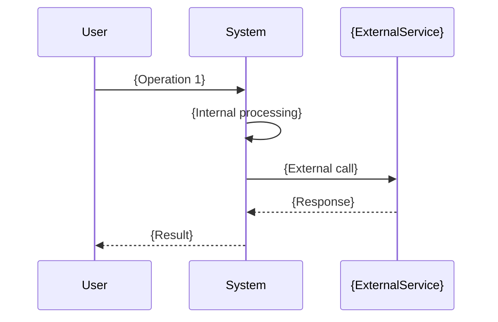
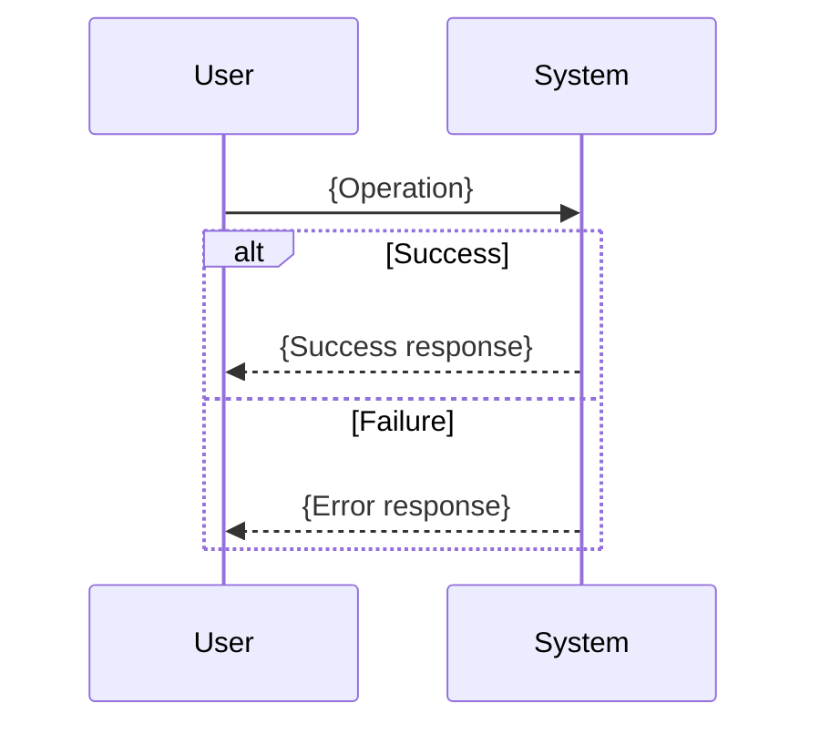

# {Feature Name} Specification

## Document Information

| Item | Content |
|:---|:---|
| Feature Name | {Feature Name} |
| Created | YYYY-MM-DD |
| Status | Draft / Review / Approved |
| Related Documents | [PRD](.docs/requirement-diagram/{feature-name}.md), [Design](.docs/specification/{feature-name}_design.md) |

## Background

{Describe why this feature is needed and the problem it solves}

## Overview

{Describe the overview of the functionality defined in this specification}

### Scope

- {What this specification covers 1}
- {What this specification covers 2}

### Out of Scope

- {What this specification does not cover}

## Functional Requirements

Defines functional requirements to realize PRD requirements.

### {Functional Category 1}

| Requirement ID | Requirement | PRD Reference | Priority |
|:---|:---|:---|:---|
| SPEC-001 | {Functional requirement description} | FR-001, FR-002 | Must / Should / Could |
| SPEC-002 | {Functional requirement description} | FR-003 | Must / Should / Could |

#### SPEC-001: {Requirement Name}

**Description**: {Detailed description}

**Input**:
- {Input parameter 1}: {Type} - {Description}
- {Input parameter 2}: {Type} - {Description}

**Output**:
- {Output 1}: {Type} - {Description}

**Behavior**:
1. {Step 1}
2. {Step 2}
3. {Step 3}

**Error Cases**:
- {Error condition 1}: {Response}
- {Error condition 2}: {Response}

### {Functional Category 2}

| Requirement ID | Requirement | PRD Reference | Priority |
|:---|:---|:---|:---|
| SPEC-003 | {Functional requirement description} | FR-004 | Must / Should / Could |

## API

Defines public interfaces in SysML Block Definition Diagram (bdd) format.

### Block Definition Diagram

```mermaid
classDiagram
    class {FeatureName}Service {
        <<block>>
        +operation1(param1: Type1): ReturnType1
        +operation2(param2: Type2): ReturnType2
    }

    class {RelatedBlock1} {
        <<block>>
        +property1: Type
        +property2: Type
    }

    class {RelatedBlock2} {
        <<block>>
        +property1: Type
    }

    {FeatureName}Service --> {RelatedBlock1} : uses
    {FeatureName}Service --> {RelatedBlock2} : produces
```

### Interface Definition

#### {Operation 1}

```typescript
/**
 * {Operation description}
 * @param {param1} - {Parameter description}
 * @returns {Return value description}
 * @throws {Error condition}
 */
function operation1(param1: Type1): ReturnType1;
```

**Constraints**:
- {Constraint 1}
- {Constraint 2}

#### {Operation 2}

```typescript
function operation2(param2: Type2): ReturnType2;
```

## Data Model

### Type Definitions

```typescript
/**
 * {Type description}
 */
interface {TypeName1} {
  /** {Field description} */
  field1: string;
  /** {Field description} */
  field2: number;
  /** {Field description} */
  field3?: OptionalType;
}

/**
 * {Type description}
 */
interface {TypeName2} {
  field1: Type;
  field2: Type;
}

/**
 * {Enum description}
 */
type {EnumName} = 'value1' | 'value2' | 'value3';
```

### Entity Relationship Diagram

```mermaid
erDiagram
    {Entity1} ||--o{ {Entity2} : "has"
    {Entity1} {
        string id PK
        string name
        datetime createdAt
    }
    {Entity2} {
        string id PK
        string entity1Id FK
        string value
    }
```

## Behavior

### Use Case 1: {Use Case Name}



**Preconditions**:
- {Precondition 1}
- {Precondition 2}

**Postconditions**:
- {Postcondition 1}
- {Postcondition 2}

### Use Case 2: {Use Case Name}



## State Transition (If Applicable)

```mermaid
stateDiagram-v2
    [*] --> {InitialState}
    {InitialState} --> {State1} : {Event1}
    {State1} --> {State2} : {Event2}
    {State2} --> {State1} : {Event3}
    {State2} --> [*] : {EndEvent}
```

| State | Description | Possible Transitions |
|:---|:---|:---|
| {InitialState} | {State description} | {State1} |
| {State1} | {State description} | {State2} |
| {State2} | {State description} | {State1}, End |

## Constraints

### Functional Constraints

- {Functional constraint 1}
- {Functional constraint 2}

### Non-Functional Constraints (PRD NFR Reference)

| Constraint | Requirement | NFR Reference |
|:---|:---|:---|
| Performance | {Specific requirement} | NFR-001 |
| Security | {Specific requirement} | NFR-002 |
| Availability | {Specific requirement} | NFR-003 |

## Glossary

| Term | Definition |
|:---|:---|
| {Term 1} | {Definition} |
| {Term 2} | {Definition} |

## PRD Reference

- Related PRD: `.docs/requirement-diagram/{feature-name}.md`
- Covered Requirements: {UR-001, FR-001, FR-002, NFR-001, ...}

### Requirements Traceability Matrix

| PRD Requirement ID | Coverage in This Spec | Status |
|:---|:---|:---|
| UR-001 | SPEC-001, SPEC-002 | Covered |
| FR-001 | SPEC-001 | Covered |
| FR-002 | SPEC-002 | Covered |
| NFR-001 | Documented in Constraints | Covered |

---

## Change History

| Date | Version | Changes | Author |
|:---|:---|:---|:---|
| YYYY-MM-DD | 1.0 | Initial creation | {Name} |
