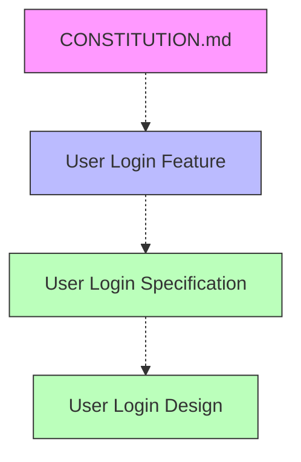

# SDD Dependency Visualizer

## Overview

Analyzes dependencies between SDD documents and visualizes them as a Mermaid diagram. Displays hierarchical structure starting from CONSTITUTION.md.

## Prerequisites

- `@shared/references/cli_tool_usage.md` - CLI tool usage guide
- `@shared/references/mermaid_notation_rules.md` - Mermaid notation rules
- Index must be built (run `/sdd-index` to build)

## Arguments

- `--filter-dir <type>`: Visualize only specific directory (requirement/specification/task)
- `--feature-id <id>`: Visualize only documents related to specific feature

## Processing Flow

**Phase 1: Shell Script** - Generate dependency graph using CLI:

```bash
bash "${CLAUDE_PLUGIN_ROOT}/skills/sdd-visualize/scripts/visualize.sh" "$ARGUMENTS"
```

**Phase 2: Claude** - Parse and present generated Mermaid diagram:

1. Read Mermaid diagram from `$SDD_DEPENDENCY_GRAPH`
2. Analyze diagram contents:
   - Number of nodes (document count)
   - Number of edges (dependency count)
   - Distribution by directory
3. Present Mermaid diagram to user
4. Explain dependency overview

## Output Example

````
Dependency graph generated.



**Dependency Summary**:
- Document count: 3
- Dependency count: 3
- Hierarchy: CONSTITUTION → requirement → specification (spec) → specification (design)
````

## Dependency Types

- **Solid arrow (`-->`)**: Explicit dependency (from frontmatter `depends-on` field)
- **Dashed arrow (`-.->`)**: Implicit dependency (inferred from file naming conventions)

## Node Color Coding

- **Purple (#f9f)**: CONSTITUTION.md (project principles)
- **Blue (#bbf)**: requirement (requirements specification)
- **Green (#bfb)**: specification (specification/design documents)
- **Yellow (#ffb)**: task (task logs)

## Usage Examples

```bash
# Visualize all dependencies
/sdd-visualize

# Visualize requirement only
/sdd-visualize --filter-dir requirement

# Visualize specific feature dependencies
/sdd-visualize --feature-id user-login

# Visualize specification only (spec + design)
/sdd-visualize --filter-dir specification
```

## Error Handling

- If index does not exist, suggest running `/sdd-index`
- If CLI tool is unavailable, provide installation instructions
- If no documents found, suggest initializing with `/sdd-init`

## Related Skills

- `/sdd-index`: Build the index
- `/sdd-search`: Search documents
- `/generate-spec`: Generate specifications
- `/check-spec`: Check consistency
