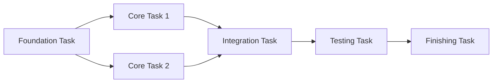

# Task Breakdown

Loads technical design document (`*_design.md`) and breaks it down into independently testable small tasks.

## Prerequisites

**Read the following prerequisite references before execution:**

- `references/prerequisites_plugin_update.md` - Check for plugin updates
- `references/prerequisites_principles.md` - Read AI-SDD principles document
- `references/prerequisites_directory_paths.md` - Resolve directory paths using `SDD_*` environment variables

### Tasks Phase Positioning (Reference)

| Phase     | Purpose                                                   | Deliverables  |
|:----------|:----------------------------------------------------------|:--------------|
| **Tasks** | Break down design into independently testable small tasks | Under `task/` |

### Language Configuration

Output templates are located under `templates/${SDD_LANG:-en}/` within this skill directory.
The `SDD_LANG` environment variable determines the language (default: `en`).

## Input

$ARGUMENTS

| Argument | Required | Description |
|:--|:--|:--|
| `feature-name` | Yes | Target feature name or path (e.g., `user-auth`, `auth/user-login`). Design doc path is resolved from this value |
| `ticket-number` | - | Used for output directory name (e.g., `TICKET-123`) |
| `--ci` | - | CI/non-interactive mode. Exits with error if design doc is missing instead of prompting |

### Input Examples

```
/task-breakdown user-auth
/task-breakdown task-management TICKET-123
```

## Processing Flow

### 1. Load Related Documents

Both flat and hierarchical structures are supported.

**For flat structure**:

```
Load .sdd/requirement/{feature-name}.md (PRD, if exists)
Load .sdd/specification/{feature-name}_spec.md (if exists)
Load .sdd/specification/{feature-name}_design.md (required)
```

**For hierarchical structure** (when argument contains `/`):

```
Load .sdd/requirement/{parent-feature}/index.md (parent feature PRD, if exists)
Load .sdd/requirement/{parent-feature}/{feature-name}.md (child feature PRD, if exists)
Load .sdd/specification/{parent-feature}/index_spec.md (parent feature spec, if exists)
Load .sdd/specification/{parent-feature}/{feature-name}_spec.md (child feature spec, if exists)
Load .sdd/specification/{parent-feature}/index_design.md (parent feature design, if exists)
Load .sdd/specification/{parent-feature}/{feature-name}_design.md (child feature design, required)
```

**Note the difference in naming conventions**:

- **Under requirement**: No suffix (`index.md`, `{feature-name}.md`)
- **Under specification**: `_spec` or `_design` suffix required (`index_spec.md`, `{feature-name}_spec.md`)

**Hierarchical structure input examples**:

```
/task-breakdown auth/user-login
/task-breakdown auth/user-login TICKET-123
```

- If design document doesn't exist:
  - **CI Mode (`--ci`)**: Output error message and stop processing.
  - **Interactive**: Prompt creation with `/generate-spec` first.
- If PRD/spec exists, use to verify tasks cover requirements

### 2. Analyze Design Document

Extract the following information from design document:

| Extraction Item      | Description                 |
|:---------------------|:----------------------------|
| **Module Structure** | Files/directories to create |
| **Dependencies**     | Inter-module dependencies   |
| **Interfaces**       | Public API for each module  |
| **Technology Stack** | Libraries/frameworks to use |

### 3. Task Breakdown Principles

#### Independence

- Each task can be implemented without depending on other tasks
- Break down to granularity allowing parallel work

#### Testability

- Each task can be tested independently
- Clear completion criteria

#### Appropriate Granularity

- 1 task = completable in hours to 1 day
- Not too large, not too small

### 4. Task Classification

| Category        | Description                      | Examples                              |
|:----------------|:---------------------------------|:--------------------------------------|
| **Foundation**  | Work prerequisite to other tasks | Directory structure, type definitions |
| **Core**        | Main feature implementation      | Business logic, API                   |
| **Integration** | Inter-module coordination        | Service layer, event processing       |
| **Testing**     | Test creation                    | Unit tests, integration tests         |
| **Finishing**   | Final adjustments                | Documentation updates, refactoring    |

### 5. Organize Dependencies

Clarify dependencies between tasks:



## Output Format

### Task List

**Reference**: `examples/task_list_format.md`

The example includes 5 phases (Foundation, Core Implementation, Integration, Testing, Finishing) with dependency diagrams and reference documents.

## Output

Use the `templates/${SDD_LANG:-en}/breakdown_output.md` template for output formatting. Save results to .sdd/task/{ticket_number}/tasks.md or .sdd/task/{feature}/tasks.md.

## Requirement Coverage Verification

If PRD/spec exists, verify the following for generated task list:

### Check Items

| Check Item                                   | Verification Content                                                 |
|:---------------------------------------------|:---------------------------------------------------------------------|
| **Functional Requirement Coverage**          | Are PRD/spec functional requirements (FR-xxx) covered by tasks?      |
| **Non-Functional Requirement Consideration** | Are non-functional requirements (NFR-xxx) included in testing tasks? |
| **API Implementation Coverage**              | Are all spec APIs included in core tasks?                            |

### Requirement Coverage Table Output

Add the following to task list end (if PRD/spec exists):

**Reference**: `examples/requirement_coverage.md`

### Handling Insufficient Coverage

- If uncovered requirements exist, add tasks
- If tasks have no corresponding requirements, verify if out of scope

## Post-Generation Actions

1. **Save File**:
    - `.sdd/task/{target}/tasks.md`

2. **Requirement Coverage Verification**:
    - If PRD/spec exists: Verify all requirements are covered by tasks
    - Add coverage table to task list

## Serena MCP Integration (Optional)

If Serena MCP is enabled, semantic code analysis can be leveraged to improve task breakdown precision.

### Usage Conditions

- `serena` is configured in `.mcp.json`
- Target language's Language Server is supported

### Additional Features When Serena is Enabled

#### Impact Scope Analysis

| Feature                    | Usage                                                 |
|:---------------------------|:------------------------------------------------------|
| `find_symbol`              | Identify symbols to be changed                        |
| `find_referencing_symbols` | Understand impact scope (dependent code) from changes |

#### Enhanced Task Breakdown Items

1. **Automatic Dependency Detection**: Analyze existing code dependencies to accurately define inter-task dependencies
2. **Impact Scope Identification**: Detect modules affected by changes and appropriately set integration tasks
3. **Existing Test Understanding**: Search related test code to improve testing task precision
4. **Refactoring Target Identification**: Detect existing code requiring modification due to changes

#### Additional Information in Task List

**Reference**: `examples/serena_analysis.md`

### Behavior When Serena is Not Configured

Even without Serena, task breakdown is performed based on design document.
If impact scope analysis is needed, recommend manual verification to user.

## Post-Generation Verification

### Automatic Verification (Performed)

The following verifications are automatically performed during generation:

- [x] **Requirement Coverage Check**: Verify PRD/spec requirements are covered by tasks
- [x] **Dependency Consistency Check**: Confirm no contradictions in inter-task dependencies
- [x] **Completion Criteria Specificity Check**: Verify each task has clear completion criteria


### Verification Commands

```bash
# Confirm consistency with related design documents
/check-spec {feature-name}

# Verify any unclear points in specifications
/clarify {feature-name}

# Generate checklist to clarify quality criteria
/checklist {feature-name} {ticket-number}
```

## Notes

- Avoid task breakdown without design document
- If tasks are too large, consider further breakdown
- Avoid implementation order that ignores dependencies
- Completion criteria should be specific and verifiable
