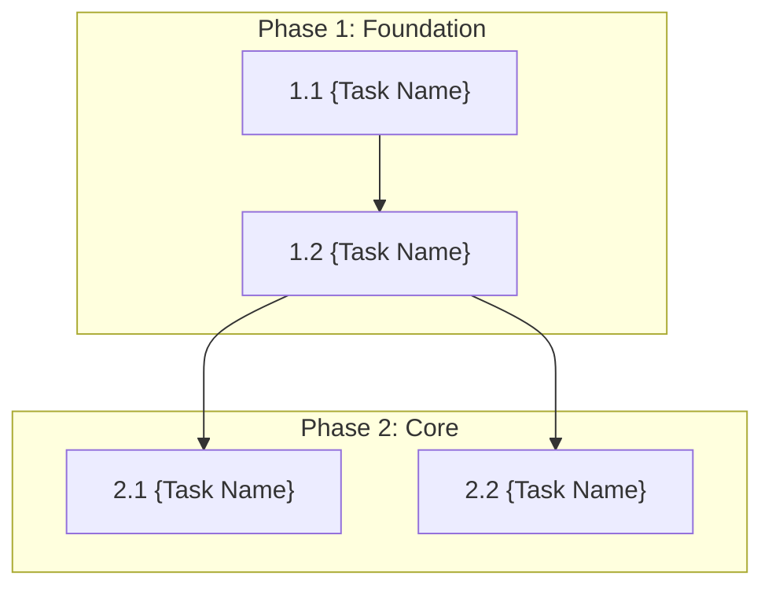

# {Feature Name} Task Breakdown

## Metadata

| Item          | Content                                  |
|:--------------|:-----------------------------------------|
| Feature Name  | {Feature Name}                           |
| Ticket Number | {Ticket Number} (if specified)           |
| Design Doc    | `.sdd/specification/{feature}_design.md` |
| Created Date  | YYYY-MM-DD                               |

## Task List

### Phase 1: Foundation

| #   | Task        | Description   | Completion Criteria | Dependencies |
|:----|:------------|:--------------|:--------------------|:-------------|
| 1.1 | {Task Name} | {Description} | {Criteria}          | -            |
| 1.2 | {Task Name} | {Description} | {Criteria}          | 1.1          |

### Phase 2: Core Implementation

| #   | Task        | Description   | Completion Criteria | Dependencies |
|:----|:------------|:--------------|:--------------------|:-------------|
| 2.1 | {Task Name} | {Description} | {Criteria}          | 1.x          |
| 2.2 | {Task Name} | {Description} | {Criteria}          | 1.x          |

### Phase 3: Integration

| #   | Task        | Description   | Completion Criteria | Dependencies |
|:----|:------------|:--------------|:--------------------|:-------------|
| 3.1 | {Task Name} | {Description} | {Criteria}          | 2.x          |

### Phase 4: Testing

| #   | Task        | Description   | Completion Criteria | Dependencies |
|:----|:------------|:--------------|:--------------------|:-------------|
| 4.1 | {Task Name} | {Description} | {Criteria}          | 3.x          |

### Phase 5: Finalization

| #   | Task        | Description   | Completion Criteria | Dependencies |
|:----|:------------|:--------------|:--------------------|:-------------|
| 5.1 | {Task Name} | {Description} | {Criteria}          | 4.x          |

## Dependency Diagram



## Implementation Notes

- {Note 1}
- {Note 2}

## Reference Documents

- Abstract Specification: `.sdd/specification/[{parent}/]{feature}_spec.md`
- Technical Design: `.sdd/specification/[{parent}/]{feature}_design.md`

※ For hierarchical structure, parent features use `index_spec.md`, `index_design.md`

## Recommended Manual Verification

- [ ] Verify task granularity is appropriate (1 task = several hours to 1 day)
- [ ] Verify dependency diagram is logically correct
- [ ] Verify requirement coverage table has no gaps
- [ ] Verify Phase classification is appropriate

## Verification Commands

```bash
# Verify consistency with related design docs
/check_spec {feature}

# Check for unclear specification points
/clarify {feature}

# Generate checklist to clarify quality criteria
/checklist {feature} {ticket_number}
```
